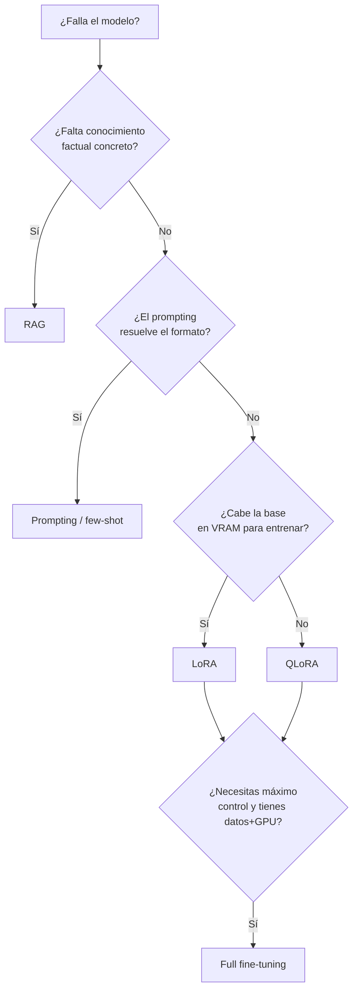
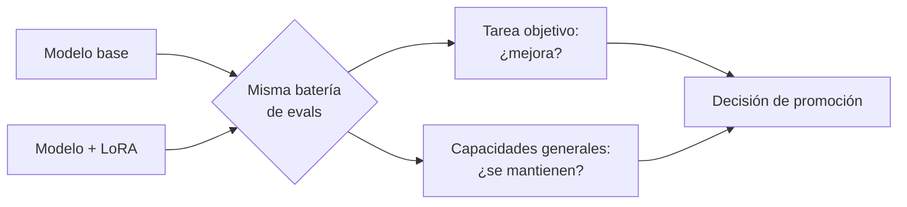

# Fine-tuning y adaptación de dominio

<!-- CURSO_NAV_TOP -->
[← 04 - Fine-tuning en Mac](01-Fine-tuning-con-MLX-en-Mac.md) · [Índice](../README.md) · [05 - Modificación y mejora de pesos →](03-Merging-pruning-y-destilacion.md)
<!-- /CURSO_NAV_TOP -->


> [!NOTE]
> **Ruta Linux / NVIDIA / cloud**
> Linux nativo es la ruta más directa para estos ejemplos CUDA. En Windows, usa WSL2; en Mac, sigue el itinerario MLX enlazado en [Plataformas y comandos](../PLATAFORMAS-Y-COMANDOS.md).


> [!NOTE]
> **En este capítulo**
> Llega el momento de **modificar los pesos** del modelo, no solo el contexto que le pasamos. Construimos el árbol de decisión que separa *prompting*, *RAG* y *fine-tuning*; derivamos desde primeros principios las matemáticas de **LoRA** (*Low-Rank Adaptation*); implementamos una capa `LoRALinear` desde cero en PyTorch; entrenamos con la librería **PEFT** (*Parameter-Efficient Fine-Tuning*); reducimos la huella de memoria con **QLoRA**; servimos adaptadores en caliente; restringimos la decodificación para garantizar salida estructurada; y, por último, evaluamos honestamente el resultado. Todo anclado en **Qwen3-0.6B**.

## El árbol de decisión del fine-tuning

Antes de tocar un solo peso conviene preguntarse si hace falta. El fine-tuning es caro en ingeniería, en GPU y en mantenimiento: cada versión del modelo base obliga a reentrenar, y un adaptador mal evaluado puede degradar capacidades generales (*catastrophic forgetting*, olvido catastrófico). El orden de menor a mayor coste y compromiso es:

1. **Prompting** (incluido *few-shot*): cambias el comportamiento solo con instrucciones y ejemplos en el contexto. Cero entrenamiento, iteración en segundos.
2. **RAG** (*Retrieval-Augmented Generation*): inyectas conocimiento factual recuperado de una base externa. Resuelve el problema de "el modelo no conoce mis datos".
3. **Fine-tuning con adaptadores** (LoRA/QLoRA): modificas un subconjunto pequeño de parámetros para cambiar *estilo*, *formato* o *comportamiento* difícil de prompting.
4. **Full fine-tuning** (entrenamiento completo): reentrenas todos los pesos. Máximo control, máximo coste, máximo riesgo de olvido.

La heurística operativa:

> [!TIP]
> **Regla de oro**
> El fine-tuning enseña **comportamiento y formato**; RAG aporta **conocimiento factual fresco**. Si el problema es "no sabe X", probablemente quieres RAG. Si es "no responde *como* quiero", quieres fine-tuning.



| Técnica | Cambia pesos | Coste | Conocimiento nuevo | Cambia formato/estilo |
|---|---|---|---|---|
| Prompting | No | Mínimo | No | Limitado |
| RAG | No | Bajo | Sí (externo) | No |
| LoRA/QLoRA | Sí (subconjunto) | Medio | Limitado | Sí |
| Full FT | Sí (todos) | Alto | Sí | Sí |

## LoRA: las matemáticas

Una capa lineal de un *transformer* aplica $h = Wx$, donde $W \in \mathbb{R}^{d \times k}$. El fine-tuning completo aprende una actualización $\Delta W$ del mismo tamaño que $W$: para Qwen3-0.6B con dimensión oculta $d = 1024$, cada proyección densa tiene del orden de un millón de parámetros, y hay decenas de ellas por capa.

LoRA parte de una observación: en lugar de aprender $\Delta W$ completa, la **factorizamos** como producto de dos matrices de **rango bajo** $r$:

$$\Delta W = BA, \qquad B \in \mathbb{R}^{d \times r}, \quad A \in \mathbb{R}^{r \times k}, \quad r \ll \min(d, k)$$

La capa adaptada queda:

$$W' x = W x + \Delta W x = W x + \frac{\alpha}{r} B A x$$

donde $\alpha$ es un factor de escala (*scaling*) y el cociente $\frac{\alpha}{r}$ normaliza la magnitud de la actualización para que cambiar $r$ no obligue a retocar la tasa de aprendizaje. Durante el entrenamiento, **$W$ permanece congelada** y solo $A$ y $B$ reciben gradientes.

El ahorro de parámetros es drástico. Una proyección $1024 \times 1024$ tiene $1024^2 \approx 1{,}05\text{M}$ de parámetros. Con $r = 8$, los adaptadores tienen $2 \cdot 1024 \cdot 8 = 16{,}384$ parámetros: en torno al **1,5 %** del original. Sumando todas las proyecciones objetivo, un adaptador LoRA típico para Qwen3-0.6B entrena del orden de unos pocos millones de parámetros frente a los 600 M de la base.

> [!NOTE]
> **Inicialización**
> $A$ se inicializa con ruido gaussiano y $B$ a ceros. Así, al empezar, $\Delta W = BA = 0$ y el modelo parte exactamente del comportamiento de la base: el entrenamiento solo puede mejorar desde ahí.

## Por qué funciona LoRA (hipótesis de bajo rango intrínseco)

La pregunta natural es: ¿por qué una factorización de rango tan pequeño basta para adaptar un modelo de cientos de millones de parámetros? La respuesta es la **hipótesis del rango intrínseco bajo** (*intrinsic low-rank hypothesis*).

La intuición: aunque $\Delta W$ *pueda* ser de rango completo, la adaptación que realmente necesita una tarea concreta vive en un subespacio de dimensión mucho menor. El modelo pre-entrenado ya ha aprendido representaciones ricas y generales; adaptarlo a un dominio no requiere reescribirlas, solo **reorientarlas** ligeramente. Esa reorientación se captura con pocos grados de libertad.

Formalmente, el rango de una matriz mide cuántas direcciones linealmente independientes contiene. Si la actualización óptima $\Delta W^*$ tiene un rango efectivo bajo (la mayor parte de su "energía", sus valores singulares dominantes, se concentra en pocas direcciones), entonces un producto $BA$ de rango $r$ la aproxima bien. Empíricamente, rangos entre 8 y 64 cubren la mayoría de tareas de adaptación de estilo y formato.

> [!NOTE]
> **Conexión matemática**
> Esto se relaciona con la **descomposición en valores singulares** (SVD): la mejor aproximación de rango $r$ de cualquier matriz se obtiene quedándose con sus $r$ mayores valores singulares (teorema de Eckart-Young). LoRA *aprende* directamente una aproximación de rango $r$ sin calcular la SVD. Ver [Apéndice A - Fundamentos matemáticos](../07-Anexos/F-Fundamentos-matematicos.md).

## LoRA desde cero (capa `LoRALinear` en PyTorch)

Para fijar las ideas, implementamos la capa nosotros mismos. Envuelve una capa lineal congelada y le suma la rama de bajo rango:

```python
import torch
import torch.nn as nn

class LoRALinear(nn.Module):
    """Capa lineal con adaptador LoRA: h = W·x + (alpha/r)·B·A·x"""

    def __init__(self, base_layer: nn.Linear, r: int = 8, alpha: int = 16):
        super().__init__()
        self.base = base_layer          # capa pre-entrenada (W, b)
        self.r = r
        self.scaling = alpha / r         # factor alpha/r de la fórmula

        # Congelamos los pesos de la base: no recibirán gradiente
        for p in self.base.parameters():
            p.requires_grad = False

        d_out, d_in = base_layer.weight.shape
        # A: (r x d_in) inicializada con ruido; B: (d_out x r) a ceros
        self.A = nn.Parameter(torch.randn(r, d_in) * 0.01)
        self.B = nn.Parameter(torch.zeros(d_out, r))

    def forward(self, x: torch.Tensor) -> torch.Tensor:
        # Salida de la base congelada
        salida_base = self.base(x)
        # Rama de bajo rango: x -> A -> B, escalada por alpha/r
        delta = (x @ self.A.t()) @ self.B.t()
        return salida_base + self.scaling * delta
```

El punto clave: solo `self.A` y `self.B` tienen `requires_grad=True`, así que el optimizador únicamente actualiza esos tensores. En la práctica usaremos PEFT, que hace esto de forma robusta y soporta *merge*, guardado de adaptadores y selección automática de módulos objetivo (`target_modules`).

## Entrenamiento práctico con PEFT

PEFT (de Hugging Face) convierte cualquier modelo `transformers` en un modelo con adaptadores con unas pocas líneas. Definimos la configuración LoRA y la aplicamos:

```python
from peft import LoraConfig, get_peft_model
from transformers import AutoModelForCausalLM, AutoTokenizer

modelo_id = "Qwen/Qwen3-0.6B"
tokenizer = AutoTokenizer.from_pretrained(modelo_id)
modelo = AutoModelForCausalLM.from_pretrained(modelo_id, torch_dtype=torch.bfloat16)

config_lora = LoraConfig(
    r=16,                       # rango de los adaptadores
    lora_alpha=32,              # alpha; scaling = alpha/r = 2.0
    target_modules=[            # qué proyecciones adaptar
        "q_proj", "k_proj", "v_proj", "o_proj",   # atención
        "gate_proj", "up_proj", "down_proj",      # MLP
    ],
    lora_dropout=0.05,          # regularización sobre la rama LoRA
    bias="none",                # no entrenamos los sesgos
    task_type="CAUSAL_LM",
)

modelo = get_peft_model(modelo, config_lora)
# Imprime cuántos parámetros son entrenables frente al total
modelo.print_trainable_parameters()
```

La llamada a `print_trainable_parameters()` reporta el número exacto de parámetros entrenables; en la salida verás que representan una fracción muy pequeña del total del modelo. Adaptar también las proyecciones del MLP (`gate/up/down_proj`), y no solo la atención, suele mejorar la calidad a cambio de algunos parámetros entrenables más.

## El bucle de entrenamiento

Con el modelo PEFT listo, el bucle es estándar. Usamos `Trainer` para no reinventar el manejo de *gradient accumulation*, *mixed precision* y *checkpointing*:

```python
from transformers import TrainingArguments, Trainer, DataCollatorForLanguageModeling

args = TrainingArguments(
    output_dir="./qwen3-lora",
    per_device_train_batch_size=4,
    gradient_accumulation_steps=4,    # batch efectivo = 4*4 = 16
    learning_rate=2e-4,               # tasas altas son típicas en LoRA
    num_train_epochs=3,
    bf16=True,                        # bfloat16 para ahorrar memoria
    logging_steps=10,
    save_strategy="epoch",
    warmup_ratio=0.03,                # calentamiento de la tasa
)

collator = DataCollatorForLanguageModeling(tokenizer, mlm=False)

trainer = Trainer(
    model=modelo,
    args=args,
    train_dataset=dataset_tokenizado,   # tu dataset ya tokenizado
    data_collator=collator,
)

trainer.train()
modelo.save_pretrained("./qwen3-lora-adaptador")   # guarda SOLO el adaptador
```

> [!WARNING]
> **Tasa de aprendizaje**
> En LoRA las tasas suelen ser un orden de magnitud mayores que en full fine-tuning ($2\text{e-}4$ frente a $\sim 2\text{e-}5$), porque entrenamos muchos menos parámetros y partimos de $\Delta W = 0$. Empezar demasiado bajo desperdicia presupuesto de cómputo.

Nota crucial: `save_pretrained` sobre un modelo PEFT guarda **solo los adaptadores** (unos pocos MB), no la base. Eso hace que distribuir y versionar adaptadores sea barato.

## QLoRA: entrenar cuando la base no cabe

¿Y si ni siquiera cargar la base congelada en VRAM es viable? **QLoRA** (*Quantized LoRA*) resuelve esto cuantizando la base a 4 bits mientras se mantienen los adaptadores en precisión completa. Tres ideas combinadas:

- **NF4** (*4-bit NormalFloat*): un tipo de dato de 4 bits cuyos niveles de cuantización están distribuidos para ajustarse a pesos con distribución aproximadamente normal (que es como se distribuyen los pesos de un modelo entrenado). Es óptimo en información para datos gaussianos, frente a un entero uniforme de 4 bits.
- **Doble cuantización** (*double quantization*): los propios coeficientes de escala de la cuantización también se cuantizan, recortando memoria adicional por parámetro.
- **Paged optimizers**: los estados del optimizador se gestionan con memoria paginada (*unified memory* de NVIDIA), de modo que los picos de uso se desbordan a RAM en vez de provocar un *out-of-memory* (OOM).

El gradiente fluye **a través** de la base cuantizada hasta los adaptadores, que sí se entrenan en `bfloat16`. La base nunca se actualiza; solo sirve para calcular activaciones y propagar gradientes hacia $A$ y $B$.

```python
from transformers import BitsAndBytesConfig

config_4bit = BitsAndBytesConfig(
    load_in_4bit=True,
    bnb_4bit_quant_type="nf4",            # NF4, no entero uniforme
    bnb_4bit_use_double_quant=True,       # doble cuantización
    bnb_4bit_compute_dtype=torch.bfloat16 # cómputo en bf16
)

modelo = AutoModelForCausalLM.from_pretrained(
    modelo_id, quantization_config=config_4bit, device_map="auto"
)
# A partir de aquí: get_peft_model(...) igual que antes
```

> [!NOTE]
> **Relación con el capítulo de cuantización**
> NF4 y la doble cuantización se tratan en profundidad en [06 - Cuantización y compresión](../05-LLMOps/06-Cuantizacion-y-compresion-avanzada.md). QLoRA es esencialmente "cuantizar la base para entrenar", mientras que allí cuantizábamos "para servir".

Para Qwen3-0.6B QLoRA es casi siempre innecesario (el modelo cabe holgado en cualquier GPU moderna), pero entender el mecanismo es clave porque la misma receta escala a modelos de decenas de miles de millones de parámetros donde sí es la única opción viable en una sola GPU.

## Inferencia con adaptadores

Hay dos modos de servir un modelo fine-tuneado, con un compromiso claro entre latencia y flexibilidad:

- **Merge (fusión)**: se calcula $W' = W + \frac{\alpha}{r} BA$ una sola vez y se guarda como pesos fusionados. El resultado es un modelo normal, sin coste extra en inferencia, pero pierdes la modularidad: vuelve a ser monolítico.
- **Adaptadores en caliente** (*hot-swap*): mantienes la base cargada una vez y conmutas adaptadores en tiempo de ejecución. Pagas un pequeño coste por la rama LoRA en cada *forward*, pero un mismo servidor sirve muchos adaptadores.

```python
from peft import PeftModel

base = AutoModelForCausalLM.from_pretrained(modelo_id, torch_dtype=torch.bfloat16)
modelo = PeftModel.from_pretrained(base, "./qwen3-lora-adaptador")

# Opción A: fusionar para inferencia rápida y monolítica
modelo_fusionado = modelo.merge_and_unload()

# Opción B: mantener el adaptador y conmutarlo en caliente
# modelo.set_adapter("dominio_legal")  # con varios adaptadores cargados
```

El **multi-LoRA serving** lleva el modo B al extremo: un único servidor (por ejemplo, con vLLM) carga la base una vez y enruta cada petición al adaptador correspondiente, batcheando peticiones de adaptadores distintos. Esto amortiza la VRAM de la base entre decenas de tareas o clientes, y es la arquitectura que hace económicamente viable ofrecer "un fine-tune por cliente".

## Decodificación restringida para salida estructurada

Un modelo fine-tuneado para devolver JSON aún puede equivocarse: una coma de más, una clave inventada. La **decodificación restringida** (*constrained decoding*) garantiza por construcción que la salida es válida, enmascarando en cada paso los *tokens* que violarían la estructura.

El mecanismo: una gramática (o un *JSON schema* compilado a gramática) define qué *tokens* son legales dado lo ya generado. Antes del *softmax*, los logits de los *tokens* ilegales se ponen a $-\infty$, de modo que tienen probabilidad cero de ser muestreados.

```python
# Esquema de salida que el modelo DEBE respetar
schema = {
    "type": "object",
    "properties": {
        "sentimiento": {"type": "string", "enum": ["positivo", "negativo", "neutro"]},
        "confianza": {"type": "number"}
    },
    "required": ["sentimiento", "confianza"]
}
# Frameworks como Outlines, XGrammar o el guided decoding de vLLM
# convierten este schema en una máscara de tokens aplicada paso a paso.
```

> [!TIP]
> **Fine-tuning + decodificación restringida**
> Son complementarios. El fine-tuning enseña al modelo a *querer* producir el formato (mejor calidad del contenido); la decodificación restringida *garantiza* que lo hace (cero fallos de parseo). Para *tool calling* fiable se usan ambos.

## Evaluar el modelo fine-tuneado

Entrenar sin evaluar es navegar a ciegas. La evaluación de un fine-tune debe medir **tres ejes** a la vez:

1. **Calidad en la tarea objetivo**: métricas específicas (exactitud de clasificación, validez del JSON, métricas de comparación con respuestas de referencia). Idealmente un *holdout* que el modelo no haya visto.
2. **No regresión en capacidades generales**: comprobar que no apareció olvido catastrófico, evaluando en *benchmarks* generales antes y después.
3. **Comportamiento operativo**: latencia, formato, tasa de rechazos indebidos.

> [!CAUTION]
> **El error más común**
> Evaluar solo sobre datos parecidos al entrenamiento da una falsa sensación de éxito. Un adaptador puede "memorizar" el estilo del *training set* y degradar todo lo demás. Siempre incluye un conjunto de control general.

La metodología comparativa correcta:



La observabilidad continua en producción cierra el ciclo: detectar *drift* y degradación en vivo es el tema de [11 - Observabilidad y monitorización](../05-LLMOps/10-Observabilidad-y-monitorizacion.md). El proyecto práctico aplica todo esto end-to-end en [P2 - Proyecto - Fine-tuning de Qwen3-0.6B](../06-Proyectos/03-Fine-tuning-de-Qwen3-0.6B.md).

> [!TIP]
> **Puntos clave**
> - El fine-tuning enseña **comportamiento y formato**; para conocimiento factual fresco, prefiere **RAG**. Sigue el árbol de decisión antes de entrenar.
> - LoRA factoriza la actualización como $\Delta W = \frac{\alpha}{r}BA$ de **rango bajo**, congelando la base y entrenando solo una fracción mínima de parámetros.
> - Funciona por la **hipótesis del rango intrínseco bajo**: la adaptación a una tarea vive en un subespacio pequeño.
> - **QLoRA** (NF4 + doble cuantización + *paged optimizers*) permite entrenar cuando la base no cabe en VRAM en precisión completa.
> - En inferencia eliges entre **fusionar** (rápido, monolítico) o **adaptadores en caliente** (flexible, multi-LoRA serving).
> - La **decodificación restringida** garantiza salida estructurada válida; es complementaria al fine-tuning.
> - **Evalúa siempre tres ejes**: tarea objetivo, no regresión general y comportamiento operativo.

## Enlaces relacionados

- [08 - De una GPU a inferencia multi-GPU](../05-LLMOps/08-De-una-GPU-a-multi-GPU.md) — paralelismo para entrenar/servir modelos grandes
- [06 - Cuantización y compresión](../05-LLMOps/06-Cuantizacion-y-compresion-avanzada.md) — NF4, doble cuantización y compresión de pesos
- [10 - Despliegue en Azure ML](../05-LLMOps/09-Despliegue-en-Azure-ML.md) — llevar el adaptador a producción
- [11 - Observabilidad y monitorización](../05-LLMOps/10-Observabilidad-y-monitorizacion.md) — detectar *drift* y degradación
- [P2 - Proyecto - Fine-tuning de Qwen3-0.6B](../06-Proyectos/03-Fine-tuning-de-Qwen3-0.6B.md) — proyecto end-to-end
- [Apéndice A - Fundamentos matemáticos](../07-Anexos/F-Fundamentos-matematicos.md) — rango, SVD y aproximación de bajo rango

---

---


Curso creado por [@are_agi](https://twitter.com/are_agi).

---


Curso creado por [@are_agi](https://twitter.com/are_agi).

---

<!-- CURSO_NAV_BOTTOM -->
[← 04 - Fine-tuning en Mac](01-Fine-tuning-con-MLX-en-Mac.md) · [Índice](../README.md) · [05 - Modificación y mejora de pesos →](03-Merging-pruning-y-destilacion.md)
<!-- /CURSO_NAV_BOTTOM -->

Curso creado por [@are_agi](https://twitter.com/are_agi).
