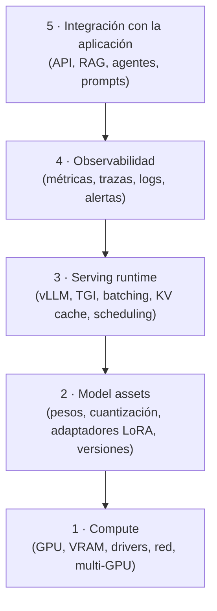

# El problema del serving de LLM

<!-- CURSO_NAV_TOP -->
[← 05 - Modificación y mejora de pesos](../04-Adaptar/03-Merging-pruning-y-destilacion.md) · [Índice](../README.md) · [Modelo de referencia Qwen3-0.6B →](02-Modelo-de-referencia-Qwen3-0.6B.md)
<!-- /CURSO_NAV_TOP -->


> [!NOTE]
> **Capítulo avanzado**
> Los conceptos se aplican a cualquier sistema. Los laboratorios de serving con CUDA se ejecutan mejor en WSL2/Linux o cloud; en Apple Silicon puedes practicar las ideas con llama.cpp, MLX o vLLM-Metal. Consulta [Plataformas y comandos](../PLATAFORMAS-Y-COMANDOS.md).


> [!NOTE]
> **En este capítulo**
> - Entenderás por qué un `model.generate()` que funciona en tu portátil **no** es un servicio de producción, y dónde está exactamente el hueco.
> - Aprenderás a razonar sobre las **restricciones simultáneas** de producción (latencia, throughput, memoria, coste, calidad) como un problema de optimización con tensiones internas.
> - Conocerás las **cinco capas de LLMOps** y por qué cada una introduce sus propios modos de fallo.
> - Adquirirás el criterio para distinguir "ejecutar un modelo" de "operar un sistema de inferencia", que es el hilo conductor de todo el curso.

## Por qué la inferencia naíf falla en producción

Casi todo el mundo entra en el mundo de los LLM por la misma puerta: cargas un modelo con la librería `transformers`, llamas a `model.generate()`, ves salir texto y declaras victoria. Ese gesto es engañosamente simple porque oculta el verdadero problema de ingeniería. La generación de un LLM es **autorregresiva**: el modelo produce un token, lo concatena a la entrada y vuelve a ejecutar la red completa para producir el siguiente. No hay forma de "saltarse" pasos; la longitud de la salida es igual al número de *forward passes* secuenciales. Esta dependencia temporal estricta es la raíz de casi todas las dificultades posteriores.

Veamos cómo se ve el camino naíf con nuestro modelo de referencia, **Qwen3-0.6B** (28 capas, `hidden_size` 1024, atención GQA con 16 *query heads* y 8 *KV heads*, `head_dim` 128, vocabulario del orden de 151k tokens y contexto de 32k):

```python
import torch
from transformers import AutoModelForCausalLM, AutoTokenizer

# Carga directa — el "hola mundo" de la inferencia
tok = AutoTokenizer.from_pretrained("Qwen/Qwen3-0.6B")
model = AutoModelForCausalLM.from_pretrained(
    "Qwen/Qwen3-0.6B", torch_dtype=torch.bfloat16, device_map="cuda"
)

prompt = "Explica qué es el serving de LLM en una frase."
inputs = tok(prompt, return_tensors="pt").to("cuda")

# Una única petición, bloqueante, sin concurrencia
out = model.generate(**inputs, max_new_tokens=128)
print(tok.decode(out[0], skip_special_tokens=True))
```

Este código **funciona**, y precisamente por eso es peligroso. Funciona para *una* petición, de *un* usuario, sin límite de tiempo, sin presión de memoria y sin nadie observando si la respuesta es correcta. El hueco entre este snippet y un `vllm serve` real no es de "rendimiento" en abstracto, sino de **todo lo que el snippet asume que no existe**: no hay varios usuarios compitiendo por la GPU, no hay reutilización de cómputo entre pasos (cada `forward` recalcula la atención sobre todo el historial), no hay control de la latencia del primer token, no hay límites de cola, no hay métricas, no hay tolerancia a fallos.

> [!WARNING]
> **El error mental más común**
> Creer que "el modelo ya funciona, solo falta envolverlo en una API". El servidor de inferencia **no** es un wrapper fino sobre `generate()`. Es un sistema que reorganiza el cómputo (continuous batching, KV cache, paginación de memoria, planificación) para que la misma GPU sirva a decenas o cientos de peticiones concurrentes con garantías de latencia. Es un cambio de arquitectura, no de empaquetado.

El primer síntoma aparece en cuanto llegan dos peticiones a la vez. El bucle naíf las atiende **en serie**: la segunda espera a que termine la primera. Con generaciones de varios segundos, la cola crece sin límite y la latencia percibida se dispara. El segundo síntoma es la memoria: cada petición mantiene su propia KV cache, y sin gestión explícita la GPU se fragmenta o se queda sin VRAM. El tercero es la observabilidad: cuando algo va mal en producción, el snippet no te dice nada — no hay trazas, ni percentiles de latencia, ni tasa de errores.

## Restricciones reales de producción

Operar un LLM es un problema de **optimización multiobjetivo bajo restricciones**, y la dificultad nace de que los objetivos se oponen entre sí. No existe una configuración que maximice todo a la vez; hay que elegir un punto en una frontera de Pareto. Conviene nombrar con precisión cada dimensión, porque cada una se mide distinto y se rompe distinto.

**Time-to-first-token (TTFT)** es el tiempo desde que llega la petición hasta que el usuario ve el primer token. Domina la sensación de "rapidez" en interfaces conversacionales y está gobernado por la fase de **prefill** (procesar todo el prompt de entrada de golpe). Su coste crece con la longitud del prompt:

$$
T_{\text{TTFT}} \approx T_{\text{cola}} + T_{\text{prefill}}(L_{\text{prompt}})
$$

**Inter-token latency (ITL)**, o *time-per-output-token*, es el tiempo entre tokens sucesivos durante la fase de **decode**. Determina la fluidez del streaming. La latencia total de una respuesta de $N$ tokens de salida es aproximadamente:

$$
T_{\text{total}} \approx T_{\text{TTFT}} + (N - 1)\cdot T_{\text{ITL}}
$$

**Throughput** es el caudal agregado del sistema, medido en tokens/segundo o peticiones/segundo. Aquí aparece la primera tensión fundamental: para maximizar throughput conviene **agrupar** muchas peticiones en un mismo *batch* y saturar la GPU, pero agrupar añade espera y empeora la latencia individual. Es el clásico *trade-off* latencia–throughput.

> [!NOTE]
> **Compute-bound vs memory-bound**
> El prefill es típicamente **compute-bound**: procesa muchos tokens en paralelo y satura las unidades de cómputo (FLOPs). El decode es típicamente **memory-bound**: genera un solo token por paso, así que el cuello de botella es leer los pesos del modelo y la KV cache desde la memoria HBM, no multiplicar matrices. Por eso el *batching* ayuda muchísimo más al decode que al prefill: amortiza la lectura de pesos entre muchas peticiones.

**Memoria** es la restricción dura que limita cuántas peticiones caben a la vez. El presupuesto de VRAM se reparte entre pesos del modelo, KV cache (que crece linealmente con el número de tokens en vuelo) y activaciones temporales. La KV cache es el recurso escaso: es lo que hace que un servidor "se llene" aunque sobre cómputo.

**Coste-por-token** traduce todo lo anterior a dinero. Si una GPU cuesta $C_{\text{hora}}$ y el sistema sostiene $R$ tokens/segundo, el coste por millón de tokens es:

$$
\text{Coste}_{1\text{M tokens}} = \frac{C_{\text{hora}}}{3600 \cdot R}\times 10^{6}
$$

Esto deja claro por qué el throughput **es** una métrica económica: duplicar $R$ a igual hardware reduce el coste a la mitad.

**Calidad** es la restricción que es fácil olvidar y carísima de recuperar. Cuantizar, recortar contexto o usar decodificación especulativa mal calibrada puede degradar las respuestas de forma sutil. La calidad debe medirse de forma continua, no asumirse.

| Restricción | Se mide en | Fase que domina | Modo de fallo típico |
|---|---|---|---|
| TTFT | ms | prefill + cola | prompts largos, cola saturada |
| ITL | ms/token | decode | GPU memory-bound, batch pequeño |
| Throughput | tokens/s | decode (batched) | batch infrautilizado |
| Memoria | GB VRAM | KV cache | OOM, fragmentación |
| Coste/token | $/1M tokens | throughput | baja utilización de GPU |
| Calidad | métricas de eval | toda la pipeline | degradación por cuantización |

## Las cinco capas de LLMOps

Para no perderse, conviene descomponer un sistema de inferencia en cinco capas. Cada una tiene responsabilidades, herramientas y fallos propios; un incidente de producción casi siempre se localiza en una de ellas.



La **capa de compute** es el hardware: GPUs, su VRAM, el ancho de banda de memoria (HBM), los drivers CUDA y, en multi-GPU, las interconexiones (NVLink, PCIe). Es la capa que fija los límites físicos; ninguna optimización software los supera, solo los aprovecha mejor.

La **capa de model assets** abarca los artefactos: los pesos en `bfloat16` o cuantizados, los adaptadores LoRA, los ficheros de configuración, el tokenizador y, crucialmente, su **versionado**. Un fallo aquí —cargar la versión equivocada de los pesos, un tokenizador desincronizado— produce respuestas erróneas sin lanzar ninguna excepción.

La **capa de serving runtime** es el corazón del curso: el motor que convierte pesos en un servicio concurrente. Aquí viven el *continuous batching*, la gestión paginada de la KV cache, el *scheduler* que decide qué peticiones avanzan en cada paso y las optimizaciones de kernels. vLLM y TGI son ejemplos; en los proyectos del curso construiremos una versión simplificada desde cero.

La **capa de observabilidad** instrumenta todo lo anterior. Sin percentiles (p50, p95, p99) de TTFT e ITL, sin tasa de errores, sin utilización de GPU y sin trazas distribuidas, operar el sistema es ir a ciegas. La regla es simple: lo que no mides, no lo controlas.

La **capa de integración con la aplicación** es donde el modelo se encuentra con el producto: el contrato de la API, la lógica de RAG, los agentes, la *prompt engineering* y el postprocesado. Muchos problemas que parecen "del modelo" son en realidad de esta capa (un prompt mal formado, un parser frágil).

> [!TIP]
> **Diagnóstico por capas**
> Cuando algo falla, pregúntate primero **en qué capa estás**. "Va lento" puede ser compute (GPU saturada), runtime (batch mal configurado), observabilidad (no lo sabes en realidad) o aplicación (un retry loop oculto). Localizar la capa reduce el espacio de búsqueda drásticamente.

## Por qué "local" no es "producción"

La diferencia entre tu portátil y producción no es de grado, es de **naturaleza**. En local hay un usuario, tú, que espera pacientemente y reintenta a mano si algo falla. En producción hay tráfico concurrente, impredecible y a ráfagas, con un SLA que cumplir y un coste que justificar. Esta tabla resume el salto:

| Dimensión | Local / notebook | Producción |
|---|---|---|
| Concurrencia | 1 petición | decenas–cientos simultáneas |
| Latencia | "cuando salga" | SLA p99 en ms |
| Memoria | sobra | KV cache es el recurso escaso |
| Fallos | reintentas a mano | degradación elegante, *circuit breakers* |
| Observabilidad | `print()` | métricas, trazas, alertas |
| Coste | tu electricidad | $/1M tokens auditado |
| Versionado | el último checkpoint | rollout/rollback controlado |

> [!TIP]
> **El experimento mental del segundo usuario**
> Toma el snippet del primer apartado y lanza dos peticiones a la vez. El bucle naíf las sirve en serie: con generaciones de 4 segundos, el segundo usuario espera 8. Añade un tercero y un cuarto y la cola explota. El servidor de producción, en cambio, **fusiona** sus pasos de decode en un único batch sobre la GPU: los cuatro avanzan casi a la vez. Ese reordenamiento del cómputo —no más hardware— es lo que separa lo local de lo productivo, y es el tema de los capítulos siguientes.

El otro factor es la **demanda no estacionaria**. El tráfico real llega a ráfagas, con picos que multiplican por diez la media. Un sistema dimensionado para la media colapsa en el pico; uno dimensionado para el pico desperdicia dinero el resto del tiempo. Gestionar esa tensión (autoescalado, colas con límites, *load shedding*) es ingeniería de sistemas pura, no *machine learning*. Y es exactamente lo que el resto del curso te enseñará a construir, capa por capa, anclándolo siempre en números concretos sobre Qwen3-0.6B.

> [!TIP]
> **Puntos clave**
> - La inferencia de LLM es **autorregresiva**: $N$ tokens de salida implican $N$ *forward passes* secuenciales, y de ahí nacen casi todas las dificultades.
> - `model.generate()` funciona para una petición sin restricciones; producción significa **concurrencia, SLA, memoria limitada, coste y calidad simultáneos**.
> - Las restricciones reales (TTFT, ITL, throughput, memoria, coste, calidad) están en **tensión**: optimizar una suele empeorar otra.
> - El prefill es **compute-bound** y el decode es **memory-bound**; por eso el *batching* dispara el throughput del decode.
> - LLMOps se descompone en **cinco capas** (compute, model assets, serving runtime, observabilidad, integración); cada fallo vive en una de ellas.
> - "Local" y "producción" difieren en **naturaleza**, no en grado: el reordenamiento del cómputo es lo que las separa.

## Enlaces relacionados
- [02 - Modelo de referencia Qwen3-0.6B](02-Modelo-de-referencia-Qwen3-0.6B.md) — el modelo concreto sobre el que razonaremos todo el curso.
- [03 - Atención y KV cache](03-Atencion-y-KV-cache.md) — por qué la KV cache es el recurso escaso de la capa de runtime.
- [04 - El bucle de inferencia](04-El-bucle-de-inferencia.md) — cómo se estructuran realmente las fases de prefill y decode.
- [05 - Batching y scheduling](05-Batching-y-scheduling.md) — cómo se resuelve la tensión latencia–throughput.
- [11 - Observabilidad y monitorización](10-Observabilidad-y-monitorizacion.md) — la capa que convierte la operación a ciegas en ingeniería.
- [12 - Optimización de costes](11-Optimizacion-de-costes.md) — el throughput como métrica económica.
- [P3 - Proyecto - Sistema de serving en producción](../06-Proyectos/04-Sistema-de-serving-en-produccion.md) — síntesis práctica de las cinco capas.

---

---


Curso creado por [@are_agi](https://twitter.com/are_agi).

---


Curso creado por [@are_agi](https://twitter.com/are_agi).

---

<!-- CURSO_NAV_BOTTOM -->
[← 05 - Modificación y mejora de pesos](../04-Adaptar/03-Merging-pruning-y-destilacion.md) · [Índice](../README.md) · [Modelo de referencia Qwen3-0.6B →](02-Modelo-de-referencia-Qwen3-0.6B.md)
<!-- /CURSO_NAV_BOTTOM -->

Curso creado por [@are_agi](https://twitter.com/are_agi).
