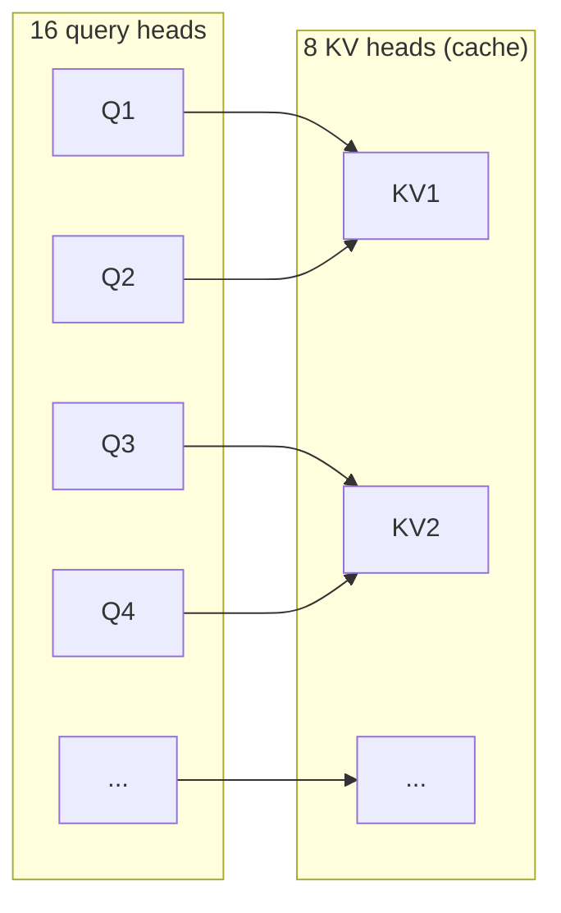

# Modelo de referencia Qwen3-0.6B

<!-- CURSO_NAV_TOP -->
[← El problema del serving de LLM](01-El-problema-del-serving.md) · [Índice](../README.md) · [Atención y KV cache →](03-Atencion-y-KV-cache.md)
<!-- /CURSO_NAV_TOP -->


> [!NOTE]
> **Capítulo avanzado**
> Los conceptos se aplican a cualquier sistema. Los laboratorios de serving con CUDA se ejecutan mejor en WSL2/Linux o cloud; en Apple Silicon puedes practicar las ideas con llama.cpp, MLX o vLLM-Metal. Consulta [Plataformas y comandos](../PLATAFORMAS-Y-COMANDOS.md).


> [!NOTE]
> **En este capítulo**
> - Conocerás en detalle la arquitectura de **Qwen3-0.6B**, el modelo que usaremos como banco de pruebas concreto durante todo el curso.
> - Entenderás por qué **Grouped-Query Attention (GQA)** no es solo un truco de calidad, sino una **decisión de serving** que reduce la KV cache.
> - Verás cómo funcionan la tokenización y los **tokens especiales**, y por qué importan para el contrato de la API.
> - Distinguirás los modos **"thinking"** y **"non-thinking"** y su impacto en latencia y coste.
> - Calcularás la **huella de memoria de principio a fin**: pesos + KV cache + activaciones.

## Arquitectura de un vistazo

Necesitamos un modelo lo bastante pequeño para caber en una sola GPU modesta y razonar sobre números a mano, pero lo bastante moderno para que sus decisiones de diseño sean representativas de los modelos grandes. **Qwen3-0.6B** cumple ambas cosas. Es un *transformer* decoder-only autorregresivo con las siguientes características de referencia:

| Parámetro | Valor |
|---|---|
| Capas (`num_hidden_layers`) | 28 |
| Dimensión del modelo (`hidden_size`) | 1024 |
| *Query heads* | 16 |
| *KV heads* (GQA) | 8 |
| `head_dim` | 128 |
| Tamaño de vocabulario | del orden de 151k |
| Longitud de contexto | 32k tokens |
| Tipo de atención | GQA con RoPE |
| Precisión típica de pesos | bfloat16 |

Hay un detalle aritmético que merece atención inmediata. En un *transformer* clásico se cumple $\text{hidden\_size} = \text{num\_heads}\times\text{head\_dim}$. Aquí, sin embargo, $16 \times 128 = 2048 \ne 1024$. Esto **no es un error**: indica que la dimensión total de la proyección de *queries* (2048) es mayor que `hidden_size` (1024). Es un patrón deliberado de los modelos Qwen3: la proyección de atención expande la dimensión antes de calcular los *scores* y luego una proyección de salida la devuelve a 1024. Lo importante para nosotros es separar tres dimensiones que a menudo se confunden: la del residual stream (`hidden_size` = 1024), la del cálculo de atención (`num_heads × head_dim`) y la de la KV cache (que depende de los **KV heads**, no de los *query heads*).

> [!NOTE]
> **Decoder-only y RoPE**
> Qwen3 es **decoder-only**: cada token solo atiende a los anteriores (atención causal). La información de posición no se inyecta con embeddings absolutos sino con **RoPE** (Rotary Position Embeddings), que rota los vectores de query y key en función de su posición. RoPE es clave para extender el contexto y para que la KV cache sea reutilizable token a token.

El bloque de cada una de las 28 capas sigue el patrón estándar: normalización (RMSNorm), atención GQA con RoPE, conexión residual, normalización, una MLP con activación tipo SwiGLU y otra conexión residual. La cabeza final proyecta el `hidden_size` de 1024 al vocabulario de ~151k para producir los *logits*.

```python
from transformers import AutoConfig

cfg = AutoConfig.from_pretrained("Qwen/Qwen3-0.6B")
# Las cifras que gobiernan la huella de memoria:
print(cfg.num_hidden_layers)        # 28 capas
print(cfg.hidden_size)              # 1024
print(cfg.num_attention_heads)      # 16 query heads
print(cfg.num_key_value_heads)      # 8 KV heads  -> clave para la KV cache
print(cfg.head_dim)                 # 128
print(cfg.vocab_size)               # del orden de 151k
```

## Grouped-Query Attention (GQA) como ventaja de serving

La atención multi-cabeza original (**MHA**) usa el mismo número de cabezas para queries, keys y values: si hay 16 *query heads*, hay 16 *key heads* y 16 *value heads*. El problema es que **las keys y values son justo lo que hay que guardar en la KV cache** durante la generación. Más KV heads significa más cache, y la cache es el recurso escaso del serving (lo vimos en el capítulo 1).

El extremo opuesto es **Multi-Query Attention (MQA)**: un único par key/value compartido por todas las query heads. Minimiza la cache pero suele degradar la calidad. **Grouped-Query Attention (GQA)** es el punto intermedio: agrupa las query heads y comparte un par key/value por grupo. En Qwen3-0.6B hay **16 query heads y 8 KV heads**, así que cada KV head da servicio a un grupo de 2 query heads:

$$
\text{grupo} = \frac{\text{query heads}}{\text{KV heads}} = \frac{16}{8} = 2
$$



El ahorro en memoria es directo y proporcional. La KV cache solo almacena keys y values, y su tamaño depende de los **KV heads**, no de los query heads. Frente a un MHA equivalente con 16 KV heads, GQA con 8 KV heads **divide a la mitad** la KV cache:

$$
\frac{\text{cache}_{\text{GQA}}}{\text{cache}_{\text{MHA}}} = \frac{n_{kv}}{n_{q}} = \frac{8}{16} = 0{,}5
$$

> [!TIP]
> **Por qué GQA es una decisión de serving, no solo de modelado**
> Reducir la KV cache a la mitad significa que **caben el doble de tokens en vuelo** con la misma VRAM, o que un contexto el doble de largo cabe por petición. Como el decode es memory-bound y limitado por la lectura de la cache, GQA también **acelera** cada paso de generación. Es de las pocas optimizaciones que mejoran memoria, throughput y latencia a la vez con una pérdida de calidad mínima.

Esta es la razón de que casi todos los modelos modernos de producción usen GQA: es una concesión deliberada de los diseñadores del modelo a quienes lo vamos a servir. En el [03 - Atención y KV cache](03-Atencion-y-KV-cache.md) desarrollaremos la mecánica completa y la fórmula exacta de la cache.

## Tokenización y tokens especiales

El modelo nunca ve texto: ve **enteros**. El tokenizador es la frontera entre el mundo del lenguaje y el de los tensores, y es una pieza con la que hay que tener tanto cuidado como con los pesos. Qwen3 usa un tokenizador de tipo BPE (Byte-Pair Encoding) a nivel de bytes, con un vocabulario del orden de 151k tokens. "A nivel de bytes" implica que **cualquier** secuencia de bytes es codificable: no hay tokens "desconocidos", lo que es importante para entradas multilingües, código o emojis.

```python
from transformers import AutoTokenizer

tok = AutoTokenizer.from_pretrained("Qwen/Qwen3-0.6B")

mensajes = [
    {"role": "system", "content": "Eres un asistente conciso."},
    {"role": "user", "content": "¿Qué es la KV cache?"},
]

# La plantilla de chat inserta los tokens especiales de rol y turno
texto = tok.apply_chat_template(
    mensajes, tokenize=False, add_generation_prompt=True
)
print(texto)            # incluye marcadores como <|im_start|> / <|im_end|>
ids = tok(texto).input_ids
print(len(ids), ids[:8])
```

Los **tokens especiales** estructuran la conversación. Qwen3 usa el formato *ChatML*, con marcadores como `<|im_start|>` y `<|im_end|>` que delimitan cada turno y su rol (system/user/assistant). El método `apply_chat_template` es el contrato real entre tu aplicación y el modelo: si lo formateas a mano y olvidas un marcador, el modelo se comporta de forma errática aunque "el texto parezca correcto".

> [!WARNING]
> **El tokenizador es parte del versionado**
> Un *mismatch* entre el tokenizador y los pesos —por ejemplo, cargar un tokenizador de otra versión del modelo— produce salidas corruptas **sin lanzar ninguna excepción**. Por eso, en la [capa de model assets](02-Modelo-de-referencia-Qwen3-0.6B.md), tokenizador y pesos se versionan y despliegan juntos como una unidad atómica.

Hay una consecuencia económica directa: el **coste se factura por token**, no por palabra. Un texto en español ocupa más tokens que en inglés (el vocabulario está sesgado hacia el inglés y el código), y entender el ratio tokens/carácter de tu tráfico real es parte de la [optimización de costes](11-Optimizacion-de-costes.md).

## Modos "thinking" y "non-thinking"

Una característica distintiva de Qwen3 es que un mismo modelo expone dos modos de operación. En el modo **"thinking"** el modelo genera primero una cadena de razonamiento interno —delimitada por marcadores especiales del tipo `<think> ... </think>`— y luego la respuesta final. En el modo **"non-thinking"** responde directamente, sin ese bloque de razonamiento.

Desde la perspectiva de LLMOps, esta elección **no es estética: es una palanca de coste y latencia**. El bloque de razonamiento son tokens generados en la fase de decode, secuencialmente, uno a uno. Si el razonamiento ocupa, digamos, 800 tokens antes de la respuesta, la latencia total crece en consecuencia:

$$
T_{\text{total}} \approx T_{\text{TTFT}} + (N_{\text{think}} + N_{\text{resp}} - 1)\cdot T_{\text{ITL}}
$$

```python
mensajes = [{"role": "user", "content": "¿Cuánto es 17 × 23?"}]

# Activar/desactivar el razonamiento desde la plantilla de chat
texto = tok.apply_chat_template(
    mensajes,
    tokenize=False,
    add_generation_prompt=True,
    enable_thinking=False,   # True -> genera bloque <think>...</think>
)
```

> [!TIP]
> **El trade-off del "thinking"**
> Para una tarea aritmética o de razonamiento en varios pasos, el modo *thinking* mejora la calidad de forma medible. Para una clasificación trivial ("¿este correo es spam?"), generar 800 tokens de razonamiento es puro despilfarro: multiplica el coste y la latencia sin ganancia. La regla operativa es **activar thinking solo donde el razonamiento aporta**, y exponerlo como un parámetro de la API gobernado por la lógica de la aplicación.

> [!CAUTION]
> **El razonamiento no debe filtrarse al usuario**
> El bloque `<think>` es intermedio: tu capa de integración debe **parsearlo y descartarlo** (o registrarlo aparte para depuración) antes de devolver la respuesta. Filtrar el razonamiento al cliente es una fuga de comportamiento del modelo y, a menudo, de información sensible.

## Huella de memoria, de principio a fin

Aquí cerramos el círculo del capítulo 1: traducimos la arquitectura a **gigabytes de VRAM**. El presupuesto de memoria se reparte en tres sumandos.

**1. Pesos.** Qwen3-0.6B tiene del orden de 0,6 mil millones de parámetros. En `bfloat16` cada parámetro ocupa 2 bytes:

$$
M_{\text{pesos}} \approx 0{,}6\times10^{9}\ \text{params}\times 2\ \text{B} \approx 1{,}2\ \text{GB}
$$

Cuantizado a 8 bits serían ~0,6 GB y a 4 bits ~0,3 GB (ver [06 - Cuantización y compresión](06-Cuantizacion-y-compresion-avanzada.md)).

**2. KV cache.** Es el sumando que crece con el uso. Para una secuencia de $L$ tokens, con $n_{layers}$ capas, $n_{kv}$ KV heads, `head_dim` $d_h$, y 2 por almacenar *key* y *value*, en `bfloat16` (2 bytes):

$$
M_{\text{KV}} = 2 \cdot n_{layers}\cdot n_{kv}\cdot d_h \cdot L \cdot 2\ \text{bytes}
$$

Sustituyendo con Qwen3-0.6B ($n_{layers}=28$, $n_{kv}=8$, $d_h=128$) y por token:

$$
\frac{M_{\text{KV}}}{L} = 2\cdot 28\cdot 8\cdot 128\cdot 2\ \text{B} \approx 114\ 688\ \text{B} \approx 0{,}11\ \text{MB/token}
$$

Es decir, **del orden de 0,11 MB por token y por secuencia**. Para un contexto lleno de 32k tokens en una sola petición:

$$
M_{\text{KV}}(32\text{k}) \approx 0{,}11\ \text{MB}\times 32\,768 \approx 3{,}6\ \text{GB}
$$

> [!NOTE]
> **La cache puede superar a los pesos**
> Fíjate en la cifra: un único contexto de 32k tokens consume ~3,6 GB de KV cache, **tres veces el tamaño de los pesos** (1,2 GB). Multiplica por el número de peticiones concurrentes y entenderás por qué la KV cache —y no los pesos— es lo que satura un servidor de inferencia. De ahí la importancia de GQA, que ya nos ha dividido esta cifra a la mitad frente a MHA.

**3. Activaciones.** Son los tensores temporales de cada *forward pass*. En decode (un token por paso) son pequeñas; en prefill, al procesar $L$ tokens en paralelo, escalan con $L$ y con el tamaño del batch. Suelen ser el sumando menor en modelos pequeños, pero no despreciable durante el prefill de prompts largos.

| Sumando | Crece con | Orden de magnitud (Qwen3-0.6B) |
|---|---|---|
| Pesos | nº de parámetros | ~1,2 GB (bf16) |
| KV cache | tokens × peticiones | ~0,11 MB/token → ~3,6 GB a 32k |
| Activaciones | batch × longitud (prefill) | variable, menor en decode |

El presupuesto total que debe caber en VRAM es:

$$
M_{\text{total}} = M_{\text{pesos}} + \sum_{\text{peticiones}} M_{\text{KV}} + M_{\text{activaciones}}
$$

Esta ecuación es el corazón del *capacity planning*: con una GPU de VRAM conocida, restas los pesos y las activaciones y el resto es tu presupuesto de KV cache, que determina cuántos tokens concurrentes puedes servir. Volveremos a ella constantemente en el [05 - Batching y scheduling](05-Batching-y-scheduling.md) y en el [08 - De una GPU a inferencia multi-GPU](08-De-una-GPU-a-multi-GPU.md).

> [!TIP]
> **Puntos clave**
> - **Qwen3-0.6B** (28 capas, hidden 1024, 16 query / 8 KV heads, head_dim 128, vocab ~151k, contexto 32k) es nuestro modelo de referencia: pequeño para razonar a mano, moderno en sus decisiones.
> - **GQA** (16 query / 8 KV heads) es una decisión de **serving**: divide a la mitad la KV cache frente a MHA, mejorando memoria, throughput y latencia a la vez.
> - El **tokenizador** y los **tokens especiales** (ChatML) son el contrato real con el modelo; se versionan junto a los pesos.
> - Los modos **thinking / non-thinking** son una palanca de **coste y latencia**: el razonamiento son tokens de decode que hay que parsear y no filtrar al usuario.
> - La **huella de memoria** = pesos (~1,2 GB) + KV cache (~0,11 MB/token, ~3,6 GB a 32k) + activaciones; la cache puede superar a los pesos y es lo que satura el servidor.

## Enlaces relacionados
- [01 - El problema del serving de LLM](01-El-problema-del-serving.md) — las restricciones de producción que esta arquitectura debe satisfacer.
- [03 - Atención y KV cache](03-Atencion-y-KV-cache.md) — la mecánica completa de GQA y la KV cache.
- [04 - El bucle de inferencia](04-El-bucle-de-inferencia.md) — cómo prefill y decode usan estas dimensiones.
- [05 - Batching y scheduling](05-Batching-y-scheduling.md) — cómo se reparte el presupuesto de KV cache entre peticiones.
- [06 - Cuantización y compresión](06-Cuantizacion-y-compresion-avanzada.md) — cómo reducir la huella de pesos por debajo de bf16.
- [09 - Fine-tuning y adaptación de dominio](../04-Adaptar/02-Fine-tuning-con-PEFT-y-QLoRA.md) — adaptar Qwen3-0.6B a un dominio concreto.
- [Apéndice A - Fundamentos matemáticos](../07-Anexos/F-Fundamentos-matematicos.md) — derivación de las fórmulas de memoria.

---

---


Curso creado por [@are_agi](https://twitter.com/are_agi).

---


Curso creado por [@are_agi](https://twitter.com/are_agi).

---

<!-- CURSO_NAV_BOTTOM -->
[← El problema del serving de LLM](01-El-problema-del-serving.md) · [Índice](../README.md) · [Atención y KV cache →](03-Atencion-y-KV-cache.md)
<!-- /CURSO_NAV_BOTTOM -->

Curso creado por [@are_agi](https://twitter.com/are_agi).
