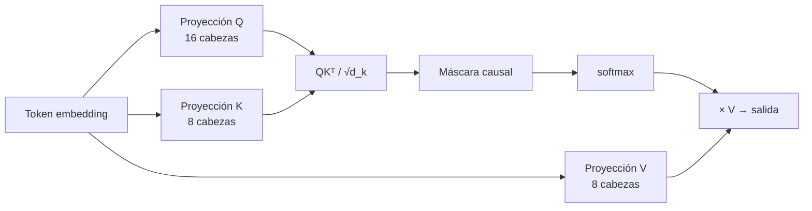
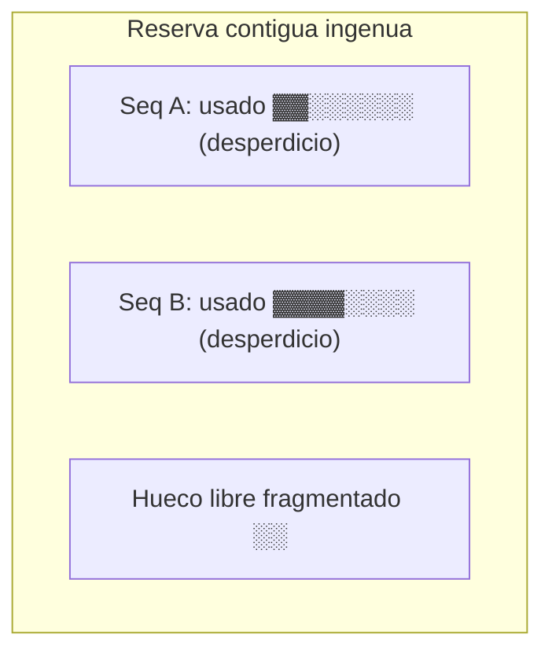
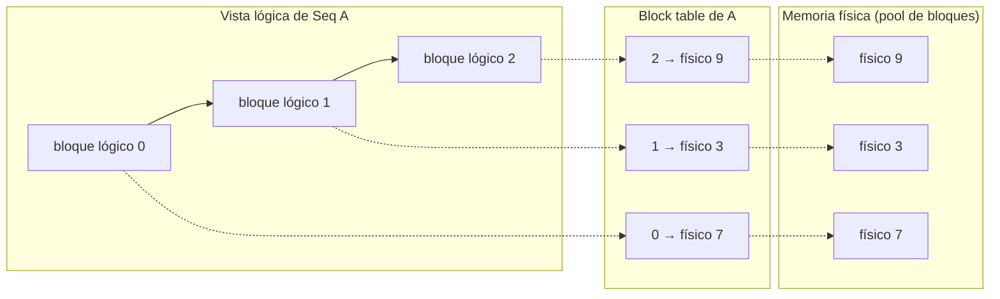

# Atención y KV cache

<!-- CURSO_NAV_TOP -->
[← Modelo de referencia Qwen3-0.6B](02-Modelo-de-referencia-Qwen3-0.6B.md) · [Índice](../README.md) · [El bucle de inferencia →](04-El-bucle-de-inferencia.md)
<!-- /CURSO_NAV_TOP -->


> [!info] Capítulo avanzado
> Los conceptos se aplican a cualquier sistema. Los laboratorios de serving con CUDA se ejecutan mejor en WSL2/Linux o cloud; en Apple Silicon puedes practicar las ideas con llama.cpp, MLX o vLLM-Metal. Consulta [Plataformas y comandos](../PLATAFORMAS-Y-COMANDOS.md).


> [!abstract] En este capítulo
> - Repasar la **atención escalada por producto punto** (*scaled dot-product attention*) lo justo para entender qué se cachea.
> - Entender **por qué** se puede cachear: la causalidad de la atención hace que las claves (*keys*) y valores (*values*) de los tokens previos no cambien.
> - Derivar la **fórmula de coste de memoria** de la KV cache y calcular los números reales para Qwen3-0.6B.
> - Diagnosticar la **fragmentación** de memoria y entender cómo **PagedAttention** la resuelve con una analogía de memoria virtual paginada.
> - Comprender el **prefix caching** (reuso de prompts de sistema) y **FlashAttention** desde el ángulo de E/S (*I/O*).
> - Implementar un **gestor de KV cache pedagógico** por bloques en Python.

La KV cache es, probablemente, la estructura de datos más importante del *serving* de LLM. Es la responsable de que la generación token a token sea barata, y a la vez es la principal consumidora de memoria de GPU durante la inferencia. Entender su funcionamiento es el cimiento sobre el que se apoyan el *batching*, el *scheduling* y casi toda la optimización posterior.

## La atención estándar, en breve

La atención escalada por producto punto (*scaled dot-product attention*) es el operador central del *transformer*. Dado un conjunto de tokens, cada uno se proyecta linealmente en tres vectores: una **consulta** (*query*, $Q$), una **clave** (*key*, $K$) y un **valor** (*value*, $V$). La salida de la atención para una posición es una media ponderada de los valores de todas las posiciones que ese token puede "ver", donde los pesos miden la afinidad entre la consulta de ese token y las claves de los demás.

Formalmente, para matrices $Q, K, V$:

$$
\text{Attention}(Q, K, V) = \text{softmax}\!\left(\frac{Q K^{\top}}{\sqrt{d_k}}\right) V
$$

El término $\sqrt{d_k}$ (con $d_k$ = `head_dim`, en Qwen3-0.6B vale **128**) es el factor de escala. Sin él, para dimensiones grandes los productos punto crecen en magnitud, empujan al *softmax* a regiones de gradiente casi nulo y degradan el aprendizaje y la estabilidad numérica.

En un LLM autorregresivo la atención es **causal**: un token de la posición $i$ solo puede atender a las posiciones $\le i$. Esto se implementa con una máscara triangular que pone $-\infty$ en las posiciones futuras antes del *softmax*.

> [!info] GQA en Qwen3-0.6B
> Qwen3-0.6B no usa atención multi-cabeza pura, sino **GQA** (*Grouped-Query Attention*): tiene **16 cabezas de query** pero solo **8 cabezas de KV**. Cada par de cabezas de query comparte una misma cabeza K/V. Esto es decisivo para la KV cache: lo que se cachea no son las 16 cabezas, sino las **8 cabezas de KV**. GQA es, en esencia, una técnica de compresión de la KV cache aplicada en tiempo de diseño del modelo.



## Por qué funciona el caching

Aquí está la idea clave. Durante la generación, el modelo produce **un token cada paso**. En el paso $t$ ya generamos los tokens $1 \dots t-1$ y queremos producir el token $t$. La pregunta es: ¿necesitamos recalcular las claves y valores de los tokens $1 \dots t-1$?

**No.** Las proyecciones $K$ y $V$ de un token dependen *únicamente* de ese token (y de su posición), no de los tokens futuros. Como la atención es causal, el token de la posición 5 jamás verá al token 6; por tanto, $K_5$ y $V_5$ son idénticos en todos los pasos posteriores. Calcularlos una sola vez y **guardarlos** (cachearlos) es correcto y exacto.

Lo que sí cambia en cada paso es la **query** del token nuevo. En el paso $t$ solo necesitamos:

1. Calcular $Q_t, K_t, V_t$ para el **único** token nuevo.
2. Añadir $K_t, V_t$ a la cache.
3. Calcular la atención de $Q_t$ contra **toda** la KV cache acumulada.

Esto transforma el coste por token de $O(t^2)$ (recalcular toda la matriz de atención) a $O(t)$ (una query contra $t$ claves). Sin KV cache, generar 1000 tokens sería cuadráticamente más caro y los tiempos de respuesta serían inaceptables.

> [!tip] La intuición en una frase
> La KV cache convierte un problema "recalcula todo el pasado en cada paso" en un problema "el pasado ya está hecho, solo añade el presente". Es memoización pura aplicada a la causalidad.

## Coste de memoria de la KV cache: la fórmula y los números

El precio de esa rapidez es memoria. Por cada token y cada capa almacenamos su vector $K$ y su vector $V$. Derivemos el tamaño total.

Para **una** secuencia, la cantidad de elementos almacenados es:

$$
\text{elementos} = \underbrace{2}_{K \text{ y } V} \cdot \;\text{capas}\; \cdot \;\text{kv\_heads}\; \cdot \;\text{head\_dim}\; \cdot \;\text{seq\_len}
$$

Y los **bytes** se obtienen multiplicando por el tamaño en bytes de la precisión:

$$
\boxed{\;\text{bytes} = 2 \cdot \text{capas} \cdot \text{kv\_heads} \cdot \text{head\_dim} \cdot \text{seq\_len} \cdot \text{precisión}\;}
$$

El factor **2** es porque guardamos $K$ **y** $V$. Es crucial usar `kv_heads` (no `query_heads`): gracias a GQA solo cacheamos las cabezas de KV.

Apliquemos los valores de **Qwen3-0.6B**:

| Parámetro | Valor |
|---|---|
| capas | 28 |
| kv_heads | 8 |
| head_dim | 128 |
| precisión (FP16/BF16) | 2 bytes |

**Bytes por token** (todas las capas):

$$
2 \cdot 28 \cdot 8 \cdot 128 \cdot 2 = 114\,688 \text{ bytes} \approx 112 \text{ KiB/token}
$$

Para una secuencia de **seq_len = 32 768** (el contexto máximo de Qwen3-0.6B):

$$
114\,688 \cdot 32\,768 = 3\,758\,096\,384 \text{ bytes} \approx 3{,}5 \text{ GiB}
$$

> [!warning] La cache puede superar al propio modelo
> Qwen3-0.6B pesa aproximadamente **1,2 GiB** en BF16. Sin embargo, la KV cache de **una sola** secuencia a contexto completo (≈3,5 GiB) es **casi tres veces** mayor que los pesos. Si servimos un *batch* de varias secuencias largas, la KV cache domina por completo el presupuesto de memoria de la GPU. Por eso toda la ingeniería de *serving* gira en torno a gestionar la KV cache de forma eficiente.

La fórmula también explica las palancas de optimización: reducir `kv_heads` (GQA/MQA), reducir `precisión` (cuantizar la cache a FP8 o INT8) o reducir `seq_len` efectiva (truncado, *sliding window*). Profundizaremos en [06 - Cuantización y compresión](06-Cuantizacion-y-compresion-avanzada.md).

## El problema de la fragmentación

La forma ingenua de reservar la KV cache es asignar, por cada secuencia, un bloque **contiguo** de memoria dimensionado para `max_tokens`. Funciona, pero desperdicia memoria de tres maneras:

- **Sobre-reserva interna**: si reservamos espacio para 2048 tokens pero la respuesta acaba en 100, los otros 1948 huecos quedan reservados e inutilizables. Es *fragmentación interna*.
- **Fragmentación externa**: al liberar secuencias de tamaños distintos, la memoria libre queda en huecos no contiguos. Puede haber 4 GiB libres en total y aun así no caber una secuencia nueva de 3 GiB porque no hay 3 GiB *seguidos*.
- **Imposibilidad de compartir**: dos peticiones con el mismo prompt de sistema almacenan copias duplicadas porque cada una tiene su bloque propio.



En sistemas reales la fragmentación de la KV cache podía desperdiciar **un 60-80%** de la memoria de GPU. La solución vino de una idea prestada de los sistemas operativos.

## PagedAttention

**PagedAttention** (introducida por vLLM) aplica a la KV cache la misma idea que la **memoria virtual paginada** de un sistema operativo.

> [!example] La analogía con el sistema operativo
> Un SO no entrega a un proceso un bloque físico contiguo de RAM. Le entrega un **espacio de direcciones virtual** continuo que se mapea, mediante una **tabla de páginas**, a **páginas físicas** (típicamente de 4 KiB) dispersas por la RAM. El proceso "cree" que su memoria es contigua; físicamente está fragmentada, pero eso no importa porque la tabla de páginas traduce.

PagedAttention hace exactamente esto:

- La KV cache se trocea en **bloques** (*KV blocks*) de tamaño fijo, cada uno con espacio para un número fijo de tokens (p. ej. 16).
- Cada secuencia tiene una **tabla de bloques** (*block table*) que mapea sus posiciones lógicas a bloques físicos, que pueden estar **en cualquier sitio** de la memoria.
- Se reservan bloques **bajo demanda**, a medida que la secuencia crece. No se sobre-reserva para `max_tokens`.

Beneficios directos:

- **Fragmentación interna mínima**: como mucho se desperdicia el último bloque parcial de cada secuencia (unos pocos tokens).
- **Sin fragmentación externa**: todos los bloques tienen el mismo tamaño, así que cualquier bloque libre sirve para cualquier secuencia.
- **Compartición (sharing)**: varias secuencias pueden apuntar al **mismo** bloque físico (*copy-on-write*), lo que habilita el *prefix caching* y el muestreo paralelo de varias respuestas para un mismo prompt.



## Prefix caching

Una vez que los bloques pueden **compartirse**, surge una optimización potentísima: el **prefix caching** (cacheo de prefijos).

En producción, muchísimas peticiones comparten un **prefijo común**: el *system prompt*, los *few-shot examples*, las instrucciones de formato o un documento RAG reutilizado. Ese prefijo se procesa siempre igual y produce siempre los mismos $K, V$.

Con prefix caching, el motor:

1. Calcula un **hash** del contenido de cada bloque del prefijo.
2. Mantiene un índice de "hash de bloque → bloque físico ya calculado".
3. Cuando llega una petición nueva cuyos primeros bloques coinciden, **reutiliza** los bloques físicos en lugar de recalcular el *prefill*.

> [!tip] El ahorro es enorme
> Si tu *system prompt* tiene 2000 tokens y atiendes 1000 peticiones, sin prefix caching haces el *prefill* de esos 2000 tokens **1000 veces**. Con prefix caching lo haces **una** vez y las otras 999 peticiones empiezan a generar casi de inmediato. Esto reduce la latencia de primer token (*TTFB*) y el consumo de cómputo de *prefill* drásticamente. Más sobre estas métricas en [11 - Observabilidad y monitorización](10-Observabilidad-y-monitorizacion.md).

El requisito es que el prefijo sea **idéntico byte a byte** (mismos tokens, mismas posiciones). Por eso conviene poner las partes estables del prompt al principio y las variables al final.

## FlashAttention: el ángulo de I/O

PagedAttention optimiza **cómo se guarda** la KV cache. **FlashAttention** optimiza **cómo se calcula** la atención, y su perspectiva clave no es el cómputo, sino la **E/S de memoria** (*I/O*).

Una GPU tiene dos niveles de memoria muy distintos:

| Memoria | Tamaño | Ancho de banda | Latencia |
|---|---|---|---|
| **HBM** (*High Bandwidth Memory*, la VRAM grande) | decenas de GiB | alto pero limitado | alta |
| **SRAM** (*on-chip*, por SM) | decenas-cientos de KiB | brutal (≈10-20×) | mínima |

La atención ingenua materializa la matriz $S = QK^{\top}$ completa en HBM. Esa matriz es de tamaño $\text{seq\_len} \times \text{seq\_len}$: para 32k tokens son más de mil millones de entradas. Escribirla y volver a leerla de HBM (para el *softmax* y la multiplicación por $V$) satura el ancho de banda. La atención es **memory-bound**, no *compute-bound*: la GPU pasa más tiempo moviendo datos que calculando.

**FlashAttention** evita materializar $S$ en HBM mediante dos técnicas:

- **Tiling (mosaico)**: trocea $Q$, $K$ y $V$ en bloques que **caben en SRAM**. Calcula la atención bloque a bloque sin escribir nunca la matriz completa en HBM.
- **Softmax online (running softmax)**: para hacer el *softmax* por bloques sin verlo entero, mantiene de forma incremental el máximo y la suma de exponenciales, reescalando los resultados parciales. Esto da el resultado **exacto** del *softmax*, no una aproximación.
- **Kernel fusionado (kernel fusion)**: todas las operaciones (producto punto, máscara, *softmax*, multiplicación por $V$) se realizan en **un único kernel** de GPU, evitando viajes de ida y vuelta a HBM entre pasos.

> [!info] Exacto, no aproximado
> FlashAttention no cambia el resultado matemático: produce **exactamente** la misma salida que la atención estándar. Solo cambia el *orden* de las operaciones para minimizar el tráfico HBM↔SRAM. Por eso es seguro usarla por defecto. El resultado: menos memoria (no se almacena $S$, que es $O(n^2)$) y más velocidad (menos E/S).

PagedAttention y FlashAttention son **complementarias**: la primera gestiona el almacenamiento de la cache, la segunda acelera el cálculo que la consume.

## Un gestor de KV cache pedagógico

Cerramos con una implementación **ilustrativa** (no optimizada) de un gestor de KV cache por bloques, al estilo de PagedAttention, para fijar los conceptos.

```python
import torch

class GestorKVCache:
    """Gestor de KV cache por bloques, estilo PagedAttention (pedagógico).

    Trocea la memoria en bloques de tamaño fijo y los asigna bajo demanda.
    Cada secuencia mantiene su propia "block table" (lista de bloques físicos).
    """

    def __init__(self, num_bloques, tokens_por_bloque, capas,
                 kv_heads, head_dim, dtype=torch.bfloat16, device="cuda"):
        self.tokens_por_bloque = tokens_por_bloque
        self.capas = capas

        # Pool físico: forma [num_bloques, 2(K/V), capas, kv_heads,
        #                     tokens_por_bloque, head_dim]
        # El factor 2 corresponde a K y V (igual que en la fórmula de memoria).
        self.pool = torch.zeros(
            (num_bloques, 2, capas, kv_heads, tokens_por_bloque, head_dim),
            dtype=dtype, device=device,
        )
        # Lista de bloques físicos libres (cualquiera sirve: sin fragmentación externa).
        self.bloques_libres = list(range(num_bloques))
        # Mapa: id_secuencia -> block table (lista de índices físicos).
        self.block_tables = {}
        # Longitud lógica (nº de tokens ya escritos) por secuencia.
        self.longitudes = {}

    def reservar_bloque(self):
        """Saca un bloque del pool libre, o falla si no hay (señal de OOM)."""
        if not self.bloques_libres:
            raise MemoryError("Sin bloques de KV cache libres: hay que evict/preempt")
        return self.bloques_libres.pop()

    def añadir_secuencia(self, id_seq):
        self.block_tables[id_seq] = []
        self.longitudes[id_seq] = 0

    def añadir_token(self, id_seq, k_token, v_token):
        """Escribe el K,V de UN token nuevo en la cache (paso de decode).

        k_token, v_token: tensores [capas, kv_heads, head_dim].
        """
        long_actual = self.longitudes[id_seq]
        tabla = self.block_tables[id_seq]

        # ¿Cabe en el último bloque o hay que reservar uno nuevo?
        if long_actual % self.tokens_por_bloque == 0:
            tabla.append(self.reservar_bloque())  # crece bajo demanda

        bloque_fisico = tabla[-1]
        offset = long_actual % self.tokens_por_bloque  # posición dentro del bloque

        # Escribimos K (índice 0) y V (índice 1) en el slot correspondiente.
        self.pool[bloque_fisico, 0, :, :, offset, :] = k_token
        self.pool[bloque_fisico, 1, :, :, offset, :] = v_token
        self.longitudes[id_seq] += 1

    def leer_kv(self, id_seq, capa):
        """Reconstruye la vista lógica contigua de K y V de una capa.

        En un sistema real, el kernel de atención lee directamente los
        bloques físicos vía la block table, sin esta copia. Aquí copiamos
        por claridad.
        """
        tabla = self.block_tables[id_seq]
        long_actual = self.longitudes[id_seq]
        ks, vs = [], []
        for i, bloque_fisico in enumerate(tabla):
            # El último bloque puede estar parcialmente lleno.
            inicio = i * self.tokens_por_bloque
            n = min(self.tokens_por_bloque, long_actual - inicio)
            ks.append(self.pool[bloque_fisico, 0, capa, :, :n, :])
            vs.append(self.pool[bloque_fisico, 1, capa, :, :n, :])
        # Concatenamos en la dimensión de secuencia (dim=1: tokens).
        return torch.cat(ks, dim=1), torch.cat(vs, dim=1)

    def liberar(self, id_seq):
        """Devuelve los bloques al pool: aquí NO hay fragmentación externa
        porque todos los bloques son intercambiables."""
        for bloque_fisico in self.block_tables.pop(id_seq):
            self.bloques_libres.append(bloque_fisico)
        del self.longitudes[id_seq]
```

> [!warning] Qué falta para producción
> Este gestor omite: muestreo de varias secuencias compartiendo prefijo (*copy-on-write* y *prefix caching* vía hashing de bloques), *eviction*/*preemption* cuando se agota el pool, escritura coalescente, y por supuesto la integración con un kernel tipo FlashAttention que lea los bloques físicos sin la copia de `leer_kv`. Sirve para entender el modelo mental, no para servir tráfico real.

> [!success] Puntos clave
> - La KV cache evita recalcular $K$ y $V$ del pasado porque la **atención causal** los hace inmutables; reduce el coste por token de $O(t^2)$ a $O(t)$.
> - El coste de memoria es $2 \cdot \text{capas} \cdot \text{kv\_heads} \cdot \text{head\_dim} \cdot \text{seq\_len} \cdot \text{precisión}$. Para **Qwen3-0.6B** son ≈**112 KiB/token** y ≈**3,5 GiB** a contexto de 32k, **mayor que los propios pesos**.
> - **GQA** (8 kv_heads frente a 16 query_heads) ya es una compresión de la cache integrada en el modelo.
> - La reserva contigua ingenua sufre **fragmentación interna y externa**; **PagedAttention** la elimina paginando la cache en bloques de tamaño fijo con una *block table*.
> - El **prefix caching** reutiliza bloques de prompts comunes (system prompts, RAG) y recorta el *prefill* repetido.
> - **FlashAttention** es una optimización de **E/S**: con *tiling*, *softmax* online y *kernel fusion* evita materializar $QK^{\top}$ en HBM, dando el resultado exacto más rápido y con menos memoria.

## Enlaces relacionados

- [02 - Modelo de referencia Qwen3-0.6B](02-Modelo-de-referencia-Qwen3-0.6B.md) — de dónde salen capas, kv_heads y head_dim.
- [04 - El bucle de inferencia](04-El-bucle-de-inferencia.md) — cómo se usa la KV cache en *prefill* y *decode*.
- [05 - Batching y scheduling](05-Batching-y-scheduling.md) — cómo el *scheduler* reparte los bloques entre peticiones.
- [06 - Cuantización y compresión](06-Cuantizacion-y-compresion-avanzada.md) — cuantizar la KV cache para reducir la `precisión`.
- [11 - Observabilidad y monitorización](10-Observabilidad-y-monitorizacion.md) — métricas de uso de cache y *cache hit rate*.
- [Apéndice A - Fundamentos matemáticos](../07-Anexos/F-Fundamentos-matematicos.md) — *softmax*, productos punto y estabilidad numérica.

---

---


Curso creado por [@are_agi](https://twitter.com/are_agi).

---


Curso creado por [@are_agi](https://twitter.com/are_agi).

---

<!-- CURSO_NAV_BOTTOM -->
[← Modelo de referencia Qwen3-0.6B](02-Modelo-de-referencia-Qwen3-0.6B.md) · [Índice](../README.md) · [El bucle de inferencia →](04-El-bucle-de-inferencia.md)
<!-- /CURSO_NAV_BOTTOM -->

Curso creado por [@are_agi](https://twitter.com/are_agi).
