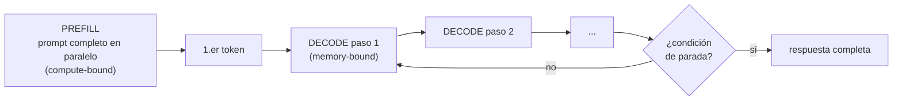

# El bucle de inferencia

<!-- CURSO_NAV_TOP -->
[← Atención y KV cache](03-Atencion-y-KV-cache.md) · [Índice](../README.md) · [Batching y scheduling →](05-Batching-y-scheduling.md)
<!-- /CURSO_NAV_TOP -->


> [!NOTE]
> **Capítulo avanzado**
> Los conceptos se aplican a cualquier sistema. Los laboratorios de serving con CUDA se ejecutan mejor en WSL2/Linux o cloud; en Apple Silicon puedes practicar las ideas con llama.cpp, MLX o vLLM-Metal. Consulta [Plataformas y comandos](../PLATAFORMAS-Y-COMANDOS.md).


> [!NOTE]
> **En este capítulo**
> - Entender que los **tokens no son palabras** y por qué eso importa para el coste y el comportamiento.
> - Distinguir las dos fases del bucle: **prefill** (compute-bound) y **decode** (memory-bound), y por qué tienen perfiles de rendimiento opuestos.
> - Dominar las estrategias de **sampling**: *greedy*, *temperature*, *top-k* y *top-p* (*nucleus*).
> - Definir las **condiciones de parada**: *EOS*, `max_tokens` y *stop strings*.
> - **Juntarlo todo** en un motor de inferencia simple en Python que implementa el bucle *prefill* + *decode* con KV cache.

En [03 - Atención y KV cache](03-Atencion-y-KV-cache.md) vimos la estructura de datos clave. Ahora vemos el **algoritmo** que la usa: el bucle de inferencia autorregresivo, el corazón que late en cada generación de texto.

## Los tokens no son palabras

Un LLM no procesa caracteres ni palabras: procesa **tokens**. Un *tokenizador* (normalmente de tipo **BPE**, *Byte-Pair Encoding*) divide el texto en subunidades del vocabulario del modelo. Qwen3 usa un vocabulario grande (≈151k tokens) basado en *byte-level BPE*, capaz de representar cualquier secuencia de bytes.

Consecuencias prácticas que conviene tener grabadas:

- **Un token ≈ 3-4 caracteres** en inglés; en español la ratio suele ser algo peor (más tokens por palabra) porque el vocabulario está sesgado hacia el inglés.
- **Palabras frecuentes** (`the`, `de`, `que`) suelen ser **un** token; palabras raras, nombres propios o código se parten en **varios** tokens.
- Los **espacios** y la puntuación forman parte de los tokens (el espacio inicial suele ir pegado a la palabra: `" hola"` es distinto de `"hola"`).
- Hay **tokens especiales** de control: inicio/fin de turno, fin de secuencia (*EOS*), etc.

> [!WARNING]
> **Por qué esto importa en LLMOps**
> Facturación, límites de contexto, latencia y coste se miden en **tokens**, no en palabras ni caracteres. Una estimación "1 palabra = 1 token" puede equivocarse en un 30-50% según el idioma. La tokenización también explica errores clásicos: el modelo "no sabe" contar las letras de una palabra porque nunca ve letras, ve tokens. Para idiomas como el español o para código, conviene **medir** el ratio token/carácter real con el tokenizador del modelo, no asumirlo.

```python
from transformers import AutoTokenizer

# El tokenizador es específico de cada modelo: nunca mezclar.
tok = AutoTokenizer.from_pretrained("Qwen/Qwen3-0.6B")

texto = "El serving de LLM es memory-bound."
ids = tok.encode(texto)
print(len(ids), "tokens")            # nº real de tokens, no de palabras
print(tok.convert_ids_to_tokens(ids))  # ver cómo se ha partido el texto
```

## Prefill frente a decode

El bucle de inferencia tiene **dos fases** con perfiles de rendimiento radicalmente distintos. Entender esta diferencia es la base de casi toda la optimización de *serving*.

**Prefill (relleno):** se procesa el *prompt* completo de entrada **de una sola vez**, en paralelo. Se calculan los $Q, K, V$ de todos los tokens del prompt, se rellena la KV cache y se produce el **primer** token de salida. Como hay muchos tokens que procesar simultáneamente, hay muchísimo trabajo matricial paralelo: la GPU está **compute-bound** (limitada por capacidad de cómputo, *FLOPs*). Las matrices son grandes y densas, los *tensor cores* trabajan a pleno rendimiento.

**Decode (decodificación):** se genera el resto de la respuesta **token a token**. En cada paso se procesa **un solo** token nuevo, se consulta su query contra toda la KV cache y se emite el siguiente token. Aquí el cuello de botella no es el cómputo (es ridículamente poco: una query contra la cache), sino **leer de memoria** todos los pesos del modelo y toda la KV cache para producir un único token. La GPU está **memory-bound** (limitada por ancho de banda de memoria).

| Aspecto | Prefill | Decode |
|---|---|---|
| Tokens procesados por paso | todos los del prompt | **1** |
| Pasos | 1 | tantos como tokens de salida |
| Cuello de botella | **cómputo** (FLOPs) | **memoria** (ancho de banda) |
| Métrica asociada | *TTFT* (time to first token) | *TPOT* / *ITL* (time per output token) |
| Utilización de GPU | alta | baja por petición individual |



> [!NOTE]
> **Por qué esto cambia el diseño del sistema**
> Como *decode* es memory-bound y procesa un token por paso, una GPU está **infrautilizada** sirviendo una sola petición en decode. La solución es el **batching**: procesar muchas secuencias a la vez para reaprovechar el ancho de banda (los pesos se leen una vez y sirven a todo el *batch*). Esto, y la convivencia de peticiones en *prefill* y *decode*, es el tema de [05 - Batching y scheduling](05-Batching-y-scheduling.md).

## Sampling

Tras cada paso, el modelo produce un vector de **logits**: una puntuación sin normalizar por cada token del vocabulario (≈151k valores en Qwen3). La estrategia de **sampling** decide qué token elegir a partir de esos logits.

**Greedy (codicioso):** elige siempre el token de mayor logit ($\arg\max$). Es determinista y rápido, pero tiende a producir texto repetitivo y plano. Útil cuando se quiere reproducibilidad o en tareas con una única respuesta correcta.

**Temperature (temperatura):** antes del *softmax*, se dividen los logits por un escalar $T$:

$$
p_i = \frac{\exp(z_i / T)}{\sum_j \exp(z_j / T)}
$$

- $T < 1$ → distribución **más afilada** (más confianza, más conservador).
- $T = 1$ → distribución original del modelo.
- $T > 1$ → distribución **más plana** (más aleatorio, más creativo).
- $T \to 0$ → equivale a *greedy*.

**Top-k:** se restringe el muestreo a los **k** tokens de mayor probabilidad; el resto se descarta (probabilidad 0) y se renormaliza. Limita la cola de tokens improbables, pero $k$ es fijo y no se adapta a si la distribución es muy concentrada o muy dispersa.

**Top-p (nucleus sampling):** en vez de un número fijo de tokens, se toma el **conjunto más pequeño** cuya probabilidad acumulada supera el umbral $p$ (p. ej. 0,9), y se muestrea dentro de él. Es **adaptativo**: si el modelo está muy seguro, el núcleo tiene pocos tokens; si está indeciso, tiene más. Suele dar el mejor equilibrio calidad/diversidad.

> [!TIP]
> **Cómo se combinan en la práctica**
> El orden habitual es: aplicar **temperature** → filtrar con **top-k** → filtrar con **top-p** → muestrear. Valores típicos de chat: `temperature ≈ 0.7`, `top_p ≈ 0.9`. Para tareas deterministas (extracción, clasificación, código con tests), usa `temperature = 0` (greedy). El muestreo afecta directamente a la reproducibilidad y a la evaluación: ver [13 - Evaluación y monitorización de calidad](12-Evaluacion-y-calidad-en-produccion.md).

```python
import torch

def aplicar_sampling(logits, temperature=1.0, top_k=0, top_p=1.0):
    """Convierte logits en un token muestreado. logits: tensor [vocab]."""
    if temperature == 0:                      # greedy: caso especial
        return int(torch.argmax(logits))

    logits = logits / temperature             # 1) temperatura

    if top_k > 0:                             # 2) top-k
        umbral = torch.topk(logits, top_k).values[-1]
        logits[logits < umbral] = float("-inf")

    probs = torch.softmax(logits, dim=-1)

    if top_p < 1.0:                           # 3) top-p / nucleus
        ordenadas, indices = torch.sort(probs, descending=True)
        acum = torch.cumsum(ordenadas, dim=-1)
        # Mantener el núcleo mínimo cuya masa acumulada supera p.
        quitar = acum > top_p
        quitar[1:] = quitar[:-1].clone()      # incluir el token que cruza el umbral
        quitar[0] = False
        ordenadas[quitar] = 0.0
        probs = torch.zeros_like(probs).scatter_(0, indices, ordenadas)
        probs = probs / probs.sum()           # renormalizar

    return int(torch.multinomial(probs, num_samples=1))  # 4) muestrear
```

## Condiciones de parada

El bucle de *decode* no es infinito. Se detiene por alguna de estas condiciones:

- **EOS (*end-of-sequence*)**: el modelo emite el token especial de fin (en Qwen3, los tokens de fin de turno tipo `<|im_end|>`). Es la parada "natural": el modelo decide que ha terminado.
- **`max_tokens`**: tope duro de tokens de salida. Imprescindible como red de seguridad: evita bucles infinitos, controla coste y latencia, y protege el presupuesto de KV cache.
- **Stop strings (*stop sequences*)**: cadenas de texto que, al aparecer, detienen la generación (p. ej. `"\nUsuario:"` para que el asistente no siga el turno del usuario, o `"```"` para cerrar un bloque de código). Operan a nivel de **texto detokenizado**, no de token, porque una cadena de parada puede repartirse entre varios tokens.

> [!CAUTION]
> **Siempre fija un max_tokens**
> Sin `max_tokens`, una petición patológica (o un modelo que entra en bucle de repetición) puede generar indefinidamente, ocupando la KV cache y la GPU, degradando a todas las demás peticiones del *batch* y disparando el coste. En producción es un parámetro **obligatorio**, no opcional.

## Juntándolo todo: un motor de inferencia simple

Reunimos las piezas —tokenización, *prefill*, KV cache, *decode*, *sampling* y paradas— en un motor **mínimo y pedagógico** para una sola secuencia. El objetivo es que el bucle se vea de un vistazo; no es código de producción.

```python
import torch
from transformers import AutoModelForCausalLM, AutoTokenizer

class MotorInferenciaSimple:
    """Bucle de inferencia prefill + decode con KV cache (una secuencia).

    Usa la KV cache nativa de transformers (past_key_values) para no
    recalcular el pasado, exactamente como vimos en el capítulo 3.
    """

    def __init__(self, nombre_modelo="Qwen/Qwen3-0.6B", device="cuda"):
        self.device = device
        self.tok = AutoTokenizer.from_pretrained(nombre_modelo)
        self.model = AutoModelForCausalLM.from_pretrained(
            nombre_modelo, torch_dtype=torch.bfloat16
        ).to(device).eval()

    @torch.inference_mode()  # sin grafo de gradientes: más rápido y menos memoria
    def generar(self, prompt, max_tokens=256, temperature=0.7,
                top_k=20, top_p=0.9, stop_strings=None):
        stop_strings = stop_strings or []

        # --- TOKENIZACIÓN ---
        ids = self.tok(prompt, return_tensors="pt").input_ids.to(self.device)

        # --- PREFILL (compute-bound): todo el prompt de una vez ---
        # use_cache=True hace que el modelo devuelva la KV cache rellena.
        salida = self.model(ids, use_cache=True)
        kv_cache = salida.past_key_values          # KV de todo el prompt
        logits = salida.logits[0, -1, :]           # logits del ÚLTIMO token

        generados = []
        # El token EOS marca la parada natural.
        eos_ids = set(self.tok.all_special_ids)

        # --- DECODE (memory-bound): un token por iteración ---
        for _ in range(max_tokens):
            siguiente = aplicar_sampling(
                logits.clone(), temperature, top_k, top_p
            )

            # Condición de parada: EOS
            if siguiente in eos_ids:
                break

            generados.append(siguiente)

            # Condición de parada: stop string (sobre el texto detokenizado)
            texto_actual = self.tok.decode(generados)
            if any(s in texto_actual for s in stop_strings):
                # Recortar en la cadena de parada y salir.
                for s in stop_strings:
                    if s in texto_actual:
                        texto_actual = texto_actual.split(s)[0]
                return texto_actual

            # Paso de decode: SOLO el token nuevo entra al modelo,
            # el pasado vive en kv_cache (esto es el ahorro O(t) vs O(t²)).
            entrada = torch.tensor(siguiente, device=self.device)
            salida = self.model(entrada, past_key_values=kv_cache, use_cache=True)
            kv_cache = salida.past_key_values      # cache crecida en 1 token
            logits = salida.logits[0, -1, :]

        # Condición de parada implícita: se alcanzó max_tokens.
        return self.tok.decode(generados)


# --- Uso ---
# motor = MotorInferenciaSimple()
# print(motor.generar("Explica qué es la KV cache:", max_tokens=120))
```

> [!TIP]
> **Lectura guiada del bucle**
> 1. **Tokeniza** el prompt → `ids`.
> 2. **Prefill**: un único *forward* sobre todo el prompt llena la KV cache y da los logits del último token (compute-bound).
> 3. **Decode**: en cada vuelta se muestrea un token, se comprueban las paradas y se hace un *forward* de **un solo** token reutilizando `past_key_values` (memory-bound).
> 4. Sale por **EOS**, **stop string** o **max_tokens**.

> [!WARNING]
> **Lo que falta para producción**
> Este motor sirve **una** petición a la vez, lo que deja la GPU infrautilizada en *decode*. Le faltan: *batching* dinámico de muchas secuencias, *scheduling* de prefill/decode, gestión paginada de la KV cache (capítulo 3), *streaming* de tokens al cliente, manejo de errores y métricas. Esas piezas son justo lo que añaden vLLM, TGI o SGLang, y lo que veremos en [05 - Batching y scheduling](05-Batching-y-scheduling.md).

> [!TIP]
> **Puntos clave**
> - El modelo opera sobre **tokens** (BPE), no palabras: coste, contexto y facturación se miden en tokens y el ratio token/carácter varía con el idioma.
> - El bucle tiene dos fases: **prefill** (todo el prompt en paralelo, *compute-bound*, fija el *TTFT*) y **decode** (un token por paso, *memory-bound*, fija el *TPOT*).
> - El **sampling** transforma logits en tokens: *greedy* (determinista), *temperature* (afila/aplana), *top-k* (k fijo) y *top-p/nucleus* (adaptativo). Se combinan en ese orden.
> - Las **condiciones de parada** son **EOS**, **max_tokens** (obligatorio como red de seguridad) y **stop strings** (sobre texto detokenizado).
> - Un motor mínimo encadena tokenización → *prefill* con KV cache → *decode* token a token con *sampling* y paradas; servir **una** petición infrautiliza la GPU, lo que motiva el *batching*.

## Enlaces relacionados

- [03 - Atención y KV cache](03-Atencion-y-KV-cache.md) — la estructura que el bucle de decode reutiliza paso a paso.
- [05 - Batching y scheduling](05-Batching-y-scheduling.md) — cómo servir muchas peticiones a la vez y exprimir el decode memory-bound.
- [07 - Decodificación especulativa](07-Decodificacion-especulativa.md) — acelerar el decode generando varios tokens por paso.
- [11 - Observabilidad y monitorización](10-Observabilidad-y-monitorizacion.md) — métricas TTFT, TPOT y throughput.
- [13 - Evaluación y monitorización de calidad](12-Evaluacion-y-calidad-en-produccion.md) — cómo el sampling afecta a la reproducibilidad y la evaluación.
- [Apéndice A - Fundamentos matemáticos](../07-Anexos/F-Fundamentos-matematicos.md) — softmax, logits y temperatura.

---

---


Curso creado por [@are_agi](https://twitter.com/are_agi).

---


Curso creado por [@are_agi](https://twitter.com/are_agi).

---

<!-- CURSO_NAV_BOTTOM -->
[← Atención y KV cache](03-Atencion-y-KV-cache.md) · [Índice](../README.md) · [Batching y scheduling →](05-Batching-y-scheduling.md)
<!-- /CURSO_NAV_BOTTOM -->

Curso creado por [@are_agi](https://twitter.com/are_agi).
