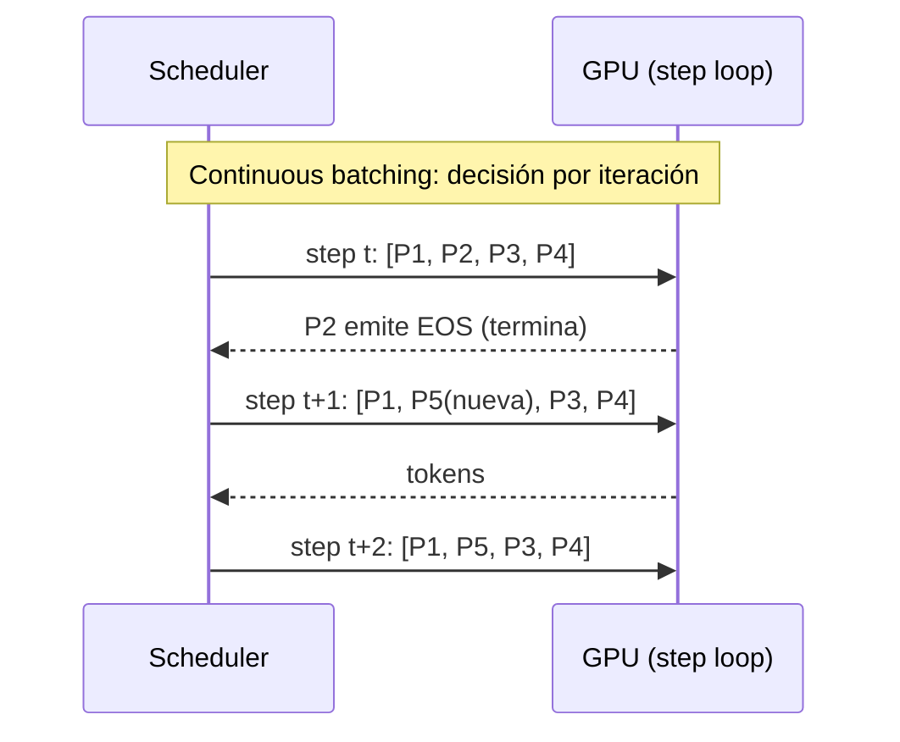
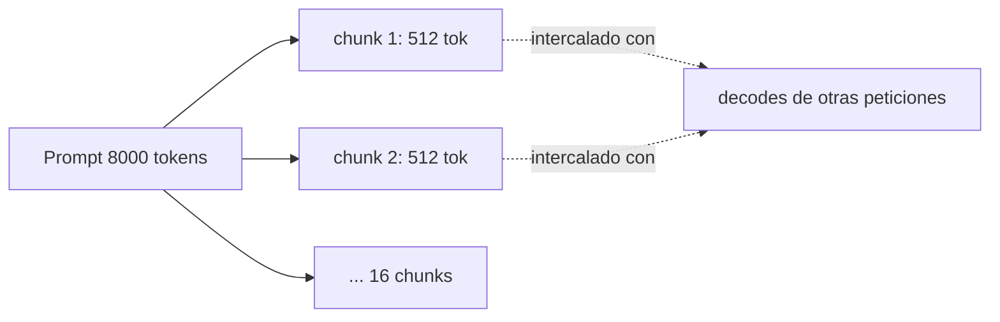
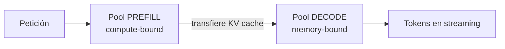
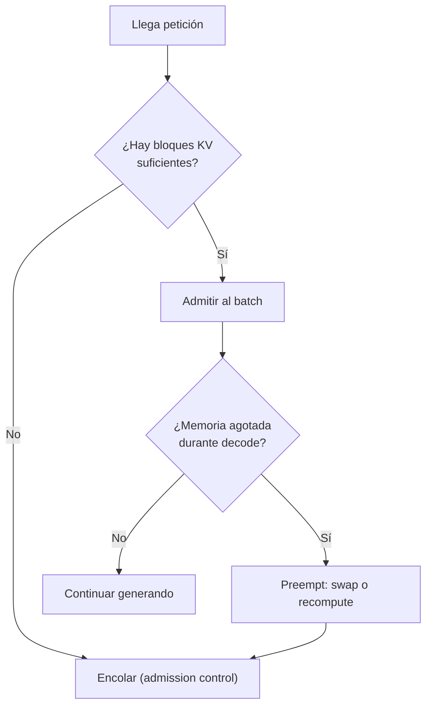

# Batching y scheduling

<!-- CURSO_NAV_TOP -->
[← El bucle de inferencia](04-El-bucle-de-inferencia.md) · [Índice](../README.md) · [Cuantización y compresión →](06-Cuantizacion-y-compresion-avanzada.md)
<!-- /CURSO_NAV_TOP -->

> [!NOTE]
> **Capítulo avanzado**
> Los conceptos se aplican a cualquier sistema. Los laboratorios de serving con CUDA se ejecutan mejor en WSL2/Linux o cloud; en Apple Silicon puedes practicar las ideas con llama.cpp, MLX o vLLM-Metal. Consulta [Plataformas y comandos](../PLATAFORMAS-Y-COMANDOS.md).

> [!NOTE]
> **En este capítulo**
> El batching es la palanca individual más potente del servidor de inferencia: convierte un kernel **memory-bound** en uno mucho más eficiente reutilizando los pesos del modelo entre muchas peticiones. Vamos a entender, desde primeros principios, **por qué** el batching gana tan dramáticamente; cómo evolucionamos del batching estático al **continuous batching**; cómo el **chunked prefill** y la **desagregación prefill/decode** protegen la latencia inter-token; y qué políticas de scheduling, admission control y preemption evitan que el servidor colapse por falta de memoria. Cerramos con el tuning operativo de los parámetros que realmente mueven la aguja. Todos los ejemplos se anclan en **Qwen3-0.6B**.

## Por qué el batching gana de forma tan dramática

Para entender el batching hay que entender qué limita la velocidad de la inferencia autorregresiva. En la fase de **decode** (generar un token cada vez), el modelo realiza, por cada token, una multiplicación de la activación de un único token por todas las matrices de pesos del modelo. El cuello de botella no es el cálculo: es **mover los pesos desde la memoria HBM de la GPU hasta los registros**. Decimos que el kernel es **memory-bound** (limitado por ancho de banda de memoria), no **compute-bound** (limitado por FLOPs).

Esto se formaliza con la **intensidad aritmética** (*arithmetic intensity*), el cociente entre operaciones de cómputo y bytes leídos de memoria:

$$
I = \frac{\text{FLOPs}}{\text{bytes leídos}}
$$

El modelo de rendimiento *roofline* dice que el rendimiento alcanzable es:

$$
\text{rendimiento} = \min\left(\text{pico de FLOP/s},\; I \times \text{ancho de banda}\right)
$$

Si $I$ es bajo, dominamos por ancho de banda y la GPU desperdicia su capacidad de cómputo. En el decode con **batch size = 1**, leemos todos los pesos del modelo para producir un solo token: la intensidad aritmética es ínfima.

Aquí entra el truco clave: si procesamos **B peticiones a la vez**, leemos los pesos **una sola vez** desde HBM pero los reutilizamos para B activaciones distintas. La lectura de pesos (el coste caro) se **amortiza** entre B tokens.

> [!TIP]
> **La intuición de un sólo número**
> Cargar los pesos de Qwen3-0.6B (unos 0,6 mil millones de parámetros, ~1,2 GB en FP16) cuesta lo mismo tanto si generas 1 token como si generas 64 simultáneamente. Con batch=64, el coste por token de mover pesos se divide casi por 64. El cómputo extra (los GEMM crecen) sí aumenta, pero como partíamos de estar memory-bound, hay enorme margen antes de saturar los FLOPs.

La matriz de pesos $W \in \mathbb{R}^{d \times d}$ se multiplica por una activación. Con batch=1 es un **GEMV** (matriz por vector), notoriamente ineficiente en GPU. Con batch=B se convierte en un **GEMM** (matriz por matriz) $X \in \mathbb{R}^{B \times d}$, que las GPU ejecutan a una fracción muchísimo mayor de su pico:

$$
Y = X W, \qquad X \in \mathbb{R}^{B \times d}, \; W \in \mathbb{R}^{d \times d}
$$

> [!WARNING]
> **El batching no es gratis**
> El batching mejora el **throughput** (tokens/segundo agregados) pero puede degradar la **latencia por petición** individual, porque cada token compartido espera a sus compañeros de batch. Todo el resto del capítulo trata, en el fondo, de cómo cosechar el throughput sin destrozar la latencia.

## Batching estático, dinámico y continuo

El reto del batching en LLMs es que las peticiones **no tienen la misma longitud** ni **empiezan al mismo tiempo**. Hay tres estrategias, en orden creciente de sofisticación.

**Batching estático (static batching).** Agrupamos N peticiones, las ejecutamos juntas y no devolvemos ninguna hasta que **todas** terminan. Sencillo, pero desastroso: si una petición genera 1.000 tokens y las otras 10, las cortas se quedan bloqueadas (*head-of-line blocking*) hasta que termine la larga. La GPU procesa secuencias ya acabadas que solo generan tokens de relleno (*padding*).

**Batching dinámico (dynamic batching).** Esperamos una ventana corta (p. ej. unos pocos milisegundos) para acumular peticiones que llegan casi a la vez y lanzarlas juntas. Reduce la latencia de cola frente al estático, pero sigue tratando el batch como una unidad atómica: una vez lanzado, no entran ni salen peticiones hasta que termina.

**Continuous batching (también *in-flight batching* o *iteration-level scheduling*).** Es el estándar actual (vLLM, TensorRT-LLM). La clave: el scheduler decide el contenido del batch **en cada iteración del bucle de generación** (cada *step*), no por lote completo. En cuanto una secuencia emite su token de fin (EOS), libera su hueco y el scheduler admite **inmediatamente** una petición nueva en ese slot, sin esperar a las demás.

> [!NOTE]
> **Por qué el continuous batching es tan superior**
> Elimina el padding y el head-of-line blocking: ninguna secuencia espera a otra para liberar recursos. La GPU se mantiene saturada de trabajo útil. En cargas reales el throughput sube de forma muy notable frente al estático, manteniendo la latencia bajo control.

## Chunked prefill: cómo protege la inter-token latency

Hay que separar las dos fases de la inferencia:

- **Prefill**: procesa el prompt completo de entrada en paralelo. Es **compute-bound** y opera sobre muchos tokens a la vez; consume mucha GPU en una sola ráfaga.
- **Decode**: genera token a token, **memory-bound**, ligero por step.

El problema: si una petición nueva con un prompt larguísimo (p. ej. 8.000 tokens) entra en prefill, ese step monopoliza la GPU durante mucho tiempo. Todas las peticiones que estaban en decode **se congelan** ese rato, y sus usuarios ven un parón en el streaming. Esto degrada la **ITL** (*inter-token latency*, el tiempo entre tokens consecutivos) y la métrica de cola TBT (*time between tokens*).

El **chunked prefill** trocea el prefill en bloques de tamaño acotado (p. ej. 512 tokens por chunk) y los **intercala** con los steps de decode de las demás peticiones. En cada step, el scheduler mezcla un trozo de prefill con varios decodes.

> [!TIP]
> **El compromiso del chunked prefill**
> Trocear protege la ITL de las peticiones en curso (no se congelan) a costa de aumentar ligeramente el **TTFT** (*time to first token*) de la petición nueva, porque su prefill tarda más en completarse al repartirse. Es exactamente el compromiso que quieres en un servicio interactivo: nadie sufre un parón largo.

## Prefill y decode desagregados (disaggregated)

Prefill y decode tienen perfiles de hardware **opuestos**: prefill quiere FLOPs, decode quiere ancho de banda de memoria y KV cache. Ejecutarlos en la misma GPU obliga a comprometer la configuración para ambos a la vez.

La **desagregación prefill/decode** (*disaggregated serving*) los ejecuta en **conjuntos de GPU distintos**:

- Las **GPU de prefill** procesan los prompts y generan la **KV cache** (ver [03 - Atención y KV cache](03-Atencion-y-KV-cache.md)).
- Esa KV cache se **transfiere** (idealmente por interconexión rápida, NVLink o RDMA) a las **GPU de decode**, que generan los tokens.

> [!NOTE]
> **Ventajas e inconvenientes**
> Ventaja: cada pool se dimensiona y optimiza por separado, y el prefill de uno nunca interfiere con el decode de otro (latencias más predecibles, mejor cumplimiento de SLO). Inconveniente: la **transferencia de la KV cache** introduce coste de red y complejidad operativa; sólo compensa a cierta escala. Para un despliegue de Qwen3-0.6B en una sola GPU casi nunca merece la pena; sí en grandes flotas multi-GPU (ver [08 - De una GPU a inferencia multi-GPU](08-De-una-GPU-a-multi-GPU.md)).

## Políticas de scheduling

El scheduler decide, en cada step, **qué peticiones** entran en el batch y en qué orden. Las políticas principales:

| Política | Idea | Ventaja | Riesgo |
|---|---|---|---|
| **FCFS** (*first-come, first-served*) | Por orden de llegada | Justa y simple; sin *starvation* | Una petición larga retrasa a las que llegan después |
| **Prioridades** | Cada petición tiene una clase (p. ej. interactivo > batch) | Cumple SLO diferenciados | Las de baja prioridad pueden morir de hambre (*starvation*) |
| **Fairness** | Reparto equitativo de recursos entre usuarios/tenants | Evita que un usuario acapare | Más complejo de implementar y ajustar |

> [!TIP]
> **FCFS con continuous batching**
> vLLM usa por defecto una política tipo FCFS sobre el continuous batching: las peticiones se admiten por orden de llegada según haya hueco de KV cache. Sencilla, predecible y suficiente para la mayoría de cargas. Las prioridades se añaden encima cuando hay clases de servicio distintas (p. ej. una API de pago frente a trabajos batch nocturnos).

Para evitar la inanición en esquemas de prioridad se usan técnicas como el **aging** (envejecer la prioridad de una petición que lleva mucho esperando) para garantizar que toda petición acabe ejecutándose.

## Admission control y preemption

Cada petición consume **KV cache**, que crece linealmente con la longitud de la secuencia y es el recurso más escaso de la GPU. Si admitimos peticiones sin medida, nos quedamos sin memoria a mitad de generación. Dos mecanismos lo previenen.

**Admission control.** Antes de admitir una petición nueva, el scheduler comprueba si hay (o habrá previsiblemente) bloques de KV cache suficientes. Si no, la petición **espera en cola** en lugar de entrar y provocar un OOM (*out of memory*). Es preferible una petición que espera a un servidor que se cae.

**Preemption.** Si la memoria se agota con peticiones ya en marcha (porque todas crecieron a la vez), el scheduler **expulsa** alguna para liberar bloques. Hay dos estrategias:

- **Swapping**: mover su KV cache a memoria de CPU (RAM del host) y traerla de vuelta luego. Conserva el trabajo hecho, a costa de la transferencia.
- **Recomputation**: descartar su KV cache y **recalcularla** desde el prompt cuando la petición se reanude. Más simple; eficiente para prompts cortos.

> [!CAUTION]
> **El colapso de memoria**
> Sin admission control ni preemption, un pico de peticiones largas concurrentes agota la KV cache y el servidor entra en un OOM o en *thrashing* (intercambio constante) que tira el throughput a cero. Estos dos mecanismos son lo que separa un servidor de juguete de uno de producción.

## Tuning operativo

Estos son los parámetros que de verdad mueven la aguja (nomenclatura de vLLM, conceptos análogos en otros motores):

| Parámetro | Qué controla | Efecto al subirlo |
|---|---|---|
| `max_num_seqs` | Nº máximo de secuencias concurrentes en el batch | Más throughput; más presión de KV cache y mayor ITL |
| `max_num_batched_tokens` | Tokens totales procesados por step (prefill + decode) | Más trabajo por step; gobierna el tamaño de los chunks de prefill |
| `gpu_memory_utilization` | Fracción de VRAM reservada para KV cache | Más cache = más concurrencia; demasiado alto arriesga OOM |
| `block_size` | Tamaño del bloque de paginación de KV cache | Afecta a la fragmentación y la granularidad de asignación |
| `enable_chunked_prefill` | Activa el troceado de prefill | Protege la ITL de peticiones en curso |

> [!TIP]
> **Cómo afinar en la práctica**
> 1. Decide tu **objetivo**: ¿optimizas throughput (tokens/s agregados) o latencia (TTFT/ITL por usuario)? No puedes maximizar ambos.
> 2. Sube `max_num_seqs` hasta que la ITL roce tu SLO; ahí está tu techo de concurrencia.
> 3. Ajusta `max_num_batched_tokens` para que el chunked prefill no congele los decodes (chunks ni muy grandes ni demasiado pequeños).
> 4. Sube `gpu_memory_utilization` con cuidado: deja margen para evitar OOM ante picos.
> 5. **Mide siempre con tu tráfico real**, no con benchmarks sintéticos: la distribución de longitudes de prompt y de salida lo cambia todo.

Para Qwen3-0.6B, que es muy ligero, la VRAM da para una concurrencia altísima; el cuello suele ser la KV cache de prompts largos antes que los pesos. Mide TTFT, ITL y throughput juntos (ver [11 - Observabilidad y monitorización](10-Observabilidad-y-monitorizacion.md)) y relaciónalos con el coste por token (ver [12 - Optimización de costes](11-Optimizacion-de-costes.md)).

> [!TIP]
> **Puntos clave**
> - El batching gana porque el decode es **memory-bound**: reutilizar los pesos entre B peticiones amortiza la lectura de HBM y convierte un GEMV ineficiente en un GEMM eficiente.
> - El **continuous batching** programa por iteración, eliminando padding y head-of-line blocking; es el estándar de producción.
> - El **chunked prefill** trocea el prefill para no congelar los decodes en curso: protege la ITL a costa de algo de TTFT.
> - La **desagregación prefill/decode** separa cargas opuestas en pools distintos; compensa a gran escala, no en una sola GPU.
> - **Admission control** y **preemption** (swap o recompute) evitan el colapso de la KV cache.
> - El tuning real es un compromiso **throughput vs. latencia**: ajusta `max_num_seqs`, `max_num_batched_tokens` y `gpu_memory_utilization` midiendo con tráfico real.

## Enlaces relacionados
- [04 - El bucle de inferencia](04-El-bucle-de-inferencia.md) — las fases prefill/decode que el scheduler orquesta.
- [03 - Atención y KV cache](03-Atencion-y-KV-cache.md) — el recurso escaso que gobierna admission control y preemption.
- [06 - Cuantización y compresión](06-Cuantizacion-y-compresion-avanzada.md) — reducir la huella de pesos y KV cache para batches mayores.
- [08 - De una GPU a inferencia multi-GPU](08-De-una-GPU-a-multi-GPU.md) — dónde la desagregación prefill/decode cobra sentido.
- [11 - Observabilidad y monitorización](10-Observabilidad-y-monitorizacion.md) — medir TTFT, ITL y throughput.
- [12 - Optimización de costes](11-Optimizacion-de-costes.md) — el throughput se traduce en coste por token.
- [Apéndice B - Patrones de diseño de sistemas](../07-Anexos/G-Patrones-de-diseno-de-sistemas.md) — patrones de cola, backpressure y prioridades.

---

---

Curso creado por [@are_agi](https://twitter.com/are_agi).

---

Curso creado por [@are_agi](https://twitter.com/are_agi).

---

<!-- CURSO_NAV_BOTTOM -->
[← El bucle de inferencia](04-El-bucle-de-inferencia.md) · [Índice](../README.md) · [Cuantización y compresión →](06-Cuantizacion-y-compresion-avanzada.md)
<!-- /CURSO_NAV_BOTTOM -->

Curso creado por [@are_agi](https://twitter.com/are_agi).
