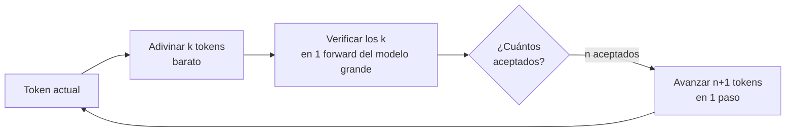

# Decodificación especulativa

<!-- CURSO_NAV_TOP -->
[← Cuantización y compresión](06-Cuantizacion-y-compresion-avanzada.md) · [Índice](../README.md) · [De una GPU a inferencia multi-GPU →](08-De-una-GPU-a-multi-GPU.md)
<!-- /CURSO_NAV_TOP -->


> [!NOTE]
> **Capítulo avanzado**
> Los conceptos se aplican a cualquier sistema. Los laboratorios de serving con CUDA se ejecutan mejor en WSL2/Linux o cloud; en Apple Silicon puedes practicar las ideas con llama.cpp, MLX o vLLM-Metal. Consulta [Plataformas y comandos](../PLATAFORMAS-Y-COMANDOS.md).


> [!NOTE]
> **En este capítulo**
> La decodificación autorregresiva genera **un token por paso**, y cada paso vuelve a leer todos los pesos del modelo desde la memoria. Esto convierte el `decode` en una operación **limitada por memoria** (*memory-bound*), no por cómputo. La **decodificación especulativa** (*speculative decoding*) explota una asimetría brutal: verificar $k$ tokens propuestos en paralelo cuesta casi lo mismo que generar uno solo. Veremos el principio nuclear, los tres "sabores" (modelo borrador, Medusa, EAGLE), las matemáticas del *acceptance rate* y el *speedup*, qué cuesta a nivel de sistema y cuándo merece la pena de verdad.

## El principio nuclear: el decode es memory-bound

Para entender por qué la decodificación especulativa funciona, hay que partir de un principio físico de las GPU modernas. Una GPU como una NVIDIA A100 o H100 tiene una **capacidad de cómputo** (FLOPs) enorme frente a su **ancho de banda de memoria** (bytes/s). La relación entre ambas se llama **intensidad aritmética de equilibrio** (*arithmetic intensity*): el número de operaciones que hay que hacer por cada byte leído para saturar las unidades de cómputo. En una H100 esa cifra ronda los varios cientos de FLOPs por byte.

Durante la fase de **decode** (generación token a token), procesamos **un único token de consulta** contra todos los pesos del modelo. Para [Qwen3-0.6B](02-Modelo-de-referencia-Qwen3-0.6B.md), con ~0,6 mil millones de parámetros, generar un token implica leer todos esos pesos desde la VRAM y hacer aproximadamente una multiplicación-acumulación por parámetro. La intensidad aritmética resultante es **bajísima** (del orden de 1-2 FLOPs/byte): estamos infrautilizando masivamente el cómputo y esperando a la memoria.

$$
t_{\text{paso}} \approx \frac{P \cdot b}{\text{BW}_{\text{mem}}}
$$

donde $P$ es el número de parámetros, $b$ los bytes por parámetro (2 en FP16/BF16) y $\text{BW}_{\text{mem}}$ el ancho de banda. Para Qwen3-0.6B en BF16, eso son $\sim 0{,}6\cdot10^9 \cdot 2 = 1{,}2$ GB que hay que mover **por cada token**. El tiempo del paso lo fija la memoria, no el cómputo.

> [!IMPORTANT]
> **La asimetría clave**
> Si en lugar de un token de consulta procesamos **$k$ tokens de consulta a la vez** (un *forward* por lotes en la dimensión de secuencia), **leemos los pesos exactamente las mismas veces**. El coste de memoria apenas cambia; lo que crece es el cómputo, que estaba ocioso. Verificar $k$ tokens cuesta casi lo mismo que generar 1.

Aquí está la idea germinal: si tuviéramos una forma barata de **adivinar** los próximos $k$ tokens, podríamos **verificarlos todos en un solo *forward***. Cada token que la adivinación acierte es un token "gratis", obtenido sin un paso completo de decode adicional.



## Los tres sabores de la decodificación especulativa

La pregunta práctica es: **¿de dónde sacamos la adivinación?** Existen tres familias principales, ordenadas de mayor a menor "peso" del adivinador.

### Sabor 1 — Draft model (modelo borrador)

El enfoque clásico, propuesto por Leviathan et al. y Chen et al. (2023). Usamos **dos modelos**:

- Un **modelo borrador** (*draft model*) pequeño y rápido $q$ — por ejemplo, una versión muy reducida o cuantizada de la familia.
- El **modelo objetivo** (*target model*) grande $p$ — el que define la distribución que queremos respetar.

El borrador genera $k$ tokens de forma autorregresiva (es barato porque es pequeño), y el objetivo los **verifica de una pasada**. La distribución final es **idéntica** a la del modelo objetivo solo, gracias al *muestreo de rechazo* (lo veremos abajo).

> [!TIP]
> **Pareja borrador-objetivo**
> Para [Qwen3-0.6B](02-Modelo-de-referencia-Qwen3-0.6B.md) como **objetivo**, no hay mucho margen: ya es diminuto, así que un borrador útil tendría que ser ridículamente pequeño. La decodificación especulativa con modelo borrador brilla cuando el **objetivo es grande** (p. ej. un Qwen3 de 32B verificando un borrador de 0,6B). Aquí Qwen3-0.6B encaja mejor como **borrador**, no como objetivo.

### Sabor 2 — Medusa-style (cabezales paralelos)

En lugar de un segundo modelo, **Medusa** (Cai et al., 2024) añade varios **cabezales de predicción** (*heads*) extra encima del último estado oculto del propio modelo. Cada cabezal $i$ predice el token en la posición $t+i$. Con un solo *forward* obtenemos candidatos para varias posiciones futuras a la vez.

- **Ventaja**: no hay segundo modelo que cargar; los cabezales son ligeros.
- **Coste**: hay que **entrenar** los cabezales, y cada cabezal individual es menos preciso cuanto más lejos predice. Se combina con árboles de candidatos (*tree attention*) para verificar varias ramas a la vez.

### Sabor 3 — EAGLE-style (autorregresión en el espacio de características)

**EAGLE** (Li et al., 2024) observa que predecir tokens es difícil, pero predecir **el siguiente vector de características** (*feature*, el estado oculto antes de la capa de salida) es más regular y predecible. EAGLE entrena una pequeña red autorregresiva que opera **en el espacio de características** del modelo, reinyectando el token ya muestreado para desambiguar. Suele lograr *acceptance rates* notablemente más altos que Medusa con un coste extra modesto.

| Sabor | Adivinador | Entrenamiento extra | Memoria extra | Acceptance típico |
|---|---|---|---|---|
| Draft model | Modelo pequeño separado | No (ya existe) | Alta (modelo entero) | Medio-alto |
| Medusa | Cabezales sobre el target | Sí (cabezales) | Baja | Medio |
| EAGLE | Red AR en features | Sí (red ligera) | Baja-media | Alto |

## Las matemáticas breves de la decodificación especulativa

Definamos las magnitudes. Sea $\alpha$ la **tasa de aceptación** (*acceptance rate*): la probabilidad de que un token propuesto por el borrador sea aceptado por la verificación. Si proponemos un bloque de $k$ tokens, el número esperado de tokens aceptados antes del primer rechazo es una serie geométrica:

$$
\mathbb{E}[\text{aceptados}] = \sum_{i=1}^{k} \alpha^{i} = \frac{\alpha (1 - \alpha^{k})}{1 - \alpha}
$$

A cada bloque verificado, además, **siempre obtenemos un token extra "corregido"** del modelo objetivo (incluso si se rechaza el primero), así que avanzamos $\mathbb{E}[\text{aceptados}] + 1$ posiciones por iteración.

### Muestreo de rechazo (que preserva la distribución)

El truco que hace esto **exacto** y no una aproximación es el **muestreo de rechazo** (*rejection sampling*). Para cada token propuesto $x$ con probabilidad $q(x)$ bajo el borrador y $p(x)$ bajo el objetivo:

1. Se acepta $x$ con probabilidad $\min\left(1, \dfrac{p(x)}{q(x)}\right)$.
2. Si se rechaza, se muestrea de la **distribución residual** normalizada $p'(x) = \dfrac{\max(0,\, p(x) - q(x))}{\sum_x \max(0,\, p(x) - q(x))}$.

> [!NOTE]
> **Por qué la salida es idéntica al modelo grande**
> Se puede demostrar que la distribución resultante de este procedimiento es **exactamente** $p(x)$. La decodificación especulativa **no degrada la calidad**: produce muestras de la misma distribución que el modelo objetivo. Solo acelera. Esto la diferencia de la cuantización agresiva vista en [06 - Cuantización y compresión](06-Cuantizacion-y-compresion-avanzada.md), que sí altera la distribución.

### Speedup esperado

Sea $c$ el **coste relativo del borrador** respecto al objetivo (p. ej. $c=0{,}1$ si el borrador cuesta el 10 %). Generar y verificar un bloque de $k$ tokens cuesta aproximadamente $1 + k\cdot c$ pasos-objetivo equivalentes, y avanzamos $\mathbb{E}[\text{aceptados}]+1$ tokens. El *speedup* aproximado es:

$$
S \approx \frac{\mathbb{E}[\text{aceptados}] + 1}{1 + k \cdot c}
$$

> [!TIP]
> **Un cálculo concreto**
> Con $\alpha = 0{,}8$, $k = 4$ y un borrador que cuesta $c = 0{,}1$:
> - $\mathbb{E}[\text{aceptados}] = \dfrac{0{,}8\,(1 - 0{,}8^{4})}{1 - 0{,}8} = \dfrac{0{,}8 \cdot 0{,}5904}{0{,}2} \approx 2{,}36$
> - Avanzamos $\approx 3{,}36$ tokens por iteración.
> - Coste: $1 + 4 \cdot 0{,}1 = 1{,}4$ pasos-objetivo.
> - $S \approx 3{,}36 / 1{,}4 \approx 2{,}4\times$
>
> Un *speedup* de ~2,4× **sin tocar la calidad de salida**. Si $\alpha$ baja a 0,5, el *speedup* cae a ~1,3×: la tasa de aceptación lo es todo.

```python
# Cálculo del speedup esperado de la decodificación especulativa.
# No es una simulación de muestreo, solo la fórmula analítica.

def speedup_esperado(alpha: float, k: int, coste_borrador: float) -> float:
    """
    alpha: tasa de aceptación por token (acceptance rate).
    k:     número de tokens propuestos por bloque.
    coste_borrador: coste de 1 paso del borrador relativo al objetivo (p. ej. 0.1).
    """
    # Tokens aceptados esperados antes del primer rechazo (serie geométrica).
    aceptados = alpha * (1 - alpha**k) / (1 - alpha)
    # Avanzamos los aceptados + 1 token corregido por el objetivo.
    avance = aceptados + 1
    # Coste: 1 forward del objetivo + k pasos del borrador.
    coste = 1 + k * coste_borrador
    return avance / coste


for a in (0.5, 0.7, 0.8, 0.9):
    print(f"alpha={a}: speedup ~ {speedup_esperado(a, k=4, coste_borrador=0.1):.2f}x")
```

## Qué cuesta a nivel de sistema

La decodificación especulativa no es gratis. Los costes reales:

- **Memoria del borrador**: en el sabor *draft model*, hay que mantener **dos conjuntos de pesos y dos KV caches** en VRAM. Esto compite por el mismo presupuesto de memoria que estudiamos en [03 - Atención y KV cache](03-Atencion-y-KV-cache.md). Si el borrador desplaza tamaño de lote (*batch size*) o longitud de contexto, el beneficio puede evaporarse.
- **Complejidad de implementación**: gestionar la **verificación por lotes**, el muestreo de rechazo, los árboles de candidatos (en Medusa/EAGLE) y la sincronización de KV caches entre borrador y objetivo es código delicado y propenso a errores sutiles que rompen la equivalencia distribucional.
- **Rollback (retroceso)**: cuando se rechaza un token, hay que **descartar** el trabajo de KV cache de los tokens posteriores ya procesados especulativamente. La gestión del KV cache debe soportar truncado eficiente.
- **Sensibilidad al dominio**: $\alpha$ depende fuertemente de **qué se genera**. Texto repetitivo o muy predecible (código *boilerplate*, formatos rígidos) eleva $\alpha$; texto creativo o de alta entropía la hunde.

> [!WARNING]
> **El speedup se evapora con batch grande**
> En servidores con **alto *throughput*** y lotes grandes, la fase de decode **ya está saturando el cómputo** (deja de ser memory-bound porque hay muchas secuencias en paralelo). En ese régimen, la decodificación especulativa **aporta poco o incluso ralentiza**, porque el cómputo extra de la verificación ya no era "gratis". Brilla en **baja latencia, lote pequeño** (idealmente $B=1$).

## Decodificación especulativa en la práctica: cuándo merece la pena

Reglas prácticas destiladas:

> [!TIP]
> **Merece la pena cuando…**
> - **Latencia interactiva con lote pequeño** ($B=1$ o muy bajo): chatbots, copilotos, agentes de un solo usuario.
> - **Modelo objetivo grande**, donde un borrador 10-20× menor mantiene buen $\alpha$.
> - **Dominio predecible**: generación de código estructurado, plantillas, salidas con formato fijo.
> - Tienes un borrador **bien alineado** con el objetivo (misma familia/tokenizador), que es lo que sube $\alpha$.

> [!CAUTION]
> **No merece la pena cuando…**
> - Sirves con **lotes grandes** y optimizas *throughput*: el decode ya no es memory-bound.
> - El **objetivo ya es minúsculo** (como [Qwen3-0.6B](02-Modelo-de-referencia-Qwen3-0.6B.md) usado como objetivo): no hay borrador suficientemente más barato.
> - La VRAM está al límite y el borrador robaría espacio crítico al KV cache.

Para la familia Qwen3, el patrón natural es usar **Qwen3-0.6B como borrador** de un objetivo grande (p. ej. 14B o 32B): comparten tokenizador y estilo de pre-entrenamiento, lo que tiende a dar tasas de aceptación altas. EAGLE-style suele ser la opción más rentable cuando se puede invertir en entrenar la cabeza ligera, porque maximiza $\alpha$ con poca memoria extra.

> [!TIP]
> **Puntos clave**
> - El **decode es memory-bound**: verificar $k$ tokens en paralelo cuesta casi lo mismo que generar 1; ahí nace todo el ahorro.
> - **Tres sabores**: *draft model* (segundo modelo), **Medusa** (cabezales paralelos sobre el target) y **EAGLE** (autorregresión en el espacio de características, mayor $\alpha$).
> - El **muestreo de rechazo** garantiza que la salida es **distribucionalmente idéntica** al modelo objetivo: aceleras sin perder calidad.
> - El *speedup* es $S \approx \dfrac{\mathbb{E}[\text{aceptados}]+1}{1+k\,c}$ y depende críticamente de la **tasa de aceptación** $\alpha$.
> - Brilla en **baja latencia / lote pequeño / objetivo grande**; se desvanece con lotes grandes o cuando el objetivo ya es diminuto.

## Enlaces relacionados

- [06 - Cuantización y compresión](06-Cuantizacion-y-compresion-avanzada.md) — otra vía de aceleración, pero esta **sí** altera la distribución.
- [03 - Atención y KV cache](03-Atencion-y-KV-cache.md) — el KV cache es el recurso que la verificación especulativa estresa y debe poder truncar.
- [08 - De una GPU a inferencia multi-GPU](08-De-una-GPU-a-multi-GPU.md) — cuando el objetivo no cabe en una GPU, el paralelismo entra en juego.
- [Apéndice A - Fundamentos matemáticos](../07-Anexos/F-Fundamentos-matematicos.md) — detalle del muestreo de rechazo y series geométricas.
- [Apéndice B - Patrones de diseño de sistemas](../07-Anexos/G-Patrones-de-diseno-de-sistemas.md) — orquestación borrador/objetivo en un servidor de inferencia.

---

---


Curso creado por [@are_agi](https://twitter.com/are_agi).

---


Curso creado por [@are_agi](https://twitter.com/are_agi).

---

<!-- CURSO_NAV_BOTTOM -->
[← Cuantización y compresión](06-Cuantizacion-y-compresion-avanzada.md) · [Índice](../README.md) · [De una GPU a inferencia multi-GPU →](08-De-una-GPU-a-multi-GPU.md)
<!-- /CURSO_NAV_BOTTOM -->

Curso creado por [@are_agi](https://twitter.com/are_agi).
