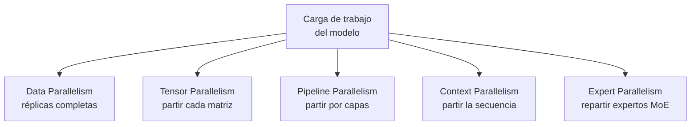
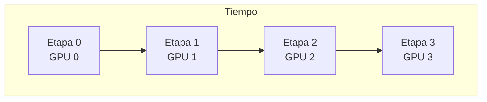
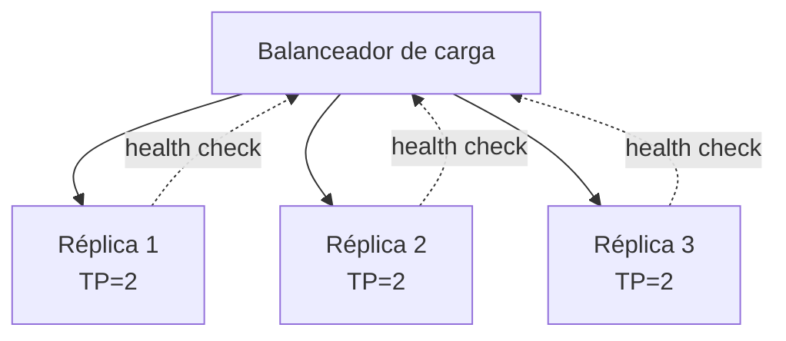

# De una GPU a inferencia multi-GPU

<!-- CURSO_NAV_TOP -->
[← Decodificación especulativa](07-Decodificacion-especulativa.md) · [Índice](../README.md) · [Despliegue en Azure ML →](09-Despliegue-en-Azure-ML.md)
<!-- /CURSO_NAV_TOP -->


> [!NOTE]
> **Capítulo avanzado**
> Los conceptos se aplican a cualquier sistema. Los laboratorios de serving con CUDA se ejecutan mejor en WSL2/Linux o cloud; en Apple Silicon puedes practicar las ideas con llama.cpp, MLX o vLLM-Metal. Consulta [Plataformas y comandos](../PLATAFORMAS-Y-COMANDOS.md).


> [!NOTE]
> **En este capítulo**
> Cuando un modelo (o su carga de trabajo) deja de caber en una sola GPU, hay que **repartirlo**. Pero "repartir" no es una sola cosa: existen **cinco ejes de paralelismo** ortogonales, cada uno con su patrón de comunicación y su coste. Recorreremos los cinco, profundizaremos en *data*, *tensor* y *pipeline parallelism*, trabajaremos a mano cómo se parte un bloque transformer en column/row parallel, mediremos el coste de los *all-reduces*, veremos la **burbuja** del pipeline y la tolerancia a fallos por réplicas, y cerraremos con decisiones de dimensionado concretas para [Qwen3-0.6B](02-Modelo-de-referencia-Qwen3-0.6B.md) y su familia.

## Los cinco ejes de paralelismo

Repartir un cálculo de transformer admite cinco dimensiones **independientes** que se pueden combinar (paralelismo 3D, 4D…):



| Eje | Qué se reparte | Comunicación dominante | Cuándo |
|---|---|---|---|
| **Data (DP)** | Réplicas enteras, datos distintos | *All-reduce* de gradientes (entreno); ninguna en inferencia | El modelo cabe; quieres más *throughput* |
| **Tensor (TP)** | Cada matriz de pesos, dividida | *All-reduce* por capa (alta frecuencia) | El modelo no cabe en 1 GPU; baja latencia |
| **Pipeline (PP)** | Bloques de capas consecutivas | *Send/recv* punto a punto entre etapas | Modelo muy profundo; ancho de banda inter-nodo limitado |
| **Context (CP)** | La dimensión de secuencia (tokens) | *All-gather*/*reduce* de atención | Contextos larguísimos (decenas-cientos de miles de tokens) |
| **Expert (EP)** | Los expertos de un modelo MoE | *All-to-all* del enrutado | Modelos *Mixture-of-Experts* |

> [!NOTE]
> **Ortogonalidad**
> Estos ejes se **multiplican**, no se suman. Un despliegue puede ser, p. ej., TP=2 × PP=4 × DP=8 = 64 GPUs. La elección óptima depende de la **topología de interconexión** (NVLink intra-nodo vs. red entre nodos) tanto como del modelo.

## Data parallelism: el caso simple

El **paralelismo de datos** (*data parallelism*, DP) es el más fácil: se carga una **copia completa** del modelo en cada GPU y se reparten **peticiones distintas** entre ellas. No hay comunicación entre GPUs durante el cálculo (en inferencia), solo un balanceador delante.

> [!TIP]
> **DP en inferencia ≠ DP en entrenamiento**
> En **entrenamiento**, DP exige un *all-reduce* de gradientes en cada paso para mantener las réplicas sincronizadas. En **inferencia** no hay gradientes: cada réplica atiende peticiones independientes, así que DP en *serving* es **escalado horizontal puro**, sin comunicación. Es el patrón que usaremos para Qwen3-0.6B.

Condición de uso: **el modelo debe caber en una sola GPU**. Si cabe, DP es casi siempre lo primero que se hace, porque escala el *throughput* de forma lineal y trivial.

## Tensor parallelism

El **paralelismo de tensores** (*tensor parallelism*, TP) parte **cada matriz de pesos** entre varias GPUs, de modo que cada una hace una fracción de cada multiplicación matricial. Es necesario cuando **una sola capa** no cabe o cuando se busca **reducir la latencia** de un solo *forward* repartiendo el cómputo.

La idea, introducida por Megatron-LM (Shoeybi et al., 2019), es partir las matrices de forma que la comunicación entre GPUs se reduzca a **un único *all-reduce* por bloque**.

### Column parallel y row parallel

Dada una multiplicación $Y = XW$, hay dos formas de partir $W$ entre $N$ GPUs:

- **Column parallel**: se parte $W$ por **columnas**, $W = [W_1 \mid W_2 \mid \dots \mid W_N]$. Cada GPU calcula $Y_i = X W_i$ con la **entrada completa** $X$ replicada. La salida queda **partida** por columnas. No requiere comunicación para producir $Y_i$.
- **Row parallel**: se parte $W$ por **filas**, lo que exige que la **entrada** $X$ esté partida por columnas: $X = [X_1 \mid \dots \mid X_N]$. Cada GPU calcula $Y_i = X_i W_i$ y la salida final es $Y = \sum_i Y_i$, lo que **sí** requiere un *all-reduce*.

## Un bloque transformer tensor-paralelo, trabajado

El truco de Megatron es **encadenar column parallel seguido de row parallel** para que solo haga falta **un *all-reduce*** por sub-bloque. Veámoslo en las dos partes del bloque.

### Atención multi-cabezal

La proyección **QKV** se hace **column parallel**: se reparten las **cabezas de atención** entre GPUs. Cada GPU calcula la atención completa de **su subconjunto de cabezas** sobre la entrada replicada $X$. Como las cabezas son independientes, no hay comunicación dentro de la atención.

La **proyección de salida** $O$ se hace **row parallel**: toma como entrada las salidas de atención ya partidas por cabezas y produce una salida que hay que **sumar** entre GPUs → **un *all-reduce***.

### MLP (red feed-forward)

- Primera capa (expansión, $W_1$): **column parallel** → salida partida.
- No-linealidad (GELU/SiLU): se aplica **elemento a elemento** sobre la partición local, sin comunicación.
- Segunda capa (contracción, $W_2$): **row parallel** → **un *all-reduce***.

```python
# Esquema conceptual de un MLP tensor-paralelo estilo Megatron.
# Cada rank (GPU) tiene SOLO su trozo de W1 y W2. No es código ejecutable real;
# ilustra dónde aparece la única comunicación (all_reduce).

def mlp_tensor_paralelo(x, W1_local, W2_local, all_reduce):
    # x está REPLICADO en todas las GPUs (entrada completa).
    # W1 está partido por COLUMNAS -> h_local queda partido, sin comunicación.
    h_local = x @ W1_local
    h_local = silu(h_local)            # no-linealidad elemento a elemento, local
    # W2 está partido por FILAS -> cada GPU produce una suma parcial.
    y_parcial = h_local @ W2_local
    # Unica comunicacion del sub-bloque: sumar las parciales entre GPUs.
    y = all_reduce(y_parcial)          # AQUI esta el coste de red
    return y
```

> [!NOTE]
> **Dos all-reduces por capa transformer**
> Sumando atención + MLP, un bloque transformer tensor-paralelo requiere **dos *all-reduces* por capa** en el *forward*. Para un modelo de $L$ capas, son $2L$ *all-reduces* por *forward*. Esta frecuencia altísima es la razón por la que **TP solo es viable con interconexión muy rápida** (NVLink intra-nodo), no entre nodos por red estándar.

## El coste de los all-reduces

Un *all-reduce* sobre $N$ GPUs con un vector de tamaño $V$ (en bytes), usando el algoritmo *ring all-reduce*, mueve por cada GPU aproximadamente:

$$
\text{bytes}_{\text{all-reduce}} \approx 2\,\frac{N-1}{N}\,V
$$

es decir, **~2V bytes** por GPU independientemente de $N$ para $N$ grande. El tiempo total combina **latencia** (número de saltos, $\propto N$) y **ancho de banda**:

$$
t_{\text{all-reduce}} \approx \underbrace{2(N-1)\,\beta}_{\text{latencia}} + \underbrace{2\,\frac{N-1}{N}\,\frac{V}{\text{BW}}}_{\text{ancho de banda}}
$$

donde $\beta$ es la latencia por salto y $\text{BW}$ el ancho de banda del enlace.

> [!WARNING]
> **Por qué TP no cruza nodos a la ligera**
> Con $2L$ *all-reduces* por *forward*, y en **decode** cada *forward* genera **un solo token**, el *all-reduce* se ejecuta **una vez por token por capa**. Si esa comunicación va por red entre nodos (latencia de microsegundos altos) en lugar de NVLink (sub-microsegundo, cientos de GB/s), el tiempo de red **domina** y el TP deja de compensar. Regla práctica: **TP dentro del nodo, PP/DP entre nodos.**

## Pipeline parallelism: microbatches y burbuja

El **paralelismo de pipeline** (*pipeline parallelism*, PP) parte el modelo **por capas**: la GPU 0 tiene las primeras capas, la GPU 1 las siguientes, etc. (*etapas*). La comunicación es **punto a punto** (`send`/`recv`) entre etapas adyacentes, mucho menos frecuente que el *all-reduce* del TP, lo que lo hace **apto para cruzar nodos**.

El problema es la **burbuja** (*pipeline bubble*): mientras la etapa 0 procesa el primer lote, las demás etapas están **ociosas** esperando. Para paliarlo se parte el lote en **microbatches** que fluyen por el pipeline en cascada, solapando trabajo.



La **fracción de burbuja** con $S$ etapas y $m$ microbatches es:

$$
\text{burbuja} = \frac{S - 1}{m + S - 1}
$$

> [!TIP]
> **Reducir la burbuja con microbatches**
> Con $S = 4$ etapas:
> - $m = 1$: burbuja $= 3/4 = 75\%$ de tiempo ocioso. Inaceptable.
> - $m = 8$: burbuja $= 3/11 \approx 27\%$.
> - $m = 32$: burbuja $= 3/35 \approx 8{,}6\%$.
>
> Más microbatches → menos burbuja, pero más latencia por petición y más presión sobre activaciones/KV cache. Hay que equilibrar.

> [!NOTE]
> **PP en inferencia generativa**
> En *decode* autorregresivo, los microbatches naturales son **distintas secuencias** del lote. PP da buen *throughput* agregado pero **no reduce la latencia** de una sola secuencia (esta debe atravesar todas las etapas en serie). Para latencia mínima de una petición, TP es mejor; para *throughput* con muchas peticiones y red lenta, PP.

## Escalado de réplicas y tolerancia a fallos

Por encima del paralelismo intra-modelo está el **escalado de réplicas**: $R$ copias del despliegue (cada una posiblemente ya TP/PP por dentro) detrás de un **balanceador de carga**. Esto es DP a nivel de servicio y es donde vive la **tolerancia a fallos**.

> [!TIP]
> **Patrones de robustez**
> - **Health checks** y *readiness probes*: una réplica que no responde se saca del balanceo.
> - **Redundancia N+1**: dimensionar para que la caída de una réplica no sature al resto.
> - **Aislamiento de fallos**: en TP, **si una GPU del grupo cae, cae todo el grupo** (el modelo está partido entre ellas). Por eso conviene que el **dominio de fallo** sea la réplica completa, no la GPU individual.
> - **Drenaje (*draining*)**: al desplegar una versión nueva, se dejan terminar las peticiones en curso antes de retirar la réplica vieja.



## Decisiones de dimensionado para Qwen3-0.6B y su familia

Aterricemos en cifras conocidas. [Qwen3-0.6B](02-Modelo-de-referencia-Qwen3-0.6B.md) tiene ~0,6 mil millones de parámetros: en BF16 ocupa $\sim 0{,}6\cdot10^9 \cdot 2 \approx 1{,}2$ GB de pesos. **Cabe holgadamente** en cualquier GPU moderna (incluso de 8-12 GB con margen para KV cache y activaciones).

> [!TIP]
> **Recomendación para Qwen3-0.6B**
> - **No usar TP ni PP.** El modelo cabe de sobra en una GPU; partirlo solo añadiría coste de comunicación sin beneficio.
> - **Usar data parallelism / réplicas**: lanzar $R$ instancias detrás de un balanceador y escalar horizontalmente según la demanda. Escalado lineal y sin comunicación.
> - El recurso a vigilar es el **KV cache** (ver [03 - Atención y KV cache](03-Atencion-y-KV-cache.md)), no los pesos: define cuántas peticiones concurrentes caben por GPU.

El cuadro cambia al subir en la **familia Qwen3**:

| Modelo (aprox.) | Pesos BF16 | ¿Cabe en 1 GPU? | Estrategia típica |
|---|---|---|---|
| Qwen3-0.6B | ~1,2 GB | Sí, holgado | DP / réplicas |
| Qwen3-8B (aprox.) | ~16 GB | Sí, en GPU grande | DP; TP=2 si baja latencia |
| Qwen3-32B (aprox.) | ~64 GB | No en una GPU de 40 GB | TP=2 intra-nodo |
| Qwen3 MoE (grande) | depende del nº de expertos | No | TP + EP intra-nodo, PP entre nodos |

> [!WARNING]
> **No paralelizar por reflejo**
> El paralelismo intra-modelo (TP/PP) **siempre añade comunicación y complejidad**. Solo se justifica cuando el modelo **no cabe** o cuando la **latencia objetivo** exige repartir el cómputo de un *forward*. Para modelos pequeños como Qwen3-0.6B, la respuesta correcta casi siempre es **más réplicas, no más particiones**.

> [!TIP]
> **Puntos clave**
> - Hay **cinco ejes ortogonales** de paralelismo: **data, tensor, pipeline, context y expert**; se multiplican entre sí.
> - **Data parallelism** en inferencia es escalado horizontal puro **sin comunicación**: la primera opción si el modelo cabe.
> - **Tensor parallelism** parte cada matriz (**column→row parallel**) y cuesta **dos *all-reduces* por capa**: solo viable con **NVLink intra-nodo**.
> - **Pipeline parallelism** parte por capas, comunica punto a punto (apto entre nodos) y sufre la **burbuja**, mitigada con microbatches: $\text{burbuja} = \frac{S-1}{m+S-1}$.
> - La **tolerancia a fallos** vive en las réplicas + balanceador; el **dominio de fallo** de un grupo TP es la réplica entera.
> - Para **Qwen3-0.6B** (~1,2 GB en BF16): **nada de TP/PP**, solo **réplicas (DP)**; vigila el **KV cache**, no los pesos.

## Enlaces relacionados

- [07 - Decodificación especulativa](07-Decodificacion-especulativa.md) — otra palanca de latencia, complementaria al paralelismo.
- [03 - Atención y KV cache](03-Atencion-y-KV-cache.md) — el KV cache es el recurso limitante real en Qwen3-0.6B y condiciona el batch.
- [09 - Fine-tuning y adaptación de dominio](../04-Adaptar/02-Fine-tuning-con-PEFT-y-QLoRA.md) — adaptar el modelo antes de desplegarlo a escala.
- [10 - Despliegue en Azure ML](09-Despliegue-en-Azure-ML.md) — materializar estas réplicas y grupos de GPU en infraestructura gestionada.
- [Apéndice B - Patrones de diseño de sistemas](../07-Anexos/G-Patrones-de-diseno-de-sistemas.md) — balanceo, health checks y drenaje en detalle.

---

---


Curso creado por [@are_agi](https://twitter.com/are_agi).

---


Curso creado por [@are_agi](https://twitter.com/are_agi).

---

<!-- CURSO_NAV_BOTTOM -->
[← Decodificación especulativa](07-Decodificacion-especulativa.md) · [Índice](../README.md) · [Despliegue en Azure ML →](09-Despliegue-en-Azure-ML.md)
<!-- /CURSO_NAV_BOTTOM -->

Curso creado por [@are_agi](https://twitter.com/are_agi).
