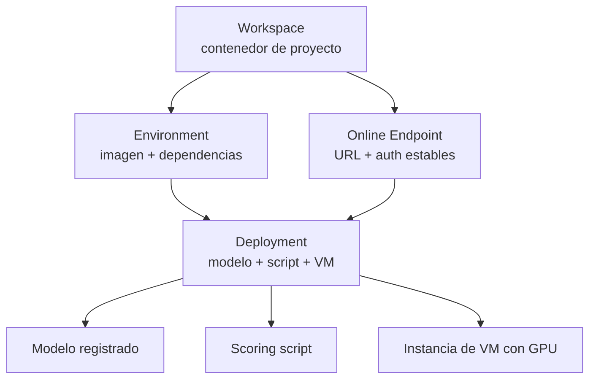
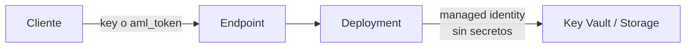
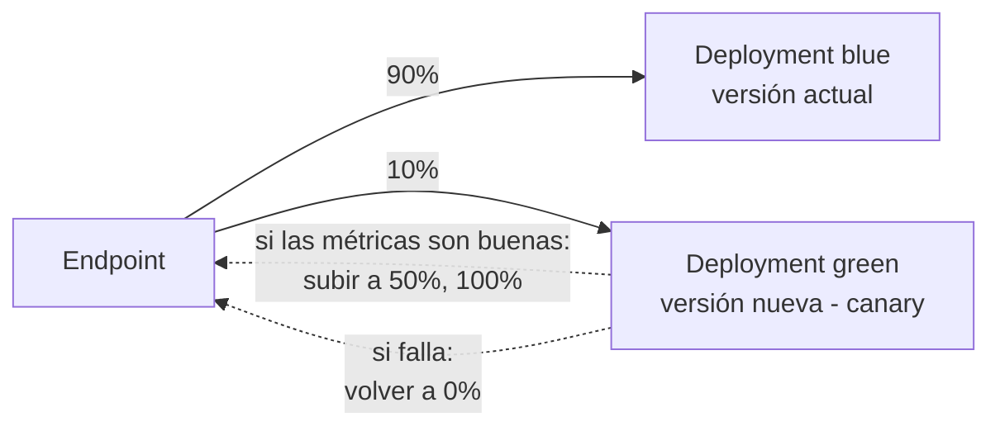
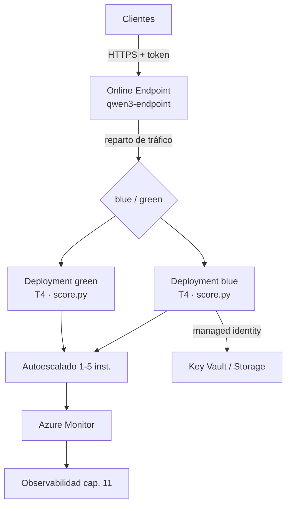

# Despliegue en Azure ML

<!-- CURSO_NAV_TOP -->
[← De una GPU a inferencia multi-GPU](08-De-una-GPU-a-multi-GPU.md) · [Índice](../README.md) · [Observabilidad y monitorización →](10-Observabilidad-y-monitorizacion.md)
<!-- /CURSO_NAV_TOP -->


> [!info] Capítulo avanzado
> Los conceptos se aplican a cualquier sistema. Los laboratorios de serving con CUDA se ejecutan mejor en WSL2/Linux o cloud; en Apple Silicon puedes practicar las ideas con llama.cpp, MLX o vLLM-Metal. Consulta [Plataformas y comandos](../PLATAFORMAS-Y-COMANDOS.md).


> [!abstract] En este capítulo
> Tenemos un modelo (Qwen3-0.6B, con o sin adaptador LoRA del [capítulo anterior](../04-Adaptar/02-Fine-tuning-con-PEFT-y-QLoRA.md)) y queremos servirlo como una API gestionada, escalable y observable. Recorremos la **jerarquía de Azure Machine Learning** (workspace → environment → endpoint → deployment); aprendemos a **elegir la SKU de VM** con GPU adecuada; configuramos la **autenticación** sin filtrar secretos; construimos el **contenedor mínimo**, el **scoring script** con `init()` y `run()`, y el **YAML** de endpoint y deployment; desplegamos; y montamos estrategias de release seguras: **blue/green**, **canary** y **autoescalado**.

## La jerarquía de Azure ML

Azure ML organiza los recursos en una jerarquía clara. Entenderla evita el error más típico: confundir el "endpoint" (la dirección estable) con el "deployment" (la versión concreta que sirve detrás).



- **Workspace**: el contenedor de nivel superior. Agrupa modelos registrados, *environments*, *datastores*, *compute* y endpoints de un proyecto. Es la unidad de gobierno y aislamiento.
- **Environment**: la definición reproducible del entorno de ejecución — imagen base de contenedor más dependencias (Python, CUDA, librerías). Versionado e inmutable.
- **Online Endpoint**: la **dirección estable** (URL HTTPS + configuración de autenticación) que ven los clientes. **No** cambia cuando despliegas una versión nueva.
- **Deployment**: la **versión concreta** que se ejecuta detrás de un endpoint — un modelo + un *scoring script* + un *environment* + una SKU de VM + un número de instancias. Un endpoint puede tener **varios** deployments y repartir tráfico entre ellos (la base de blue/green y canary).

> [!tip] La distinción que lo cambia todo
> El **endpoint** es la marca de la tienda; el **deployment** es la mercancía del almacén. Cambias la mercancía sin que el cliente note que la dirección cambió. Esa separación es lo que hace posibles los despliegues sin tiempo de inactividad.

## Elegir la SKU de VM

La SKU (*Stock Keeping Unit*, el tipo de máquina) determina la GPU disponible, y la GPU determina si el modelo entra en memoria y a qué velocidad responde. Las familias relevantes para inferencia de LLM:

| Familia | GPU | VRAM aprox. | Uso típico |
|---|---|---|---|
| **NC T4 v3** (`Standard_NC4as_T4_v3`) | NVIDIA T4 | 16 GB | Modelos pequeños, inferencia económica |
| **NC A100 v4** (`Standard_NC24ads_A100_v4`) | NVIDIA A100 | 80 GB | Modelos medianos/grandes, throughput alto |
| **ND A100 v4** (`Standard_ND96asr_v4`) | 8× A100 | 8×80 GB | Entrenamiento y modelos muy grandes multi-GPU |

La heurística de dimensionado parte de la huella de memoria del modelo. En `bfloat16` cada parámetro ocupa 2 bytes, así que Qwen3-0.6B necesita del orden de **~1,2 GB** solo para pesos, más memoria para activaciones y la *KV cache*. Cabe sobradamente en una **T4** (16 GB), que es la elección coste-eficiente para este modelo.

> [!note] No sobredimensionar
> Una A100 para servir Qwen3-0.6B es desperdicio de presupuesto: el modelo no usa ni el 2 % de su VRAM. La regla es la GPU **más pequeña** en la que el modelo quepa con holgura para *KV cache* y *batch*. Reserva las A100 para modelos grandes o para QLoRA del [capítulo 9](../04-Adaptar/02-Fine-tuning-con-PEFT-y-QLoRA.md).

## Autenticación: elige el modo correcto

Hay tres modos, y el orden de preferencia por seguridad es claro:

1. **Managed identity** (identidad administrada): Azure gestiona las credenciales; el deployment recibe una identidad que se autentica contra otros recursos (Key Vault, Storage) **sin secretos en código ni configuración**. Es el modo preferido para que el *deployment* acceda a recursos.
2. **Service principal**: una identidad de aplicación con `client_id`/`tenant_id`/secreto, pensada para automatización CI/CD donde no hay un usuario interactivo. Rota el secreto y guárdalo en Key Vault.
3. **Keys / tokens**: el endpoint expone autenticación por clave (`key`) o por token (`aml_token`). Simple para que los **clientes** llamen a la API, pero las claves son secretos de larga vida; los tokens caducan y son más seguros.

> [!danger] Nunca en el código
> Jamás incrustes claves, secretos de service principal ni *connection strings* en el *scoring script*, el YAML o el repositorio. Usa **managed identity** para el acceso del deployment a recursos y **Key Vault** para cualquier secreto inevitable. Un secreto en Git es un incidente de seguridad, no un descuido.



## El contenedor mínimo

El *environment* define el contenedor. Partimos de una imagen base curada de Azure ML (que ya trae CUDA y *runtime* de inferencia) y le añadimos solo nuestras dependencias mediante un fichero conda. Minimalismo: cada dependencia extra es superficie de fallo y segundos de arranque.

```yaml
# conda.yaml — dependencias del entorno de inferencia
name: qwen3-inference
channels:
  - conda-forge
dependencies:
  - python=3.10
  - pip
  - pip:
      - torch==2.3.0          # runtime de PyTorch
      - transformers==4.44.0  # carga del modelo y tokenizer
      - peft==0.12.0          # solo si servimos un adaptador LoRA
      - accelerate==0.33.0    # colocación en GPU
```

```python
# Registro del environment con el SDK v2 de Azure ML
from azure.ai.ml.entities import Environment

env = Environment(
    name="qwen3-inference-env",
    # imagen base curada de Azure ML con CUDA preinstalado
    image="mcr.microsoft.com/azureml/curated/minimal-ubuntu22.04-py310-cuda12.1-gpu:latest",
    conda_file="conda.yaml",
)
```

## El scoring script (`init()` y `run()`)

El *scoring script* es el contrato entre Azure ML y tu modelo. Implementa dos funciones obligatorias:

- **`init()`** se ejecuta **una vez** al arrancar cada instancia. Aquí cargas el modelo en GPU — es caro, y queremos hacerlo solo al inicio, no en cada petición.
- **`run(raw_data)`** se ejecuta **en cada petición**. Recibe el cuerpo HTTP, ejecuta inferencia y devuelve la respuesta. Debe ser rápido y sin estado.

```python
# score.py — contrato de inferencia de Azure ML
import os
import json
import torch
from transformers import AutoModelForCausalLM, AutoTokenizer

# Variables globales: se cargan una vez en init() y se reutilizan en run()
modelo = None
tokenizer = None

def init():
    """Se ejecuta una sola vez al arrancar la instancia."""
    global modelo, tokenizer
    # AZUREML_MODEL_DIR apunta a la carpeta del modelo registrado
    ruta_modelo = os.path.join(os.environ["AZUREML_MODEL_DIR"], "qwen3-0.6b")
    tokenizer = AutoTokenizer.from_pretrained(ruta_modelo)
    modelo = AutoModelForCausalLM.from_pretrained(
        ruta_modelo, torch_dtype=torch.bfloat16, device_map="cuda"
    )
    modelo.eval()  # modo evaluación: sin dropout, sin gradientes

def run(raw_data: str) -> str:
    """Se ejecuta en cada petición HTTP."""
    datos = json.loads(raw_data)
    prompt = datos["prompt"]
    max_tokens = datos.get("max_tokens", 256)

    entradas = tokenizer(prompt, return_tensors="pt").to("cuda")
    with torch.no_grad():  # sin gradientes: ahorra memoria y tiempo
        salida = modelo.generate(**entradas, max_new_tokens=max_tokens)

    texto = tokenizer.decode(salida[0], skip_special_tokens=True)
    return json.dumps({"respuesta": texto})
```

> [!warning] La carga va en `init()`
> Cargar el modelo dentro de `run()` es el error de rendimiento más caro posible: añadirías segundos de latencia a **cada** petición. El modelo se carga una vez en `init()` y vive en las variables globales mientras la instancia esté en pie.

## El YAML de endpoint y deployment

Azure ML usa YAML declarativo. Primero el **endpoint** (la dirección estable y su modo de auth); luego el **deployment** (qué se ejecuta detrás).

```yaml
# endpoint.yaml — la dirección estable
$schema: https://azuremlschemas.azureedge.net/latest/managedOnlineEndpoint.schema.json
name: qwen3-endpoint
auth_mode: aml_token        # tokens con caducidad para los clientes
```

```yaml
# deployment-blue.yaml — la versión "blue" que sirve detrás del endpoint
$schema: https://azuremlschemas.azureedge.net/latest/managedOnlineDeployment.schema.json
name: blue                   # nombre del deployment
endpoint_name: qwen3-endpoint
model: azureml:qwen3-0.6b@latest        # modelo registrado
environment: azureml:qwen3-inference-env@latest
code_configuration:
  code: ./src                # carpeta con score.py
  scoring_script: score.py
instance_type: Standard_NC4as_T4_v3     # SKU con GPU T4
instance_count: 1            # número de instancias (réplicas)
```

> [!info] Versionado con `@latest`
> La sintaxis `azureml:nombre@latest` referencia la última versión registrada del modelo o environment. En producción es buena práctica **anclar a una versión concreta** (`@7`) para reproducibilidad, en lugar de `@latest`.

## Desplegar

Con el SDK v2 o la CLI de Azure ML, el despliegue es declarativo. El patrón habitual: crear el endpoint, crear el deployment "blue" y dirigirle el 100 % del tráfico una vez sano.

```bash
# Crear el endpoint (la dirección estable)
az ml online-endpoint create -f endpoint.yaml

# Crear el deployment "blue" detrás del endpoint
az ml online-deployment create -f deployment-blue.yaml

# Dirigir el 100% del tráfico al deployment "blue"
az ml online-endpoint update --name qwen3-endpoint \
    --traffic "blue=100"

# Probar con una petición de ejemplo
az ml online-endpoint invoke --name qwen3-endpoint \
    --request-file ejemplo_peticion.json
```

El reparto de tráfico (`--traffic`) es la pieza central: el endpoint enruta peticiones a los deployments según los porcentajes que definas. Esto es precisamente lo que habilita las estrategias de release.

## Releases blue/green y canary

La separación endpoint/deployment permite actualizar **sin tiempo de inactividad** y con reversión instantánea.

**Blue/green**: mantienes dos deployments. "Blue" sirve el 100 % en producción. Despliegas "green" con la versión nueva, lo validas con tráfico cero, y cuando estás seguro **conmutas el 100 %** de blue a green de golpe. Si algo va mal, devuelves el tráfico a blue al instante.

**Canary**: en vez de conmutar de golpe, expones la versión nueva a una **fracción pequeña** del tráfico real (p. ej. 10 %), observas métricas y errores, y vas subiendo el porcentaje gradualmente. Limita el radio de impacto de un fallo.



```bash
# Canary: 10% al nuevo deployment "green", 90% al estable "blue"
az ml online-endpoint update --name qwen3-endpoint \
    --traffic "blue=90 green=10"

# Si las métricas acompañan, promocionar a green al 100%
az ml online-endpoint update --name qwen3-endpoint \
    --traffic "blue=0 green=100"
```

> [!success] Reversión instantánea
> La reversión (*rollback*) es un cambio de porcentaje, no un nuevo despliegue. Volver a `blue=100` es inmediato porque blue **nunca se apagó**. Esa es la red de seguridad que justifica mantener dos deployments en paralelo durante la transición. La decisión de promocionar o revertir debe apoyarse en las métricas de [11 - Observabilidad y monitorización](10-Observabilidad-y-monitorizacion.md).

## Autoescalado

Un `instance_count` fijo desperdicia recursos en horas valle y se queda corto en picos. El **autoescalado** ajusta el número de instancias según la carga, apoyándose en Azure Monitor.

```python
# Regla de autoescalado basada en uso de CPU/GPU del deployment
from azure.mgmt.monitor.models import (
    AutoscaleProfile, ScaleRule, MetricTrigger, ScaleAction
)

# Escalar entre 1 y 5 instancias según la métrica observada
perfil = AutoscaleProfile(
    name="perfil-qwen3",
    capacity={"minimum": "1", "maximum": "5", "default": "1"},
    rules=[
        # Si la utilización supera el umbral, añadir una instancia
        ScaleRule(
            metric_trigger=MetricTrigger(
                metric_name="CpuUtilizationPercentage",
                threshold=70, operator="GreaterThan",
                time_aggregation="Average", time_window="PT5M",
                statistic="Average", time_grain="PT1M",
            ),
            scale_action=ScaleAction(
                direction="Increase", type="ChangeCount",
                value="1", cooldown="PT5M",  # espera antes de reescalar
            ),
        ),
    ],
)
```

Tres consideraciones de diseño:

- **Mínimo ≥ 1** para evitar arranque en frío (*cold start*): la primera petición tras escalar a cero pagaría el coste de `init()` cargando el modelo.
- **Cooldown** (periodo de enfriamiento): evita el "*flapping*", escalar arriba y abajo sin parar ante ruido en la métrica.
- **Métrica adecuada**: para LLM, la latencia de petición o la profundidad de la cola suelen reflejar mejor la saturación que la CPU.

## Lo que tienes (resumen del sistema desplegado)

Al terminar este capítulo, el sistema desplegado tiene esta forma:



Un **endpoint estable** con autenticación por token; uno o dos **deployments** sobre VMs **T4** dimensionadas al tamaño real de Qwen3-0.6B; un **scoring script** que carga el modelo una sola vez en `init()` y responde en `run()`; **managed identity** para acceder a recursos sin secretos; **blue/green y canary** para actualizar sin downtime y revertir al instante; y **autoescalado** entre 1 y 5 instancias. Lo único que falta es **observar** ese sistema en producción: es el tema del [próximo capítulo](10-Observabilidad-y-monitorizacion.md).

> [!success] Puntos clave
> - La jerarquía es **workspace → environment → endpoint → deployment**. El **endpoint** es la dirección estable; el **deployment** es la versión concreta detrás.
> - Elige la SKU **más pequeña** que albergue el modelo con holgura: una **T4** sobra para Qwen3-0.6B (~1,2 GB de pesos en bf16); reserva las A100 para modelos grandes.
> - Prefiere **managed identity** para el acceso del deployment a recursos; **nunca** incrustes secretos en código o YAML.
> - El **scoring script** carga el modelo en `init()` (una vez) y responde en `run()` (cada petición). Cargar en `run()` es el peor error de rendimiento.
> - El reparto de tráfico habilita **blue/green** (conmutación) y **canary** (exposición gradual), con **reversión instantánea** por cambio de porcentaje.
> - El **autoescalado** ajusta instancias según carga; usa mínimo ≥ 1 y *cooldown* para evitar arranques en frío y *flapping*.

## Enlaces relacionados

- [09 - Fine-tuning y adaptación de dominio](../04-Adaptar/02-Fine-tuning-con-PEFT-y-QLoRA.md) — el modelo/adaptador que aquí desplegamos
- [11 - Observabilidad y monitorización](10-Observabilidad-y-monitorizacion.md) — observar el sistema en producción
- [08 - De una GPU a inferencia multi-GPU](08-De-una-GPU-a-multi-GPU.md) — cuándo el deployment necesita multi-GPU
- [06 - Cuantización y compresión](06-Cuantizacion-y-compresion-avanzada.md) — reducir la huella para servir en SKUs más pequeñas
- [P2 - Proyecto - Fine-tuning de Qwen3-0.6B](../06-Proyectos/03-Fine-tuning-de-Qwen3-0.6B.md) — proyecto que culmina con este despliegue

---

---


Curso creado por [@are_agi](https://twitter.com/are_agi).

---


Curso creado por [@are_agi](https://twitter.com/are_agi).

---

<!-- CURSO_NAV_BOTTOM -->
[← De una GPU a inferencia multi-GPU](08-De-una-GPU-a-multi-GPU.md) · [Índice](../README.md) · [Observabilidad y monitorización →](10-Observabilidad-y-monitorizacion.md)
<!-- /CURSO_NAV_BOTTOM -->

Curso creado por [@are_agi](https://twitter.com/are_agi).
