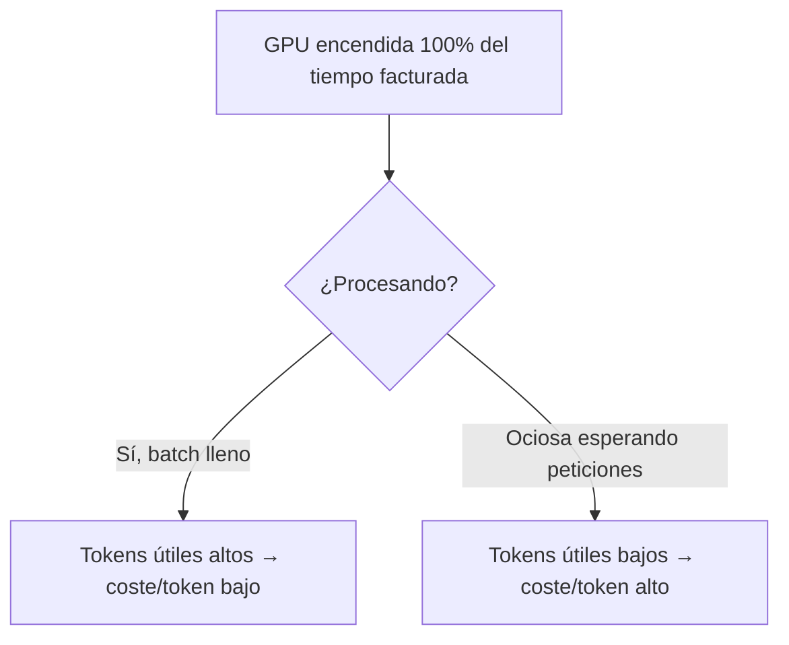
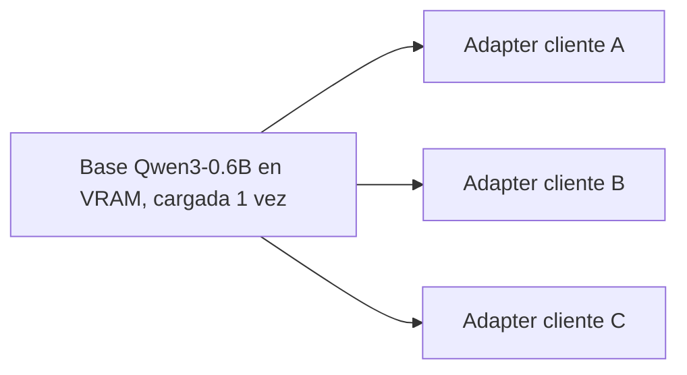

# Optimización de costes

<!-- CURSO_NAV_TOP -->
[← Observabilidad y monitorización](10-Observabilidad-y-monitorizacion.md) · [Índice](../README.md) · [Evaluación y monitorización de calidad →](12-Evaluacion-y-calidad-en-produccion.md)
<!-- /CURSO_NAV_TOP -->

> [!NOTE]
> **Capítulo avanzado**
> Los conceptos se aplican a cualquier sistema. Los laboratorios de serving con CUDA se ejecutan mejor en WSL2/Linux o cloud; en Apple Silicon puedes practicar las ideas con llama.cpp, MLX o vLLM-Metal. Consulta [Plataformas y comandos](../PLATAFORMAS-Y-COMANDOS.md).

> [!NOTE]
> **En este capítulo**
> El coste de servir un LLM no es un misterio: es **aritmética**. Partimos de la **economía unitaria** (coste-por-token y coste-por-petición) y deshacemos la cadena de variables que la mueven, ordenadas por impacto: la **utilización de GPU** (la dominante), la **cuantización**, la **decodificación especulativa**, las **bases compartidas** (multi-LoRA) y las **instancias spot**. Cerramos con el *right-sizing* (dimensionar correctamente), la lectura de la **facturación basada en uso** como señal de mercado y un **ejemplo numérico completo** de coste-por-millón-de-tokens, anclado en **Qwen3-0.6B**.

## La economía unitaria: coste-por-token y coste-por-petición

Todo el capítulo descansa en una única identidad. El coste de servir es, ante todo, el coste de alquilar la GPU durante el tiempo que está ocupada:

$$
\text{coste por token} = \frac{\text{coste por hora de la GPU}}{\text{tokens por hora generados}}
$$

Y el coste por petición se deriva sin más:

$$
\text{coste por petición} = \text{coste por token} \times (\text{tokens entrada} + \text{tokens salida})
$$

> [!NOTE]
> **El denominador lo es todo**
> El numerador (precio de la GPU) lo fija la nube y apenas lo controlas. El denominador (tokens útiles por hora) lo controlas tú casi por completo. **Optimizar coste es maximizar tokens útiles por hora-GPU.** Todo lo demás son corolarios de esta frase.

## La variable dominante: la utilización de GPU

Una GPU se paga por tiempo encendida, esté trabajando o no. Si tu servicio está al 20 % de utilización, estás pagando 5× por cada token útil. La utilización es, con diferencia, la palanca mayor.

Las tres causas de baja utilización y sus remedios:

- **Tráfico irregular**: picos y valles dejan la GPU ociosa en los valles. Remedio: autoescalado y consolidación de cargas.
- **Batches pequeños**: si sirves de uno en uno, desperdicias el paralelismo. Remedio: *continuous batching* (ver [05 - Batching y scheduling](05-Batching-y-scheduling.md)).
- **Sobredimensionado**: una GPU enorme para un modelo pequeño. Remedio: *right-sizing* (más abajo).

Para un modelo pequeño como **Qwen3-0.6B**, el *batching* es decisivo: el modelo cabe holgadamente en VRAM, así que el cuello de botella es llenar el *batch* para amortizar cada paso de *decode* entre muchas peticiones simultáneas.

## La segunda variable: la cuantización

La **cuantización** reduce la precisión numérica de los pesos (de bf16 a int8 o int4). Dos efectos sobre el coste:

1. **Menos VRAM** → cabe el modelo en GPU más baratas o caben más peticiones en *batch* (sube la utilización).
2. **Más ancho de banda efectivo** → en *decode*, que está limitado por memoria, mover menos bytes por token sube los tokens/s.

La VRAM aproximada de los pesos es:

$$
\text{VRAM}_{\text{pesos}} \approx N_{\text{parámetros}} \times \text{bytes por parámetro}
$$

Para Qwen3-0.6B (≈ 0,6 · 10⁹ parámetros): en bf16 (2 bytes) son ≈ 1,2 GB; en int4 (0,5 bytes) ≈ 0,3 GB. La compresión libera VRAM para KV-cache y *batch* mayor. El detalle técnico y el compromiso con la calidad están en [06 - Cuantización y compresión](06-Cuantizacion-y-compresion-avanzada.md).

> [!WARNING]
> **La cuantización no es gratis**
> Reduce coste solo si la pérdida de calidad es tolerable para tu tarea. Cuantizar y luego perder un 5 % de calidad puede salir más caro si te obliga a reintentos o degrada el negocio. Mídelo con el *eval set* de [13 - Evaluación y monitorización de calidad](12-Evaluacion-y-calidad-en-produccion.md).

## La tercera variable: la decodificación especulativa

La **decodificación especulativa** (*speculative decoding*) usa un modelo borrador pequeño y rápido para proponer varios tokens que el modelo grande verifica en una sola pasada. Si la tasa de aceptación es alta, se generan más tokens por paso sin perder calidad (la salida es idéntica a la del modelo grande).

El efecto sobre coste es directo: sube los tokens/s y por tanto el denominador de la economía unitaria. El *speedup* depende de la aceptación $\alpha$ y del número de tokens especulados $k$. Si el coste de verificación es bajo respecto al de generación normal, la mejora de *throughput* es aproximadamente:

$$
\text{speedup} \approx \frac{1 - \alpha^{k+1}}{1 - \alpha}
$$

Detalle completo en [07 - Decodificación especulativa](07-Decodificacion-especulativa.md). Para Qwen3-0.6B, al ser ya pequeño, el margen de un borrador aún menor es limitado; brilla más en modelos grandes.

## La cuarta variable: bases compartidas (multi-LoRA)

Servir N modelos *fine-tuneados* como N despliegues independientes multiplica el coste por N. Con **LoRA** (*Low-Rank Adaptation*), cada variante es un pequeño conjunto de matrices de bajo rango sobre **una misma base compartida**. El servidor carga la base una vez y conmuta adaptadores por petición.

El ahorro es enorme cuando tienes muchas variantes con poco tráfico cada una: en vez de N GPUs al 10 %, una GPU al 80 % sirviéndolas todas. Es la misma idea de la variable dominante (utilización) aplicada a la multi-tenencia.

## La quinta variable: instancias spot

Las **instancias spot** (capacidad sobrante de la nube) cuestan típicamente entre un 60 % y un 90 % menos que las *on-demand*, a cambio de poder ser **desalojadas** (*preempted*) con poco aviso.

> [!TIP]
> **Spot sí, pero con red de seguridad**
> Funcionan bien para cargas tolerantes a interrupción: *batch* offline, evaluaciones, reentrenos. Para *serving* online necesitas: réplicas en *on-demand* como base, *spot* para absorber picos, drenado limpio de conexiones al recibir el aviso de desalojo y reintentos idempotentes. Nunca pongas el 100 % del tráfico crítico en *spot*.

## *Right-sizing*: dimensionar correctamente

*Right-sizing* es elegir la GPU más pequeña que cumpla tu SLO de latencia con margen razonable. El error habitual es elegir por "la que sobra de seguro".

Procedimiento de primeros principios:

1. Calcula la **VRAM necesaria**: pesos + KV-cache (proporcional a *batch* × longitud de contexto) + *overhead* del runtime.
2. Mide los **tokens/s reales** bajo carga representativa, no de catálogo.
3. Calcula el **coste-por-token** de cada candidata y elige la mínima que respete el SLO.

Para Qwen3-0.6B, una GPU de gama alta está sobredimensionada: cabe muchas veces. El *right-sizing* aquí suele apuntar a GPU más modestas saturadas con *batching* agresivo, no a la GPU más potente infrautilizada.

## La señal del mercado: facturación basada en uso

Los proveedores de API cobran **por token** (entrada y salida con precios distintos). Esa estructura de precios **es la economía unitaria hecha pública**: cuando una API cobra X por millón de tokens de salida, te está revelando su coste marginal más margen.

Leer esa señal sirve para dos decisiones:

- **Construir vs. comprar**: si tu coste-por-millón auto-alojado supera el precio de API, no hay caso para alojar; salvo por latencia, privacidad o control.
- **Diseño del producto**: si la salida cuesta más que la entrada, optimiza por respuestas concisas y *prompts* cacheados.

## Ejemplo trabajado: coste-por-millón-de-tokens

Pongamos números a la identidad. **Las cifras del hardware son hipotéticas y didácticas**; sustitúyelas por las reales de tu nube.

> [!TIP]
> **Supuestos del cálculo**
> - GPU alquilada: **1,00 €/hora** (supuesto didáctico).
> - Qwen3-0.6B sirviendo con *continuous batching*.
> - *Throughput* medido bajo carga: **2 000 tokens/segundo** de salida agregada.
> - Utilización efectiva durante la ventana facturada: **80 %**.

**Paso 1 — tokens útiles por hora a plena ocupación:**

$$
2000 \ \tfrac{\text{tok}}{\text{s}} \times 3600 \ \tfrac{\text{s}}{\text{h}} = 7\,200\,000 \ \tfrac{\text{tok}}{\text{h}}
$$

**Paso 2 — ajuste por utilización real (80 %):**

$$
7\,200\,000 \times 0{,}80 = 5\,760\,000 \ \tfrac{\text{tok útiles}}{\text{h}}
$$

**Paso 3 — coste por token:**

$$
\frac{1{,}00 \ \text{€/h}}{5\,760\,000 \ \text{tok/h}} \approx 1{,}74 \times 10^{-7} \ \text{€/token}
$$

**Paso 4 — coste por millón de tokens:**

$$
1{,}74 \times 10^{-7} \ \tfrac{\text{€}}{\text{tok}} \times 10^{6} \ \text{tok} \approx 0{,}174 \ \text{€ / millón}
$$

Ahora veamos el **efecto de la variable dominante**. Si la utilización cae del 80 % al 30 % (tráfico irregular sin *batching*):

$$
\frac{1{,}00}{7\,200\,000 \times 0{,}30} \times 10^{6} \approx 0{,}463 \ \text{€ / millón}
$$

El mismo modelo, el mismo hardware, **2,7× más caro por token** solo por dejar la GPU ociosa. Esto demuestra numéricamente por qué la utilización es la variable dominante.

| Escenario | Utilización | Tokens útiles/h | €/millón tokens |
|---|---|---|---|
| Bien dimensionado + batching | 80 % | 5 760 000 | ≈ 0,174 |
| Tráfico irregular sin batching | 30 % | 2 160 000 | ≈ 0,463 |
| Línea ideal (teórico) | 100 % | 7 200 000 | ≈ 0,139 |

> [!TIP]
> **Puntos clave**
> - La economía unitaria es aritmética: **coste-por-token = coste-hora-GPU / tokens útiles por hora**.
> - La **utilización de GPU** es la variable dominante; el ejemplo muestra 2,7× de diferencia solo por ociosidad.
> - **Cuantización**, **decodificación especulativa** y **multi-LoRA** suben los tokens útiles por hora o reducen el hardware necesario.
> - Las **instancias spot** abaratan, pero solo con red de seguridad para cargas online.
> - El **right-sizing** elige la GPU mínima que cumple el SLO; para Qwen3-0.6B, satura GPUs modestas en vez de infrautilizar grandes.
> - La **facturación por uso** de las APIs es la economía unitaria pública: úsala para decidir construir vs. comprar.

## Enlaces relacionados

- [11 - Observabilidad y monitorización](10-Observabilidad-y-monitorizacion.md) — la telemetría de coste alimenta este cálculo
- [13 - Evaluación y monitorización de calidad](12-Evaluacion-y-calidad-en-produccion.md) — para medir el coste real de cuantizar
- [06 - Cuantización y compresión](06-Cuantizacion-y-compresion-avanzada.md) — la segunda variable, en detalle
- [07 - Decodificación especulativa](07-Decodificacion-especulativa.md) — la tercera variable, en detalle
- [05 - Batching y scheduling](05-Batching-y-scheduling.md) — el motor de la utilización
- [P3 - Proyecto - Sistema de serving en producción](../06-Proyectos/04-Sistema-de-serving-en-produccion.md) — donde se mide el coste real
- [Apéndice C - Checklist de producción](../07-Anexos/H-Checklist-de-produccion.md) — verificación de dimensionado y coste

---

---

Curso creado por [@are_agi](https://twitter.com/are_agi).

---

Curso creado por [@are_agi](https://twitter.com/are_agi).

---

<!-- CURSO_NAV_BOTTOM -->
[← Observabilidad y monitorización](10-Observabilidad-y-monitorizacion.md) · [Índice](../README.md) · [Evaluación y monitorización de calidad →](12-Evaluacion-y-calidad-en-produccion.md)
<!-- /CURSO_NAV_BOTTOM -->

Curso creado por [@are_agi](https://twitter.com/are_agi).
