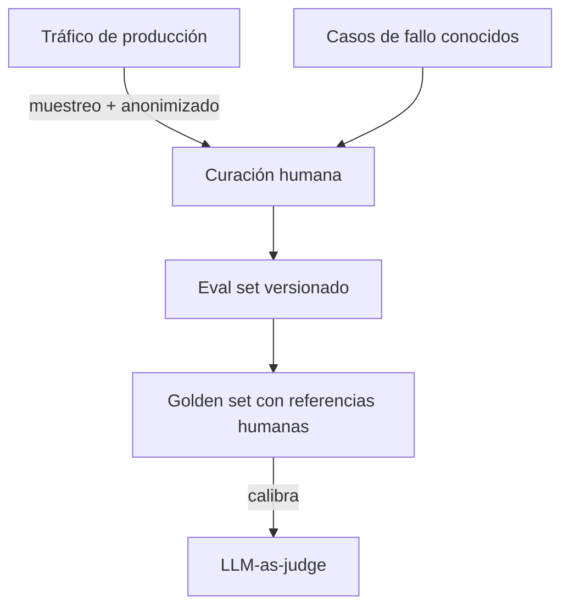
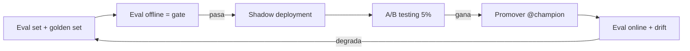

# Evaluación y monitorización de calidad

<!-- CURSO_NAV_TOP -->
[← Optimización de costes](11-Optimizacion-de-costes.md) · [Índice](../README.md) · [06 - Proyecto final →](../06-Proyectos/01-Asistente-local-completo.md)
<!-- /CURSO_NAV_TOP -->


> [!info] Capítulo avanzado
> Los conceptos se aplican a cualquier sistema. Los laboratorios de serving con CUDA se ejecutan mejor en WSL2/Linux o cloud; en Apple Silicon puedes practicar las ideas con llama.cpp, MLX o vLLM-Metal. Consulta [Plataformas y comandos](../PLATAFORMAS-Y-COMANDOS.md).


> [!abstract] En este capítulo
> Medir la calidad de un LLM es el problema sin resolver de LLMOps: no hay una métrica única ni una verdad de referencia limpia. Construimos una disciplina práctica desde primeros principios: la diferencia entre evaluación **offline** y **online**, cómo **elegir métricas por tarea**, el uso responsable de **LLM-as-judge** (rúbricas, sesgos, *pairwise*), la construcción del **eval set** y su *golden set*, el **A/B testing** en producción, la **monitorización de drift**, **dos casos de estudio de fallo** reales y cómo **juntarlo todo**. Anclado en **Qwen3-0.6B**.

## Evaluación offline frente a online

Son dos regímenes complementarios, no alternativos.

| | Offline | Online |
|---|---|---|
| Cuándo | Antes de desplegar | Con tráfico real |
| Datos | *Eval set* fijo y curado | Peticiones de producción |
| Objetivo | ¿Es lo bastante buena para salir? | ¿Sigue siéndolo y a qué coste? |
| Bucle | Lento, exhaustivo | Continuo, muestreado |
| Riesgo | Sobreajuste al *eval set* | Coste y privacidad |

> [!info] La regla de oro
> La evaluación **offline** es una **puerta** (*gate*) de despliegue: nada llega a producción sin pasarla. La **online** es un **vigía**: detecta lo que el *eval set* no anticipó. Necesitas las dos porque el *eval set* nunca cubre toda la distribución real.

## Elegir métricas por tarea

No existe "la métrica de calidad de un LLM". La métrica se deriva de la tarea.

- **Clasificación / extracción** (salida estructurada): *accuracy*, F1, validez del esquema JSON. Determinista y barata.
- **Resumen / traducción**: solapamiento léxico (ROUGE, BLEU) como suelo, y similitud semántica con *embeddings* como mejora; idealmente, juicio humano o de LLM.
- **Generación abierta / chat**: rúbricas multidimensionales (utilidad, corrección, seguridad, tono) evaluadas por humanos o por LLM-as-judge.
- **RAG**: *faithfulness* (fidelidad a las fuentes) y *answer relevance*, además de métricas de recuperación.

> [!tip] Métricas baratas primero
> Pon siempre un suelo determinista barato (validez de formato, longitud, presencia de campos obligatorios) antes de gastar en juicios caros. Filtra lo obvio gratis.

Para una tarea de extracción con Qwen3-0.6B, validar el JSON contra un esquema con `jsonschema` ya descarta una fracción de fallos sin invocar ningún juez.

## LLM-as-judge: rúbricas, sesgos y *pairwise*

**LLM-as-judge** usa un LLM (idealmente más capaz que el evaluado) para puntuar salidas según una **rúbrica**. Es escalable y razonablemente correlacionado con el juicio humano, pero tiene sesgos conocidos que hay que neutralizar.

```python
RUBRICA = """Eres un evaluador imparcial. Puntúa la RESPUESTA frente a la
PREGUNTA en una escala 1-5 según estos criterios, devolviendo SOLO JSON:
- corrección: ¿es factualmente correcta?
- completitud: ¿responde todo lo preguntado?
- concisión: ¿evita relleno innecesario?

Formato: {"correccion": n, "completitud": n, "concision": n, "razon": "..."}
"""

def juzgar(pregunta, respuesta, cliente_juez):
    # El juez recibe rúbrica explícita; nunca "di si es buena" a secas
    msg = f"PREGUNTA:\n{pregunta}\n\nRESPUESTA:\n{respuesta}"
    salida = cliente_juez.generar(sistema=RUBRICA, usuario=msg)
    return parsear_json(salida)  # validar el esquema antes de confiar
```

Los **sesgos** del juez y sus mitigaciones:

- **Sesgo de posición**: en comparaciones *pairwise*, prefiere la primera (o la segunda) opción. Mitigación: evaluar A-vs-B y B-vs-A y promediar.
- **Sesgo de verbosidad**: premia respuestas largas. Mitigación: incluir "concisión" en la rúbrica y normalizar.
- **Sesgo de auto-preferencia**: un juez prefiere salidas de su propia familia de modelos. Mitigación: usar un juez de familia distinta a la del modelo evaluado.

> [!warning] Pairwise > escala absoluta
> Pedir "puntúa de 1 a 5" produce puntuaciones inconsistentes entre ejecuciones. La comparación **pairwise** ("¿cuál es mejor, A o B?") es mucho más estable y es la base natural del A/B testing.

## El propio *eval set*: construcción y *golden set*

El *eval set* es el activo más valioso del equipo de calidad, y el más descuidado. Un buen *eval set* tiene tres propiedades:

1. **Representativo**: refleja la distribución real de *prompts*, incluida la cola larga.
2. **Estratificado**: cubre explícitamente los casos difíciles y los modos de fallo conocidos, no solo el caso feliz.
3. **Versionado**: cambia con el producto y se versiona como código.

El **golden set** es un subconjunto pequeño con respuestas de referencia validadas por humanos. Es la calibración del LLM-as-judge: si el juez no concuerda con el *golden set*, el juez está mal, no el modelo.



> [!danger] No filtres el eval set al entrenamiento
> Si los ejemplos del *eval set* acaban en los datos de *fine-tuning*, la evaluación queda contaminada y miente. Mantén una separación estricta, como en cualquier *train/test split*.

## A/B testing en producción

El A/B testing es la única forma honesta de saber si el *challenger* mejora al *champion* con tráfico real. Conecta directamente con los **alias** de [model registry](10-Observabilidad-y-monitorizacion.md#El%20model%20registry%20y%20los%20aliases): el *champion* sirve el grueso, el *challenger* un porcentaje.

Mecánica de primeros principios:

1. **Hipótesis** medible: "el challenger mejora la tasa de aceptación del juez sin subir la latencia p95 más de un 10 %".
2. **Asignación aleatoria** y estable por usuario (un usuario siempre ve la misma variante).
3. **Tamaño de muestra** suficiente: calcula el $n$ para detectar el efecto mínimo relevante con potencia estadística adecuada.
4. **Significancia**: no declares ganador por una diferencia de ruido. Usa un test apropiado y corrige por comparaciones múltiples.

> [!tip] Empieza con un *shadow deployment*
> Antes del A/B con usuarios, sirve el *challenger* en **sombra**: recibe copia del tráfico real pero su salida no llega al usuario. Comparas calidad y latencia sin riesgo. Luego pasas a A/B real con un 5 %.

## Monitorización de *drift*

La evaluación online vigila que la calidad no se erosione. Las señales de *drift* (deriva) que más alertan:

- **Drift de entrada**: cambian los *prompts* (test KS sobre longitud, *clustering* de *embeddings* para temas nuevos). Ver [detección de drift](10-Observabilidad-y-monitorizacion.md#Detecci%C3%B3n%20de%20drift).
- **Drift de salida**: cambia la distribución de respuestas (longitud media, tasa de rechazos) sin tocar el modelo.
- **Caída de la puntuación del juez**: la métrica online de calidad baja de forma sostenida.

La práctica recomendada es evaluar online sobre una **muestra continua** del tráfico (p. ej. 1 %) con el LLM-as-judge ya calibrado, y alertar cuando la media móvil de calidad cae por debajo de un umbral derivado del *golden set*.

## Dos casos de estudio de fallo

> [!example] Caso 1 — La degradación silenciosa por *drift* de entrada
> Un servicio de extracción con Qwen3-0.6B funcionaba al 96 % de validez de esquema. Un cliente empezó a enviar documentos en un idioma nuevo. Las métricas de **servicio** (latencia, errores) seguían perfectas: el modelo respondía rápido y sin excepciones. Pero la **validez de esquema** cayó al 70 %. El fallo solo era visible en la **capa de calidad**. *Lección*: las golden signals no detectan degradación de calidad; necesitas evaluación online y *drift* de entrada.

> [!example] Caso 2 — El falso ganador del A/B mal medido
> Un *challenger* cuantizado a int4 mostró +3 % en la puntuación del juez y se promovió. Dos semanas después, quejas de usuarios. El problema: el juez tenía **sesgo de verbosidad** y el *challenger* simplemente respondía más largo; además el *golden set* no se había actualizado y no detectó pérdidas factuales. *Lección*: calibra el juez contra el *golden set*, neutraliza sesgos (concisión en rúbrica, *pairwise* con permutación) y no confíes en una métrica única.

## Juntándolo todo

La calidad no es una fase, es un bucle cerrado que atraviesa todo el ciclo de vida.



El bucle: el *eval set* alimenta la puerta offline; el *challenger* que pasa va a sombra, luego a A/B; el ganador se promueve moviendo el alias; la evaluación online vigila el *drift* y, cuando algo se degrada, los casos de fallo realimentan el *eval set*. Es el mismo principio de mejora continua de MLOps, adaptado a la naturaleza no determinista de los LLM.

> [!success] Puntos clave
> - **Offline** es la puerta de despliegue; **online** es el vigía. Necesitas ambas.
> - La métrica se **deriva de la tarea**; pon suelos deterministas baratos antes de juicios caros.
> - **LLM-as-judge** escala, pero exige rúbricas explícitas y neutralizar sesgos (posición, verbosidad, auto-preferencia); prefiere **pairwise** a escala absoluta.
> - El **eval set** representativo, estratificado y versionado, con un **golden set** humano que calibra al juez, es el activo central; nunca lo filtres al entrenamiento.
> - El **A/B testing** sobre alias champion/challenger, precedido de **shadow deployment**, es la prueba honesta en producción.
> - Vigila el **drift** con evaluación online muestreada; las golden signals no ven la calidad.
> - Los dos casos de fallo enseñan: la calidad se degrada en silencio y los jueces mal calibrados producen falsos ganadores.

## Enlaces relacionados

- [12 - Optimización de costes](11-Optimizacion-de-costes.md) — para medir el coste real de cuantizar antes de promover
- [11 - Observabilidad y monitorización](10-Observabilidad-y-monitorizacion.md) — drift, alias y la capa de calidad
- [06 - Cuantización y compresión](06-Cuantizacion-y-compresion-avanzada.md) — origen del caso de fallo 2
- [P3 - Proyecto - Sistema de serving en producción](../06-Proyectos/04-Sistema-de-serving-en-produccion.md) — donde se implementa el bucle de calidad
- [P1 - Proyecto - Motor de inferencia desde cero](../06-Proyectos/02-Motor-de-inferencia-desde-cero.md) — siguiente parada del curso
- [Apéndice C - Checklist de producción](../07-Anexos/H-Checklist-de-produccion.md) — verificación de evaluación
- [Apéndice D - Guía de troubleshooting](../07-Anexos/I-Troubleshooting-de-serving.md) — diagnóstico de degradación de calidad

---

---


Curso creado por [@are_agi](https://twitter.com/are_agi).

---


Curso creado por [@are_agi](https://twitter.com/are_agi).

---

<!-- CURSO_NAV_BOTTOM -->
[← Optimización de costes](11-Optimizacion-de-costes.md) · [Índice](../README.md) · [06 - Proyecto final →](../06-Proyectos/01-Asistente-local-completo.md)
<!-- /CURSO_NAV_BOTTOM -->

Curso creado por [@are_agi](https://twitter.com/are_agi).
