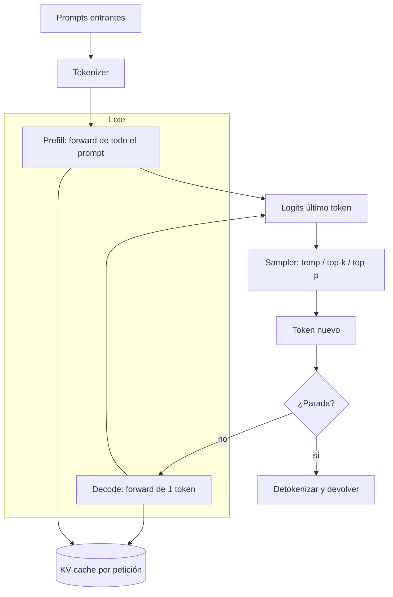

# P1 - Proyecto - Motor de inferencia desde cero

<!-- CURSO_NAV_TOP -->
[← 06 - Proyecto final](01-Asistente-local-completo.md) · [Índice](../README.md) · [P2 - Proyecto - Fine-tuning de Qwen3-0.6B →](03-Fine-tuning-de-Qwen3-0.6B.md)
<!-- /CURSO_NAV_TOP -->


> [!NOTE]
> **Capítulo avanzado**
> Los conceptos se aplican a cualquier sistema. Los laboratorios de serving con CUDA se ejecutan mejor en WSL2/Linux o cloud; en Apple Silicon puedes practicar las ideas con llama.cpp, MLX o vLLM-Metal. Consulta [Plataformas y comandos](../PLATAFORMAS-Y-COMANDOS.md).


> [!NOTE]
> **Objetivo del proyecto**
> Construir, desde primeros principios y sin apoyarse en `model.generate()`, un **motor de inferencia** (en inglés *inference engine*) completo para **Qwen3-0.6B**. Implementarás el ciclo entero: carga de pesos, tokenización, fase de *prefill*, fase de *decode* con **KV cache** (caché de claves y valores), estrategias de *sampling* (muestreo), condiciones de parada y un *batching* (procesamiento por lotes) básico. Al terminar entenderás exactamente qué ocurre en cada `forward` y por qué la latencia y el coste se reparten como se reparten.

## Objetivo y resultado esperado

El resultado tangible es un paquete Python `mini_engine/` que expone una función `generate(prompts: list[str], max_new_tokens: int, **sampling) -> list[str]` capaz de servir varias peticiones simultáneas. No se trata de competir con vLLM ni con TensorRT-LLM, sino de **dominar la mecánica**: cuando en producción veas que el *time-to-first-token* (TTFT, tiempo hasta el primer token) se dispara o que el *throughput* (rendimiento, tokens/segundo) cae al crecer la longitud de contexto, querrás saber qué pieza es la culpable.

Trabajamos sobre Qwen3-0.6B porque cabe holgadamente en una GPU modesta (≈ 0.6 mil millones de parámetros, unos 1.2 GB en FP16) e incluso en CPU para depurar. Es un decodificador autorregresivo (en inglés *decoder-only*) con atención de consultas agrupadas (**GQA**, *Grouped-Query Attention*), lo que hace que la gestión de la KV cache sea didácticamente rica sin ser inabordable.

## Requisitos y entorno

| Componente | Versión / nota |
|---|---|
| Python | 3.11+ |
| PyTorch | 2.3+ (CUDA opcional pero recomendado) |
| `transformers` | solo para cargar pesos y el *tokenizer*, **no** para generar |
| `safetensors` | lectura de pesos |
| GPU | cualquiera con ≥ 4 GB; CPU válida para depurar |

> [!TIP]
> **Disciplina de proyecto**
> Prohibido llamar a `model.generate()`, `model.forward()` con caché automática o utilidades de *sampling* de `transformers`. Sí está permitido reutilizar los **módulos de capa** del modelo (las matrices de atención y MLP) o reimplementarlas; la decisión la fijas en el Milestone 1.

## Arquitectura



La clave conceptual es la asimetría **prefill vs decode**: el *prefill* procesa los $T$ tokens del *prompt* en un único `forward` paralelo (coste $\mathcal{O}(T^2)$ en atención, *compute-bound*), mientras que cada paso de *decode* procesa **un solo token** apoyándose en la caché (coste $\mathcal{O}(T)$, fuertemente *memory-bound*). Esto está desarrollado en [04 - El bucle de inferencia](../05-LLMOps/04-El-bucle-de-inferencia.md) y [03 - Atención y KV cache](../05-LLMOps/03-Atencion-y-KV-cache.md).

## Milestones

### 1. Carga de pesos y arquitectura del modelo

Carga la configuración y los pesos en `safetensors`, y reconstruye el grafo de cómputo. El objetivo es tener control total sobre el `forward`.

```python
import torch
from transformers import AutoConfig, AutoModelForCausalLM, AutoTokenizer

MODEL_ID = "Qwen/Qwen3-0.6B"

# Cargamos config, tokenizer y pesos. Usamos transformers SOLO como contenedor de pesos.
config = AutoConfig.from_pretrained(MODEL_ID)
tokenizer = AutoTokenizer.from_pretrained(MODEL_ID)
model = AutoModelForCausalLM.from_pretrained(
    MODEL_ID, torch_dtype=torch.float16
).eval()  # eval() desactiva dropout; no entrenamos aquí

device = "cuda" if torch.cuda.is_available() else "cpu"
model.to(device)

# Inspeccionamos los hiperparámetros que gobiernan la KV cache
print(config.num_hidden_layers)       # nº de capas (L)
print(config.num_attention_heads)     # nº de cabezas de consulta (Q)
print(config.num_key_value_heads)     # nº de cabezas K/V (GQA): < Q
print(config.hidden_size, config.head_dim if hasattr(config, "head_dim") else "n/a")
```

El detalle didáctico: `num_key_value_heads < num_attention_heads` confirma **GQA**. Varias cabezas de consulta comparten un mismo par K/V, lo que reduce el tamaño de la caché por un factor `num_attention_heads / num_key_value_heads`.

### 2. Tokenización y plantilla de chat

Qwen3 usa una plantilla de chat (en inglés *chat template*) con tokens especiales de rol. No la inventes: úsala vía el *tokenizer*.

```python
def construir_entrada(prompt_usuario: str) -> torch.Tensor:
    # Aplicamos la plantilla oficial de chat; add_generation_prompt añade
    # el turno del asistente para que el modelo continúe.
    mensajes = [{"role": "user", "content": prompt_usuario}]
    ids = tokenizer.apply_chat_template(
        mensajes, add_generation_prompt=True, return_tensors="pt"
    )
    return ids.to(device)  # forma [1, T]
```

### 3. Prefill con KV cache

El *prefill* procesa el *prompt* completo y materializa la caché. Conceptualmente, para cada capa $l$ guardamos $K^{(l)} \in \mathbb{R}^{H_{kv} \times T \times d}$ y $V^{(l)}$ análogo, donde $H_{kv}$ es el número de cabezas K/V, $T$ la longitud y $d$ la dimensión por cabeza.

```python
@torch.no_grad()
def prefill(input_ids: torch.Tensor):
    # use_cache=True hace que el modelo devuelva past_key_values.
    salida = model(input_ids=input_ids, use_cache=True)
    logits = salida.logits[:, -1, :]      # logits SOLO del último token
    kv_cache = salida.past_key_values     # estructura por capa con K y V
    return logits, kv_cache
```

> [!NOTE]
> **Por qué solo el último token**
> Para predecir el siguiente token únicamente necesitamos los *logits* de la última posición. Los $T-1$ restantes ya cumplieron su papel: poblar la caché.

### 4. Bucle de decode (un token cada vez)

Cada iteración: muestrear un token de los *logits*, volver a entrar al modelo **solo con ese token** y la caché, que crece en una posición.

```python
@torch.no_grad()
def decode_paso(token_id: torch.Tensor, kv_cache):
    # token_id tiene forma [B, 1]; el modelo usa la caché para el contexto previo.
    salida = model(input_ids=token_id, past_key_values=kv_cache, use_cache=True)
    return salida.logits[:, -1, :], salida.past_key_values
```

El coste por paso es casi constante salvo por la atención, que escala linealmente con la longitud acumulada. Aquí es donde nace el *throughput* real del sistema (ver [05 - Batching y scheduling](../05-LLMOps/05-Batching-y-scheduling.md)).

### 5. Estrategias de sampling

Implementa *temperature*, *top-k* y *top-p* (núcleo, en inglés *nucleus sampling*) a mano. La temperatura $\tau$ reescala los *logits* $z$ antes del *softmax*:

$$ p_i = \frac{\exp(z_i / \tau)}{\sum_j \exp(z_j / \tau)} $$

```python
def muestrear(logits, temperatura=0.7, top_k=20, top_p=0.9):
    if temperatura <= 0:                       # greedy: argmax determinista
        return torch.argmax(logits, dim=-1, keepdim=True)
    logits = logits / temperatura
    # top-k: nos quedamos con los k logits mayores
    if top_k > 0:
        v, _ = torch.topk(logits, top_k)
        logits[logits < v[:, [-1]]] = -float("inf")
    probs = torch.softmax(logits, dim=-1)
    # top-p: mínimo conjunto cuya masa acumulada >= top_p
    if top_p < 1.0:
        ordenadas, idx = torch.sort(probs, descending=True)
        acum = torch.cumsum(ordenadas, dim=-1)
        quitar = acum - ordenadas > top_p      # los que sobran tras el umbral
        ordenadas[quitar] = 0.0
        probs = torch.zeros_like(probs).scatter(-1, idx, ordenadas)
        probs = probs / probs.sum(dim=-1, keepdim=True)
    return torch.multinomial(probs, num_samples=1)
```

### 6. Condiciones de parada

Para cada secuencia, detener cuando: aparece el token de fin de turno (`eos_token_id`, que en Qwen3 puede ser varios), se alcanza `max_new_tokens`, o se detecta una secuencia de parada textual (*stop string*).

```python
def terminada(tokens_generados, eos_ids, max_new):
    if len(tokens_generados) >= max_new:
        return True
    return tokens_generados[-1] in eos_ids
```

### 7. Batching básico (lote estático)

Agrupa varias peticiones en un único `forward`. La versión sencilla es el **lote estático con padding por la izquierda** (en inglés *left padding*), que mantiene alineadas las posiciones del último token real.

```python
def empaquetar(prompts, pad_id):
    secuencias = [tokenizer(p)["input_ids"] for p in prompts]
    L = max(map(len, secuencias))
    batch, mascara = [], []
    for s in secuencias:
        relleno = [pad_id] * (L - len(s))
        batch.append(relleno + s)            # padding a la IZQUIERDA
        mascara.append([0] * len(relleno) + [1] * len(s))
    return (torch.tensor(batch, device=device),
            torch.tensor(mascara, device=device))
```

> [!NOTE]
> **Hacia el batching dinámico**
> El lote estático desperdicia cómputo cuando las secuencias terminan en momentos distintos. La extensión natural es el *continuous batching* (lote continuo): retirar secuencias terminadas y añadir nuevas en cada paso. Se aborda como extensión opcional y se trata en [05 - Batching y scheduling](../05-LLMOps/05-Batching-y-scheduling.md).

## Criterios de aceptación

- [ ] El motor genera texto coherente para 5 *prompts* distintos sin usar `model.generate()`.
- [ ] Con `temperatura=0` (greedy), dos ejecuciones del mismo *prompt* producen **salidas idénticas** (determinismo).
- [ ] El *decode* con KV cache es al menos **5× más rápido** (tokens/s) que regenerar el contexto completo en cada paso (mídelo desactivando `use_cache` como referencia).
- [ ] El TTFT (prefill) y el tiempo por token de *decode* se reportan por separado en milisegundos.
- [ ] Un lote de 8 *prompts* alcanza un *throughput* agregado **mayor** que ejecutarlos secuencialmente uno a uno.
- [ ] Las condiciones de parada funcionan: ninguna secuencia excede `max_new_tokens` y todas se cortan en `eos`.
- [ ] El uso de memoria de la KV cache crece linealmente con la longitud (verificado con `torch.cuda.memory_allocated`).

## Errores comunes

> [!WARNING]
> **Padding por la derecha en decoder-only**
> Si rellenas por la derecha, el último token "real" deja de estar en la posición $-1$ y muestrearás a partir de un token de *padding*. En modelos *decoder-only* el *padding* va **siempre a la izquierda**.

> [!WARNING]
> **Olvidar la máscara de atención con padding**
> Sin `attention_mask`, los tokens de relleno contaminan la atención. Pasa siempre la máscara al `forward` del *prefill*.

> [!WARNING]
> **Reescalar logits dos veces**
> Aplicar temperatura y luego volver a normalizar tras *top-p* sin cuidado puede sesgar la distribución. Normaliza una sola vez, al final, tras filtrar.

> [!WARNING]
> **Crecimiento descontrolado de la caché**
> Si no fijas un tope de contexto, secuencias largas agotan la VRAM. Define un `max_position_embeddings` efectivo y rechaza o trunca lo que lo supere.

## Extensiones opcionales

1. **Continuous batching**: planificador (en inglés *scheduler*) que admite peticiones nuevas en cada paso de *decode*.
2. **Paged KV cache**: gestiona la caché en bloques de tamaño fijo (estilo PagedAttention) para reducir la fragmentación.
3. **Speculative decoding** (decodificación especulativa): un modelo borrador propone varios tokens y el modelo grande los verifica.
4. **Cuantización del KV cache** a int8 para duplicar la longitud servible (puente hacia [06 - Cuantización y compresión](../05-LLMOps/06-Cuantizacion-y-compresion-avanzada.md)).

> [!TIP]
> **Qué has aprendido**
> Has desmontado la caja negra de `generate()`: sabes diferenciar *prefill* de *decode*, entiendes por qué la KV cache convierte un coste cuadrático repetido en uno casi lineal, dominas las tres palancas de *sampling* y has construido el primer eslabón —el lote estático— de un planificador de *serving*. Esta base sostiene todo lo que viene después.

## Enlaces relacionados

- [03 - Atención y KV cache](../05-LLMOps/03-Atencion-y-KV-cache.md) — fundamento de la caché y de GQA.
- [04 - El bucle de inferencia](../05-LLMOps/04-El-bucle-de-inferencia.md) — prefill, decode y su asimetría de coste.
- [05 - Batching y scheduling](../05-LLMOps/05-Batching-y-scheduling.md) — del lote estático al continuo.
- [Apéndice E - Scaffold de implementación de referencia](../07-Anexos/J-Scaffold-de-implementacion.md) — esqueleto de código base.
- [P2 - Proyecto - Fine-tuning de Qwen3-0.6B](03-Fine-tuning-de-Qwen3-0.6B.md) — siguiente proyecto.

---


Curso creado por [@are_agi](https://twitter.com/are_agi).

---


Curso creado por [@are_agi](https://twitter.com/are_agi).

---

<!-- CURSO_NAV_BOTTOM -->
[← 06 - Proyecto final](01-Asistente-local-completo.md) · [Índice](../README.md) · [P2 - Proyecto - Fine-tuning de Qwen3-0.6B →](03-Fine-tuning-de-Qwen3-0.6B.md)
<!-- /CURSO_NAV_BOTTOM -->

Curso creado por [@are_agi](https://twitter.com/are_agi).
