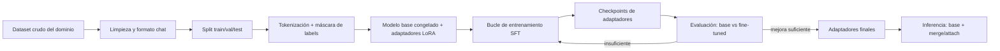

# P2 - Proyecto - Fine-tuning de Qwen3-0.6B

<!-- CURSO_NAV_TOP -->
[← P1 - Proyecto - Motor de inferencia desde cero](02-Motor-de-inferencia-desde-cero.md) · [Índice](../README.md) · [P3 - Proyecto - Sistema de serving en producción →](04-Sistema-de-serving-en-produccion.md)
<!-- /CURSO_NAV_TOP -->


> [!NOTE]
> **Ruta NVIDIA / cloud**
> Los ejemplos con CUDA están pensados para Windows mediante WSL2, Linux o una GPU cloud. En Mac, usa el itinerario MLX enlazado en [Plataformas y comandos](../PLATAFORMAS-Y-COMANDOS.md).


> [!NOTE]
> **Objetivo del proyecto**
> Adaptar **Qwen3-0.6B** a un **dominio propio** mediante *fine-tuning* eficiente en parámetros (**PEFT**, *Parameter-Efficient Fine-Tuning*) con **LoRA** y su variante cuantizada **QLoRA**. Recorrerás el ciclo completo: preparar un *dataset* de instrucciones, montar el bucle de entrenamiento con adaptadores, evaluar antes/después y servir el modelo cargando los adaptadores. El entregable es un par de pesos LoRA reutilizables y un informe de mejora cuantificada.

## Objetivo y resultado esperado

El resultado es un directorio de adaptadores (`adapter_model.safetensors` + `adapter_config.json`) de unos pocos MB que, montado sobre el Qwen3-0.6B base, eleva la calidad en tu dominio sin tocar los 0.6 mil millones de parámetros originales. Elegimos un dominio concreto y acotado —por ejemplo, **respuestas a tickets de soporte técnico interno** o **clasificación-redacción de notas de un área específica**— porque un objetivo medible es la única forma de demostrar que el *fine-tuning* sirvió.

La idea de primeros principios: en lugar de actualizar la matriz de pesos $W \in \mathbb{R}^{d \times k}$, LoRA congela $W$ y aprende una corrección de **bajo rango** $\Delta W = B A$, con $A \in \mathbb{R}^{r \times k}$ y $B \in \mathbb{R}^{d \times r}$ donde $r \ll \min(d, k)$. La salida pasa a ser:

$$ h = W x + \frac{\alpha}{r} \, B A \, x $$

Solo $A$ y $B$ son entrenables, lo que reduce los parámetros a optimizar en uno o dos órdenes de magnitud. Todo el fundamento está en [09 - Fine-tuning y adaptación de dominio](../04-Adaptar/02-Fine-tuning-con-PEFT-y-QLoRA.md).

## Requisitos y entorno

| Componente | Versión / nota |
|---|---|
| Python | 3.11+ |
| PyTorch | 2.3+ con CUDA |
| `transformers`, `datasets` | carga de modelo y datos |
| `peft` | implementación de LoRA/QLoRA |
| `bitsandbytes` | cuantización a 4 bits (QLoRA) |
| `trl` (opcional) | `SFTTrainer` para el bucle SFT |
| GPU | ≥ 6 GB para LoRA FP16; QLoRA cabe en ≈ 4 GB |

> [!NOTE]
> **LoRA frente a QLoRA**
> **LoRA**: el modelo base se mantiene en FP16 y se entrenan los adaptadores. **QLoRA**: el modelo base se carga **cuantizado a 4 bits** (NF4) y los adaptadores se entrenan en precisión mayor. QLoRA recorta drásticamente la VRAM a cambio de algo de sobrecarga de dequantización. Con un modelo de 0.6B, LoRA basta; QLoRA se incluye para que practiques la técnica que necesitarás con modelos de 7B+.

## Arquitectura



## Milestones

### 1. Construir y formatear el dataset

Reúne pares instrucción-respuesta del dominio y conviértelos a la **plantilla de chat** de Qwen3. La calidad y consistencia del formato pesan más que el volumen.

```python
from datasets import load_dataset

# Suponemos un JSONL con campos {"instruccion": ..., "respuesta": ...}
ds = load_dataset("json", data_files="dominio.jsonl", split="train")

def formatear(ejemplo, tokenizer):
    mensajes = [
        {"role": "user", "content": ejemplo["instruccion"]},
        {"role": "assistant", "content": ejemplo["respuesta"]},
    ]
    # tokenize=False devuelve la cadena con tokens de rol ya insertados
    texto = tokenizer.apply_chat_template(mensajes, tokenize=False)
    return {"text": texto}
```

> [!TIP]
> **Enmascarar la pérdida sobre el prompt**
> En *fine-tuning* de instrucciones solo queremos que el modelo aprenda a **generar la respuesta**, no a repetir la instrucción. Las *labels* de los tokens del *prompt* se ponen a `-100` (índice ignorado por la *cross-entropy*). `SFTTrainer` con `DataCollatorForCompletionOnlyLM` lo hace por ti; si montas el bucle a mano, hazlo explícitamente.

### 2. Cargar el modelo base (LoRA o QLoRA)

```python
import torch
from transformers import AutoModelForCausalLM, AutoTokenizer, BitsAndBytesConfig

MODEL_ID = "Qwen/Qwen3-0.6B"
tokenizer = AutoTokenizer.from_pretrained(MODEL_ID)

USAR_QLORA = True
if USAR_QLORA:
    # NF4 = NormalFloat 4-bit; doble cuantización ahorra algo más de memoria
    bnb = BitsAndBytesConfig(
        load_in_4bit=True,
        bnb_4bit_quant_type="nf4",
        bnb_4bit_compute_dtype=torch.bfloat16,
        bnb_4bit_use_double_quant=True,
    )
    model = AutoModelForCausalLM.from_pretrained(MODEL_ID, quantization_config=bnb)
else:
    model = AutoModelForCausalLM.from_pretrained(MODEL_ID, torch_dtype=torch.bfloat16)
```

### 3. Inyectar adaptadores LoRA con PEFT

Selecciona los módulos diana (en inglés *target modules*): típicamente las proyecciones de atención y de la MLP.

```python
from peft import LoraConfig, get_peft_model, prepare_model_for_kbit_training

if USAR_QLORA:
    model = prepare_model_for_kbit_training(model)  # estabiliza el entrenamiento 4-bit

lora_cfg = LoraConfig(
    r=16,                    # rango: capacidad de la corrección de bajo rango
    lora_alpha=32,           # escala alpha/r aplicada a B·A
    lora_dropout=0.05,
    target_modules=["q_proj", "k_proj", "v_proj", "o_proj",
                    "gate_proj", "up_proj", "down_proj"],
    bias="none",
    task_type="CAUSAL_LM",
)
model = get_peft_model(model, lora_cfg)
model.print_trainable_parameters()   # debería reportar < 2% de parámetros entrenables
```

### 4. Bucle de entrenamiento (SFT)

Usa `SFTTrainer` de `trl` para no reimplementar el bucle, controlando *learning rate*, acumulación de gradiente y *scheduler*.

```python
from trl import SFTTrainer, SFTConfig

cfg = SFTConfig(
    output_dir="adaptadores_dominio",
    num_train_epochs=3,
    per_device_train_batch_size=4,
    gradient_accumulation_steps=4,     # lote efectivo = 4*4 = 16
    learning_rate=2e-4,                # LR alto típico de LoRA
    lr_scheduler_type="cosine",
    warmup_ratio=0.03,
    logging_steps=10,
    eval_strategy="steps",
    eval_steps=50,
    save_steps=50,
    bf16=True,
    max_seq_length=1024,
)
trainer = SFTTrainer(model=model, args=cfg,
                     train_dataset=ds_train, eval_dataset=ds_val)
trainer.train()
trainer.save_model("adaptadores_dominio")  # guarda SOLO los adaptadores
```

> [!NOTE]
> **Por qué un learning rate alto**
> En *full fine-tuning* un LR de $2 \times 10^{-4}$ desestabilizaría el modelo. En LoRA solo ajustamos matrices pequeñas inicializadas para que $\Delta W = 0$ al arrancar, así que toleran —y necesitan— LR más agresivos.

### 5. Evaluación antes/después

Mide sobre el *split* de test que el modelo **no vio**. Combina una métrica automática con revisión cualitativa.

```python
import math, torch

@torch.no_grad()
def perplejidad(modelo, ds_test):
    # Perplejidad = exp(pérdida media). Más baja = mejor ajuste al dominio.
    perdidas = []
    for ej in ds_test:
        ids = tokenizer(ej["text"], return_tensors="pt").input_ids.to(modelo.device)
        out = modelo(ids, labels=ids)
        perdidas.append(out.loss.item())
    return math.exp(sum(perdidas) / len(perdidas))
```

La perplejidad (en inglés *perplexity*, $\text{ppl} = \exp(\mathcal{L})$ donde $\mathcal{L}$ es la *cross-entropy* media) sirve como proxy barato, pero **no** sustituye una evaluación de tarea. Complétala con métricas de tarea (exactitud de clasificación, *exact match*, o un juez LLM) según se describe en [13 - Evaluación y monitorización de calidad](../05-LLMOps/12-Evaluacion-y-calidad-en-produccion.md).

### 6. Inferencia con adaptadores

Dos modos: **adjuntar** los adaptadores en caliente (flexible, permite intercambiar dominios) o **fusionarlos** (en inglés *merge*) en el modelo base para servir sin sobrecarga.

```python
from peft import PeftModel

base = AutoModelForCausalLM.from_pretrained(MODEL_ID, torch_dtype=torch.bfloat16)

# Modo 1: adjuntar (los pesos base quedan intactos)
modelo = PeftModel.from_pretrained(base, "adaptadores_dominio")

# Modo 2: fusionar para producción (W <- W + alpha/r · B·A)
modelo_fusionado = modelo.merge_and_unload()
modelo_fusionado.save_pretrained("qwen3_dominio_merged")
```

> [!TIP]
> **Fusionar es el puente con el Proyecto 3**
> Un modelo fusionado se cuantiza y se sirve como uno cualquiera. Esto conecta directamente con [P3 - Proyecto - Sistema de serving en producción](04-Sistema-de-serving-en-produccion.md), donde el modelo fusionado entra en la pipeline de cuantización y despliegue.

## Criterios de aceptación

- [ ] El *dataset* final tiene al menos **3 splits** (train/val/test) sin solapamiento de ejemplos.
- [ ] `print_trainable_parameters()` reporta **menos del 2 %** de parámetros entrenables.
- [ ] La pérdida de validación **desciende de forma monótona** durante al menos las 2 primeras épocas (sin divergencia).
- [ ] La **perplejidad en test** del modelo *fine-tuned* es **menor** que la del modelo base (reporta ambos valores).
- [ ] En la métrica de tarea elegida, el modelo *fine-tuned* mejora al base en un margen **medible y reportado** (p. ej. +X puntos de exactitud).
- [ ] Los adaptadores guardados ocupan **menos de 50 MB**.
- [ ] El modelo fusionado produce las **mismas salidas** (greedy) que el modelo con adaptadores adjuntos.

## Errores comunes

> [!WARNING]
> **Sobreajuste con dataset pequeño**
> Con pocos ejemplos y 3+ épocas el modelo memoriza. Vigila la curva de validación: si la pérdida de *train* baja pero la de *val* sube, has cruzado el punto de sobreajuste (en inglés *overfitting*). Reduce épocas o aumenta `lora_dropout`.

> [!WARNING]
> **Plantilla de chat inconsistente**
> Si entrenas con un formato de *prompt* y sirves con otro, el modelo rinde mal en producción. Usa **exactamente** la misma `apply_chat_template` en entrenamiento e inferencia.

> [!WARNING]
> **No enmascarar el prompt**
> Si dejas que la pérdida cuente los tokens de la instrucción, el modelo aprende a regurgitar *prompts* en vez de a responder. Confirma que las *labels* del *prompt* valen `-100`.

> [!WARNING]
> **Olvidar prepare_model_for_kbit_training en QLoRA**
> Sin esta llamada, el entrenamiento 4-bit suele ser inestable (gradientes en capas mal preparadas, *layernorms* sin precisión adecuada).

## Extensiones opcionales

1. **DoRA / rsLoRA**: variantes que mejoran la estabilidad o el rendimiento del adaptador.
2. **Multi-adaptador**: entrena varios LoRA (uno por subdominio) y conmútalos en caliente sin recargar el base.
3. **DPO** (*Direct Preference Optimization*): añade una fase de alineación con pares de preferencia tras el SFT.
4. **Barrido de hiperparámetros**: rejilla sobre $r \in \{8, 16, 32\}$ y `lora_alpha` registrando perplejidad para encontrar el frente de Pareto coste/calidad.

> [!TIP]
> **Qué has aprendido**
> Sabes adaptar un modelo a un dominio sin reentrenar miles de millones de parámetros: entiendes la corrección de bajo rango de LoRA, la cuantización 4-bit de QLoRA, la importancia de enmascarar el *prompt* y de mantener la plantilla de chat coherente, y cómo medir la mejora con perplejidad y métricas de tarea. Tienes adaptadores listos para fusionar y servir.

## Enlaces relacionados

- [09 - Fine-tuning y adaptación de dominio](../04-Adaptar/02-Fine-tuning-con-PEFT-y-QLoRA.md) — teoría de PEFT, LoRA y QLoRA.
- [06 - Cuantización y compresión](../05-LLMOps/06-Cuantizacion-y-compresion-avanzada.md) — NF4 y la base de QLoRA.
- [13 - Evaluación y monitorización de calidad](../05-LLMOps/12-Evaluacion-y-calidad-en-produccion.md) — cómo medir la mejora correctamente.
- [P1 - Proyecto - Motor de inferencia desde cero](02-Motor-de-inferencia-desde-cero.md) — proyecto anterior.
- [P3 - Proyecto - Sistema de serving en producción](04-Sistema-de-serving-en-produccion.md) — donde se despliega el modelo fusionado.

---


Curso creado por [@are_agi](https://twitter.com/are_agi).

---


Curso creado por [@are_agi](https://twitter.com/are_agi).

---

<!-- CURSO_NAV_BOTTOM -->
[← P1 - Proyecto - Motor de inferencia desde cero](02-Motor-de-inferencia-desde-cero.md) · [Índice](../README.md) · [P3 - Proyecto - Sistema de serving en producción →](04-Sistema-de-serving-en-produccion.md)
<!-- /CURSO_NAV_BOTTOM -->

Curso creado por [@are_agi](https://twitter.com/are_agi).
