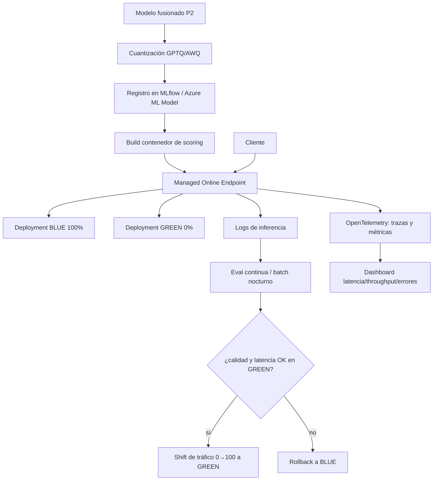

# P3 - Proyecto - Sistema de serving en producción

<!-- CURSO_NAV_TOP -->
[← P2 - Proyecto - Fine-tuning de Qwen3-0.6B](03-Fine-tuning-de-Qwen3-0.6B.md) · [Índice](../README.md) · [Evaluación de LLMs locales sin autoengaño →](../07-Anexos/A-Evaluacion-local-sin-autoengano.md)
<!-- /CURSO_NAV_TOP -->


> [!info] Capítulo avanzado
> Los conceptos se aplican a cualquier sistema. Los laboratorios de serving con CUDA se ejecutan mejor en WSL2/Linux o cloud; en Apple Silicon puedes practicar las ideas con llama.cpp, MLX o vLLM-Metal. Consulta [Plataformas y comandos](../PLATAFORMAS-Y-COMANDOS.md).


> [!abstract] Objetivo del proyecto
> Ensamblar un **sistema de serving (servicio de inferencia) en producción** end-to-end alrededor de **Qwen3-0.6B**: tomar el modelo (idealmente el fusionado del Proyecto 2), **cuantizarlo**, **desplegarlo en Azure ML** como *endpoint* gestionado, instrumentarlo con **observabilidad** (MLflow + OpenTelemetry), evaluarlo en continuo y operar despliegues seguros con estrategia **blue/green**. Este proyecto integra todos los anteriores y los capítulos 6, 10, 11 y 13.

## Objetivo y resultado esperado

El entregable es un *endpoint* HTTP en Azure Machine Learning que sirve Qwen3-0.6B cuantizado, expone métricas y trazas, registra cada inferencia para auditoría y permite **promocionar una versión nueva sin downtime**. El criterio de éxito no es solo "responde", sino "responde dentro de un presupuesto de latencia, con calidad monitorizada y con un mecanismo de *rollback* (reversión) probado".

Este proyecto es deliberadamente integrador: reutiliza el entendimiento del motor de inferencia ([P1 - Proyecto - Motor de inferencia desde cero](02-Motor-de-inferencia-desde-cero.md)) y el modelo adaptado ([P2 - Proyecto - Fine-tuning de Qwen3-0.6B](03-Fine-tuning-de-Qwen3-0.6B.md)).

## Requisitos y entorno

| Componente | Versión / nota |
|---|---|
| Suscripción Azure | con cuota de GPU o CPU según el tier elegido |
| `azure-ai-ml` (SDK v2) | despliegue de *endpoints* gestionados |
| Azure CLI + extensión `ml` | autenticación y operaciones |
| `mlflow` | registro de modelo, parámetros y métricas |
| `opentelemetry-sdk` + exportador | trazas distribuidas (en inglés *traces*) |
| Motor de serving | vLLM / TGI / contenedor propio |
| Cuantización | GPTQ / AWQ / bitsandbytes |

> [!info] Modelo gestionado vs autoalojado
> Azure ML *Managed Online Endpoints* abstrae la infraestructura (autoescalado, *health probes*, *traffic split*). Tú aportas el contenedor de *scoring* y el modelo registrado. Es el camino recomendado para este proyecto frente a montar Kubernetes a mano. Ver [10 - Despliegue en Azure ML](../05-LLMOps/09-Despliegue-en-Azure-ML.md).

## Arquitectura



## Milestones

### 1. Cuantizar el modelo

Reducir precisión a 4 u 8 bits para bajar memoria y subir *throughput*. La cuantización post-entrenamiento (en inglés *post-training quantization*, PTQ) tipo GPTQ/AWQ usa un pequeño *dataset* de calibración.

```python
# Esquema con AutoGPTQ (conceptual). El modelo de entrada es el fusionado de P2.
from transformers import AutoTokenizer
from auto_gptq import AutoGPTQForCausalLM, BaseQuantizeConfig

tok = AutoTokenizer.from_pretrained("qwen3_dominio_merged")
qcfg = BaseQuantizeConfig(bits=4, group_size=128, desc_act=False)
modelo = AutoGPTQForCausalLM.from_pretrained("qwen3_dominio_merged", qcfg)

# Datos de calibración: muestras representativas del dominio
calibracion = [tok(t, return_tensors="pt") for t in textos_calibracion]
modelo.quantize(calibracion)
modelo.save_quantized("qwen3_dominio_gptq4")
```

> [!note] Compromiso calidad/recursos
> La cuantización a 4 bits suele reducir la huella de memoria ~4× frente a FP16 con una pérdida de calidad pequeña, **pero no nula**. Por eso el Milestone 5 vuelve a evaluar: nunca des por hecho que la versión cuantizada conserva la calidad. Fundamento en [06 - Cuantización y compresión](../05-LLMOps/06-Cuantizacion-y-compresion-avanzada.md).

### 2. Registrar el modelo y empaquetar el scoring

Registra el modelo cuantizado y escribe el *script de scoring* que Azure ML invocará.

```python
# score.py — ejecutado dentro del contenedor del endpoint
import os, json
from vllm import LLM, SamplingParams

def init():
    global engine
    ruta = os.path.join(os.environ["AZUREML_MODEL_DIR"], "qwen3_dominio_gptq4")
    engine = LLM(model=ruta, quantization="gptq", dtype="float16")

def run(raw_data):
    datos = json.loads(raw_data)
    params = SamplingParams(temperature=datos.get("temperature", 0.7),
                            max_tokens=datos.get("max_tokens", 256))
    salida = engine.generate([datos["prompt"]], params)
    return {"text": salida[0].outputs[0].text}
```

### 3. Desplegar como Managed Online Endpoint en Azure ML

```python
from azure.ai.ml import MLClient
from azure.ai.ml.entities import (ManagedOnlineEndpoint,
                                   ManagedOnlineDeployment, Model, Environment)
from azure.identity import DefaultAzureCredential

ml = MLClient.from_config(DefaultAzureCredential())

endpoint = ManagedOnlineEndpoint(name="qwen3-dominio", auth_mode="key")
ml.online_endpoints.begin_create_or_update(endpoint).result()

blue = ManagedOnlineDeployment(
    name="blue",
    endpoint_name="qwen3-dominio",
    model=Model(path="qwen3_dominio_gptq4"),
    environment=Environment(image="mcr.microsoft.com/azureml/...",
                            conda_file="conda.yml"),
    instance_type="Standard_NC4as_T4_v3",   # GPU T4; ajustar a la cuota
    instance_count=1,
)
ml.online_deployments.begin_create_or_update(blue).result()
ml.online_endpoints.begin_create_or_update(    # 100% del tráfico al blue
    ManagedOnlineEndpoint(name="qwen3-dominio", traffic={"blue": 100})
).result()
```

### 4. Observabilidad: MLflow + OpenTelemetry

Registra parámetros y métricas del modelo con MLflow, e instrumenta el *endpoint* con OpenTelemetry para trazas y métricas operativas.

```python
import mlflow
from opentelemetry import trace
from opentelemetry.sdk.trace import TracerProvider

trace.set_tracer_provider(TracerProvider())   # configura el exportador a tu backend
tracer = trace.get_tracer("qwen3-serving")

def run(raw_data):
    with tracer.start_as_current_span("inferencia") as span:
        datos = json.loads(raw_data)
        span.set_attribute("prompt.longitud", len(datos["prompt"]))
        # ... generación ...
        span.set_attribute("salida.tokens", n_tokens)
        # MLflow para métricas agregadas del despliegue
        mlflow.log_metric("latencia_ms", latencia)
        mlflow.log_metric("tokens_por_segundo", tps)
    return resultado
```

> [!tip] Tres familias de señales
> Distingue **métricas** (latencia p50/p95/p99, *throughput*, tasa de error, utilización GPU), **trazas** (recorrido de una petición) y **logs de inferencia** (prompt + respuesta para auditoría y eval). Las tres se cubren en [11 - Observabilidad y monitorización](../05-LLMOps/10-Observabilidad-y-monitorizacion.md).

### 5. Evaluación continua

No basta con evaluar una vez. Programa un trabajo (en inglés *job*) que muestree inferencias reales y mida calidad contra un *golden set* o con un juez LLM.

```python
def evaluacion_nocturna(muestras):
    # muestras: pares (prompt, respuesta_servida) capturados del log de inferencia
    aciertos = 0
    for prompt, respuesta in muestras:
        veredicto = juez_llm(prompt, respuesta)   # devuelve True/False o puntuación
        aciertos += int(veredicto)
        mlflow.log_metric("calidad_acierto", aciertos / len(muestras))
    return aciertos / len(muestras)
```

Define un **umbral de calidad** y dispara alerta si se cruza (detección de *drift* o degradación). Metodología en [13 - Evaluación y monitorización de calidad](../05-LLMOps/12-Evaluacion-y-calidad-en-produccion.md).

### 6. Despliegue blue/green y rollback

Crea el *deployment* `green` con la versión nueva, dirígele un porcentaje pequeño de tráfico (en inglés *canary*), valida, y promociona o revierte.

```python
# 1) green con 0% de tráfico (solo se valida internamente)
green = ManagedOnlineDeployment(name="green", endpoint_name="qwen3-dominio",
                                model=Model(path="qwen3_dominio_v2_gptq4"),
                                instance_type="Standard_NC4as_T4_v3", instance_count=1)
ml.online_deployments.begin_create_or_update(green).result()

# 2) canary: 10% a green, 90% a blue
ml.online_endpoints.begin_create_or_update(
    ManagedOnlineEndpoint(name="qwen3-dominio", traffic={"blue": 90, "green": 10})
).result()

# 3a) si métricas y calidad OK -> promoción total
# traffic={"blue": 0, "green": 100}
# 3b) si KO -> rollback inmediato
# traffic={"blue": 100, "green": 0}
```

> [!note] Por qué blue/green
> Mantener **dos versiones vivas** permite cambiar el reparto de tráfico de forma atómica y revertir en segundos sin reconstruir nada. El coste extra de tener `green` desplegado durante la validación es el precio del *downtime* cero.

## Criterios de aceptación

- [ ] El modelo cuantizado a 4 bits ocupa **≤ 1/3** de la huella de memoria del modelo FP16 (reporta ambas).
- [ ] El *endpoint* responde con un código 200 y texto coherente a una petición de prueba.
- [ ] La latencia **p95 está por debajo de un umbral fijado** (p. ej. < 2000 ms para 256 tokens; documenta el valor real).
- [ ] Las métricas latencia/throughput/errores y al menos **una traza** son visibles en el *backend* de observabilidad.
- [ ] La evaluación continua produce una métrica de calidad **con umbral y alerta** configurados.
- [ ] La calidad del modelo cuantizado **no cae más de un margen acordado** respecto al fusionado sin cuantizar (p. ej. ≤ 2 puntos).
- [ ] Un *shift* de tráfico blue→green y un **rollback** se ejecutan con éxito y **sin errores 5xx** durante la transición.

## Errores comunes

> [!warning] Asumir que cuantizar no cambia la calidad
> 4 bits casi nunca es gratis. Si no reevalúas tras cuantizar, puedes desplegar una regresión silenciosa. El Milestone 5 existe precisamente para atraparla.

> [!warning] Promocionar green sin canary
> Mandar el 100 % del tráfico a una versión no validada en producción es jugar a la ruleta. Siempre pasa por una fase *canary* con tráfico reducido y métricas observadas.

> [!warning] Logs de inferencia sin gobernanza
> Registrar *prompts* y respuestas es esencial para evaluar, pero pueden contener datos sensibles. Define retención, anonimización y control de acceso antes de activarlo.

> [!warning] Cuota de GPU insuficiente
> Los despliegues blue/green requieren capacidad para **dos** despliegues a la vez. Verifica la cuota de tu suscripción antes de lanzar el `green` o el `begin_create_or_update` fallará.

## Extensiones opcionales

1. **Autoescalado** basado en métricas (peticiones por segundo o utilización GPU).
2. **Caché de respuestas** para *prompts* repetidos, reduciendo coste de cómputo.
3. **Enrutado multi-modelo**: servir el base y el *fine-tuned* tras el mismo *endpoint* con un selector.
4. **Pipeline CI/CD** que automatice cuantizar → registrar → desplegar green → canary → promocionar, con *gates* de evaluación.
5. **Detección de drift de entrada** comparando la distribución de *prompts* entrantes con la de entrenamiento.

> [!success] Qué has aprendido
> Has cerrado el ciclo completo de LLMOps: de un modelo entrenado a un servicio productivo cuantizado, desplegado en Azure ML, observado en métricas/trazas/logs, evaluado de forma continua y operado con despliegues seguros blue/green y *rollback*. Sabes que cada optimización (cuantizar) exige reevaluar, que la observabilidad es la condición para operar, y que el tráfico se mueve de forma gradual y reversible. Este es el final natural del recorrido que empezó construyendo el motor a mano.

## Enlaces relacionados

- [06 - Cuantización y compresión](../05-LLMOps/06-Cuantizacion-y-compresion-avanzada.md) — PTQ, GPTQ/AWQ y compromisos de calidad.
- [10 - Despliegue en Azure ML](../05-LLMOps/09-Despliegue-en-Azure-ML.md) — endpoints gestionados, deployments y tráfico.
- [11 - Observabilidad y monitorización](../05-LLMOps/10-Observabilidad-y-monitorizacion.md) — métricas, trazas y logs.
- [13 - Evaluación y monitorización de calidad](../05-LLMOps/12-Evaluacion-y-calidad-en-produccion.md) — evaluación continua y umbrales.
- [P1 - Proyecto - Motor de inferencia desde cero](02-Motor-de-inferencia-desde-cero.md) — la mecánica de inferencia que aquí se sirve.
- [P2 - Proyecto - Fine-tuning de Qwen3-0.6B](03-Fine-tuning-de-Qwen3-0.6B.md) — origen del modelo desplegado.
- [Apéndice E - Scaffold de implementación de referencia](../07-Anexos/J-Scaffold-de-implementacion.md) — esqueleto de código.

---


Curso creado por [@are_agi](https://twitter.com/are_agi).

---


Curso creado por [@are_agi](https://twitter.com/are_agi).

---

<!-- CURSO_NAV_BOTTOM -->
[← P2 - Proyecto - Fine-tuning de Qwen3-0.6B](03-Fine-tuning-de-Qwen3-0.6B.md) · [Índice](../README.md) · [Evaluación de LLMs locales sin autoengaño →](../07-Anexos/A-Evaluacion-local-sin-autoengano.md)
<!-- /CURSO_NAV_BOTTOM -->

Curso creado por [@are_agi](https://twitter.com/are_agi).
