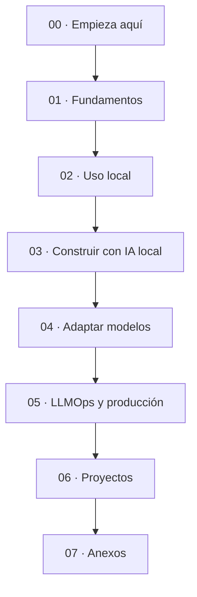

# IA local de cero a producción

> Un curso gratuito y autodidacta para aprender a ejecutar, entender, adaptar y servir modelos de IA en tu propio ordenador.

**Autor:** [@are_agi](https://twitter.com/are_agi)

Este curso une y reorganiza los materiales de **Curso-IA-Local** y **Curso LLMOps Deep Dive**. Empieza sin dar por hecho que sabes de modelos, terminal o GPUs, y termina en temas de producción: KV cache, batching, fine-tuning, observabilidad, costes y despliegue.

Puedes seguirlo con **Linux, Windows o macOS**, tanto en un ordenador personal como en un servidor Linux. La mayor parte del curso usa Python, Ollama, llama.cpp y APIs HTTP, por lo que en Linux solo cambian unos pocos comandos de instalación y monitorización. Con 8 GB puedes hacer las primeras prácticas usando modelos pequeños; con 16-32 GB tendrás más margen; con una GPU NVIDIA, AMD compatible o un Mac con bastante memoria unificada podrás abordar los laboratorios avanzados.

> [!important] Empieza aquí
> Lee [Bienvenida y método](00-Introduccion/00-Bienvenida-y-metodo.md), elige tu ruta en [Hardware y modelos](00-Introduccion/01-Elige-hardware-y-modelo.md) y prepara el equipo con [Instalación en Linux, Windows y macOS](00-Introduccion/02-Instalacion-Windows-y-macOS.md).

## Qué vas a conseguir

Al terminar podrás:

- distinguir modelo, formato, cuantización y runtime sin mezclar conceptos;
- elegir un modelo que quepa de verdad en tu RAM o VRAM;
- usar Ollama, LM Studio y llama.cpp en Linux, Windows y macOS;
- levantar una API compatible con OpenAI que funcione solo en tu equipo;
- crear un RAG con tus documentos y un agente con herramientas;
- evaluar calidad, velocidad y memoria antes de decir que algo "va mejor";
- adaptar modelos con LoRA usando MLX en Apple Silicon o PEFT/QLoRA con NVIDIA;
- entender cómo funcionan prefill, decode, atención, KV cache y sampling;
- razonar sobre batching, scheduling, multi-GPU, observabilidad y coste;
- completar un proyecto local y, si quieres ir más lejos, un sistema de serving.

## Antes de seguir: cuatro ideas tranquilizadoras

1. **No hace falta hacerlo entero.** La ruta esencial termina al levantar una API local y construir un pequeño RAG.
2. **No necesitas la misma máquina que otra persona.** Cada práctica indica qué rutas son viables.
3. **Copiar un comando no es aprender.** Después de cada bloque comprobarás qué ha ocurrido y guardarás una medición.
4. **Un modelo más grande no siempre es mejor para tu caso.** Una respuesta útil, rápida y privada suele valer más que un benchmark bonito.

## Mapa del curso



### 00 · Empieza aquí

- [Bienvenida y método](00-Introduccion/00-Bienvenida-y-metodo.md)
- [Elige hardware y modelo](00-Introduccion/01-Elige-hardware-y-modelo.md)
- [Instalación en Linux, Windows y macOS](00-Introduccion/02-Instalacion-Windows-y-macOS.md)
- [Tu primera sesión local](00-Introduccion/03-Tu-primera-IA-local.md)
- [Rutas y autoevaluación](00-Introduccion/04-Rutas-y-autoevaluacion.md)
- [Equivalencias de comandos y plataformas](PLATAFORMAS-Y-COMANDOS.md)

### 01 · Fundamentos

- [Qué es un LLM](01-Fundamentos/01-Que-es-un-LLM.md)
- [Arquitectura transformer con intuición](01-Fundamentos/02-Arquitectura-transformer.md)
- [Memoria, contexto y KV cache en Apple Silicon](01-Fundamentos/03-Memoria-contexto-y-KV-cache-en-Apple-Silicon.md)

### 02 · Usar modelos en local

- [Inferencia con Ollama, llama.cpp y MLX](02-Uso-local/01-Inferencia-con-Ollama-llama.cpp-y-MLX.md)
- [Cuantización y formatos](02-Uso-local/02-Cuantizacion-y-formatos.md)

### 03 · Construir aplicaciones

- [RAG local con tus documentos](03-Construir/01-RAG-local.md)
- [Agentes locales y MCP](03-Construir/02-Agentes-locales-y-MCP.md)
- [IA multimodal local](03-Construir/03-IA-multimodal-local.md)
- [Voz y transcripción local](03-Construir/04-Voz-y-transcripcion-local.md)

### 04 · Adaptar modelos

- [Fine-tuning con MLX en Mac](04-Adaptar/01-Fine-tuning-con-MLX-en-Mac.md)
- [Fine-tuning con PEFT y QLoRA](04-Adaptar/02-Fine-tuning-con-PEFT-y-QLoRA.md)
- [Merging, pruning y destilación](04-Adaptar/03-Merging-pruning-y-destilacion.md)

### 05 · LLMOps y producción

- [El problema del serving](05-LLMOps/01-El-problema-del-serving.md)
- [Modelo de referencia Qwen3-0.6B](05-LLMOps/02-Modelo-de-referencia-Qwen3-0.6B.md)
- [Atención y KV cache](05-LLMOps/03-Atencion-y-KV-cache.md)
- [El bucle de inferencia](05-LLMOps/04-El-bucle-de-inferencia.md)
- [Batching y scheduling](05-LLMOps/05-Batching-y-scheduling.md)
- [Cuantización avanzada](05-LLMOps/06-Cuantizacion-y-compresion-avanzada.md)
- [Decodificación especulativa](05-LLMOps/07-Decodificacion-especulativa.md)
- [De una GPU a multi-GPU](05-LLMOps/08-De-una-GPU-a-multi-GPU.md)
- [Despliegue en Azure ML](05-LLMOps/09-Despliegue-en-Azure-ML.md)
- [Observabilidad y monitorización](05-LLMOps/10-Observabilidad-y-monitorizacion.md)
- [Optimización de costes](05-LLMOps/11-Optimizacion-de-costes.md)
- [Evaluación y calidad en producción](05-LLMOps/12-Evaluacion-y-calidad-en-produccion.md)

### 06 · Proyectos

- [Proyecto 1: asistente local completo](06-Proyectos/01-Asistente-local-completo.md)
- [Proyecto 2: motor de inferencia desde cero](06-Proyectos/02-Motor-de-inferencia-desde-cero.md)
- [Proyecto 3: fine-tuning de Qwen3-0.6B](06-Proyectos/03-Fine-tuning-de-Qwen3-0.6B.md)
- [Proyecto 4: sistema de serving en producción](06-Proyectos/04-Sistema-de-serving-en-produccion.md)

### 07 · Anexos

- [Evaluación local sin autoengaño](07-Anexos/A-Evaluacion-local-sin-autoengano.md)
- [Glosario](07-Anexos/B-Glosario.md)
- [Chuleta original de comandos para Mac](07-Anexos/C-Chuleta-de-comandos-original-Mac.md)
- [Modelos para Apple Silicon con 24 GB](07-Anexos/D-Modelos-para-Apple-Silicon-24GB.md)
- [Troubleshooting local](07-Anexos/E-Troubleshooting-local.md)
- [Fundamentos matemáticos](07-Anexos/F-Fundamentos-matematicos.md)
- [Patrones de diseño de sistemas](07-Anexos/G-Patrones-de-diseno-de-sistemas.md)
- [Checklist de producción](07-Anexos/H-Checklist-de-produccion.md)
- [Troubleshooting de serving](07-Anexos/I-Troubleshooting-de-serving.md)
- [Scaffold de implementación](07-Anexos/J-Scaffold-de-implementacion.md)

## Qué ruta elegir

| Si ahora mismo tú… | Empieza por | Para cuando… |
|---|---|---|
| nunca has usado IA local | capítulos 00 → 03 | puedas conversar con un modelo y explicar dónde se ejecuta |
| ya usas Ollama o LM Studio | fundamentos → cuantización → RAG | tengas un sistema útil con tus documentos |
| programas en Python | inferencia → RAG → agentes → evaluación | puedas construir una aplicación reproducible |
| quieres adaptar un modelo | evaluación → fine-tuning de tu plataforma | demuestres mejora frente al modelo base |
| trabajas en ML/infra | LLMOps en orden → proyectos 2-4 | puedas diseñar y operar serving concurrente |

En [Rutas y autoevaluación](00-Introduccion/04-Rutas-y-autoevaluacion.md) tienes itinerarios más concretos y criterios para saber si puedes pasar al siguiente bloque.

## Convenciones

- Los bloques **Linux/macOS** usan una shell tipo bash o zsh; **Windows PowerShell** tiene equivalencias cuando la sintaxis cambia.
- Los laboratorios CUDA avanzados se ejecutan de forma nativa en **Linux**; en Windows, la ruta recomendada es WSL2.
- En un servidor Linux sin escritorio, usa Ollama o llama.cpp por terminal y accede a sus APIs mediante un túnel SSH; LM Studio requiere interfaz gráfica.
- `localhost` significa "este ordenador". Mientras no cambies el host o abras el firewall, el servicio no está publicado en Internet.
- Los tamaños de modelo son orientativos. El contexto, la cuantización, el runtime y otras aplicaciones abiertas cambian la memoria real.
- Las recomendaciones de modelos están fechadas. Comprueba siempre la ficha y la licencia antes de usar uno en un producto.

## Privacidad y seguridad

"Local" no garantiza privacidad por arte de magia. Los pesos pueden descargarse de Internet; algunas interfaces incluyen búsquedas o funciones cloud; y una API ligada a `0.0.0.0` puede quedar accesible desde tu red. Durante el curso:

- usa modelos y runtimes de fuentes oficiales;
- no pegues secretos reales en ejercicios;
- mantén los servidores en `127.0.0.1` mientras aprendes;
- revisa la licencia y el model card;
- no confundas una respuesta convincente con una respuesta cierta.

El repositorio incluye una auditoría automática de secretos y datos personales. Para ejecutar también el control antes de cada envío, instala `gitleaks` y activa el hook una vez:

```bash
git config core.hooksPath .githooks
```

## Sobre este material

El curso está escrito en español de España y pensado para estudiar sin profesor. Cada bloque combina explicación, práctica, comprobación y preguntas de cierre. Si algo no funciona, ve primero a [Troubleshooting local](07-Anexos/E-Troubleshooting-local.md).

Si detectas un comando que ha cambiado o quieres mejorar una explicación, consulta [Cómo contribuir](CONTRIBUTING.md).

Creado por **[@are_agi](https://twitter.com/are_agi)**.
